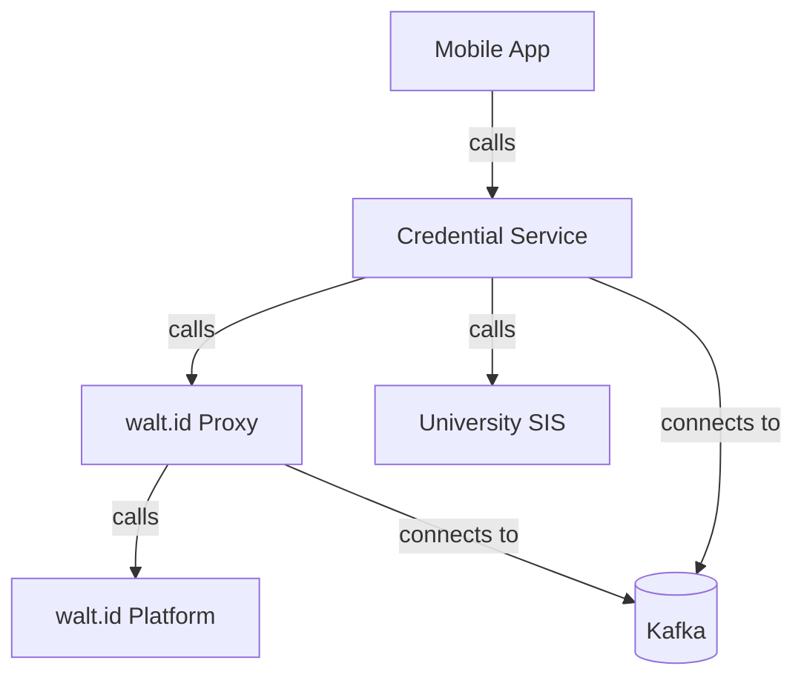

# Digital Credential System (DCS)

[](https://github.com/marcelogdomingues/ulht-dcs-public/actions/workflows/backend.yml)
[](https://github.com/marcelogdomingues/ulht-dcs-public/actions/workflows/mobile.yml)
[](https://github.com/marcelogdomingues/ulht-dcs-public/actions/workflows/docker.yml)
[](https://github.com/marcelogdomingues/ulht-dcs-public/actions/workflows/codeql.yml)
[](https://github.com/marcelogdomingues/ulht-dcs-public/actions/workflows/security-scan.yml)
[](https://github.com/marcelogdomingues/ulht-dcs-public/actions/workflows/docs.yml)
[](https://codecov.io/gh/marcelogdomingues/ulht-dcs-public)
[](https://scorecard.dev/viewer/?uri=github.com/marcelogdomingues/ulht-dcs-public)

[](https://codespaces.new/marcelogdomingues/ulht-dcs-public)
[](LICENSE)
[](https://marcelogdomingues.github.io/ulht-dcs-public/)

> 📖 Documentation: <https://marcelogdomingues.github.io/ulht-dcs-public/> · 🧩 [Open in Codespaces](https://codespaces.new/marcelogdomingues/ulht-dcs-public)

**Issue → hold → verify university credentials, the standards-compliant way.** DCS
is an event-driven microservices platform that turns a single student login into a set of
**W3C Verifiable Credentials** — then lets any verifier check exactly the one they need,
with privacy-preserving selective disclosure. Java 25 · Spring Boot 4.1 · Kafka (KRaft) ·
[walt.id](https://walt.id) · Flutter — all runnable with one `docker compose` command, or
straight from your browser in **[GitHub Codespaces](https://codespaces.new/marcelogdomingues/ulht-dcs-public)**.



| | |
|---|---|
| **Runtime** | Java 25 · Spring Boot 4.1.0 · Spring Cloud 2025.1.2 |
| **Messaging** | Apache Kafka (Confluent CP 8.3, **KRaft** — no ZooKeeper) |
| **Gateway / Discovery** | Kong 3.9 · Consul 1.22 |
| **Observability** | Prometheus · Grafana · Loki · Promtail |
| **Mobile** | Flutter 3.44 / Dart 3.12 (student, verifier, issuer apps) |
| **Identity backend** | walt.id (issuer / verifier / wallet, run separately) |

> **Status:** Development / academic project. It handles real student data, so treat the
> security notes in [`docs/SECURITY.md`](docs/SECURITY.md) as required reading before any
> shared or public deployment.

---

## Try the demo (no setup)

Run the **full issue → verify pipeline with one command** — no walt.id, no university
SIS, no `.env`:

```bash
docker compose -f compose/demo.yml up -d --build
```

A `demo` Spring profile swaps the two external dependencies (walt.id and the student
information system) for in-memory mocks, so the whole workflow reaches `COMPLETED`
with credential-offer URLs using only Kafka + Consul + the four services. The
credentials are **illustrative only** (mock issuer/verifier). See
[`docs/DEMO.md`](docs/DEMO.md) for the curl commands to issue, poll, fetch, and
verify, and `make demo` as a shortcut.

---

## Documentation

📖 **Documentation site: <https://marcelogdomingues.github.io/ulht-dcs-public/>**
(built from `docs/` with MkDocs Material; search, dark mode, and rendered diagrams).

The source Markdown lives in [`docs/`](docs/). Start here:

| Document | What it covers |
|---|---|
| [Getting Started](docs/GETTING_STARTED.md) | Prerequisites, `.env` setup, build, run, first credential, mobile apps |
| [Architecture](docs/ARCHITECTURE.md) | Services, event flow, Kafka topics, diagrams, network topology |
| [Configuration](docs/CONFIGURATION.md) | Environment variables, Spring profiles, ports, per-service settings |
| [Security](docs/SECURITY.md) | API-key auth model, secrets, CORS, hardening, remaining manual steps |
| [API Reference](docs/API.md) | Every REST endpoint per service, with `apikey` examples |
| [Deployment](docs/DEPLOYMENT.md) | Compose files, KRaft Kafka, images, volumes, healthchecks, prod notes |
| [Mobile Apps](docs/MOBILE_APPS.md) | The three Flutter apps, `--dart-define` config, secure storage |
| [Troubleshooting](docs/TROUBLESHOOTING.md) | Common failures and fixes (KRaft, walt.id, 401s, healthchecks) |

To preview the site locally: `pip install mkdocs-material && mkdocs serve` then open
<http://127.0.0.1:8000>.

---

## Quick start

```bash
# 1. Clone
git clone <repository-url>
cd dcs

# 2. Configure secrets (required — services fail fast without them)
cp .env.example .env
# then edit .env and set at least:
#   APP_API_KEY, WALLET_PASSWORD_SECRET, WALLET_PASSWORD_SALT,
#   GRAFANA_ADMIN_PASSWORD, KAFKA_UI_PASSWORD

# 3. Build images and start the full stack (KRaft Kafka, Consul, Kong, services, monitoring)
docker compose -f compose/microservices.yml -f compose/override.yml up -d --build

# 4. Watch services become healthy
docker compose -f compose/microservices.yml ps
```

Every business endpoint now requires the `apikey` header. Issue your first credential
(replace the placeholders with a real DCS username / install key):

```bash
curl -X POST http://localhost:8084/api/v1/student/issue \
  -H "Content-Type: application/json" \
  -H "apikey: ${APP_API_KEY:-dcs-dev-local-CHANGE-ME}" \
  -d '{"userName":"<your-username>","installKey":"<your-install-key>"}'
# -> 202 Accepted { "correlationId": "...", "status": "PROCESSING" }

# Poll status, then fetch the credential offer URLs:
curl -H "apikey: $APP_API_KEY" http://localhost:8084/api/v1/student/status/<correlationId>
curl -H "apikey: $APP_API_KEY" http://localhost:8084/api/v1/student/credentials/<correlationId>
```

> Full credential issuance also requires the external **walt.id** stack (issuer/verifier/wallet).
> See [Getting Started](docs/GETTING_STARTED.md#walt-id-backend) and
> [Troubleshooting](docs/TROUBLESHOOTING.md).

---

## What it does

**Issuance** — a student logs in once; the platform authenticates them against the
university and issues up to four credentials:

- `EducationalID` — student identity & enrolment (SCHAC-aligned)
- `IdentityCredential` — digital identity
- `EuropeanStudentCard` — cross-border recognition (ESC Initiative)
- `UniversityDegree` — graduation certificate (conditional, graduates only)

**Selective verification** — verifiers request only the specific credential they need
(a cinema asks for `EducationalID`, an employer for `UniversityDegree`), so the holder
never over-shares. This is a deliberate privacy/GDPR design choice; see
[Architecture → Selective verification](docs/ARCHITECTURE.md#selective-verification).

**Event-driven** — services communicate asynchronously over Kafka; the HTTP request
returns immediately with a correlation ID while issuance proceeds in the background.

---

## Screenshots & demo

The demo stack is verified end-to-end — a single `POST /student/issue` runs the
full workflow to `COMPLETED`, issuing three credentials and skipping
`UniversityDegree` for a non-graduate (the conditional-issuance rule). See
[`docs/DEMO.md`](docs/DEMO.md) for the exact commands and a real response payload.

**Capture your own visuals** (everything below is live once the demo is up):

| Visual | Where |
|---|---|
| **Swagger UI** (per service) | `http://localhost:8084/api/v1/swagger-ui/index.html` (also `:8085`, `:8086`, `:8087`) |
| **OpenAPI spec** | `http://localhost:8084/api/v1/api-docs` |
| **Grafana dashboards** | start the monitoring overlay, then `http://localhost:3000` |
| **Mobile — issue & verify** | run the Flutter apps in [`mobile-apps/`](mobile-apps/) against the stack |

Contributions of screenshots/GIFs are welcome — drop them in
[`docs/screenshots/`](docs/screenshots/) using the filenames in its
[`README.md`](docs/screenshots/README.md).

---

## Services & ports

All published ports bind to `127.0.0.1` (loopback) by default.

| Service | Port | Context path | Purpose |
|---|---|---|---|
| Student Service | 8084 | `/api/v1` | Entry point, request validation, correlation IDs |
| SIS Service | 8085 | `/api/v1` | University SIS integration & student data |
| Credential Service | 8086 | `/api/v1` | W3C issuance, wallet, verifier (walt.id) |
| Fulfilment Service | 8087 | `/api/v1` | Workflow tracking & results |

**Infrastructure & tooling**

| Component | Port | Notes |
|---|---|---|
| Kong Gateway (proxy / admin) | 8000 / 8001 | Admin API is loopback-only |
| Kong UI | 8080 | Static admin console |
| Kafka (client / external) | 9092 / 29092 | KRaft mode, controller on 29093 (internal) |
| Consul | 8500 / 8600 | Service discovery |
| Kafka UI (kafbat) | 8081 → 8181 (override) | Login required |
| Prometheus | 9090 | Metrics |
| Grafana | 3000 | Dashboards (credentials via env) |
| Loki / Promtail | 3100 / 9080 | Logs |
| Kafka Exporter | 9308 | Kafka metrics |

Full details in [Configuration](docs/CONFIGURATION.md) and [Deployment](docs/DEPLOYMENT.md).

---

## Repository layout

```
dcs/
├── services/                 # Backend Maven modules
│   ├── student-service/         # Entry point (8084)
│   ├── sis-service/             # University SIS integration (8085)
│   ├── credential-service/      # W3C issuance + walt.id (8086)
│   ├── fulfilment-service/      # Workflow tracking (8087)
│   └── dcs-commons/             # Shared auto-configured security module
├── mobile-apps/              # Flutter apps: student / verifier / issuer
├── infra/                    # Infrastructure configs
│   ├── api-gateway/             # Kong declarative config (kong.yml)
│   ├── kong-ui/                 # Static Kong admin console
│   ├── monitoring/             # Prometheus, Grafana, Loki, Promtail configs
│   └── docker/                  # keycloak / postgres / walt.id service configs
├── compose/                  # Docker Compose stacks (microservices · demo · infrastructure · keycloak · walt.id)
├── postman/                  # API collection + environment
├── scripts/                  # Helper scripts (Kafka debug / reset)
├── docs/                     # Documentation (MkDocs Material site)
├── .github/                  # CI workflows + community-health files
├── .env.example              # Required environment variables (template)
└── README.md
```

---

## Security at a glance

- **API-key authentication** on every business endpoint (`apikey` header); only
  `/api/v1/actuator/health|info|prometheus` and Swagger are public.
- **Secrets externalized** to environment variables (no credentials in source); the
  committed `.env` is git-ignored, with `.env.example` as the template.
- **Loopback-bound ports**, non-root containers, pinned images, Kong CORS allow-list.

Read [`docs/SECURITY.md`](docs/SECURITY.md) for the full model and the manual steps that
remain (rotating the DCS install key, enabling TLS for production).

---

## Standards & compliance

- W3C Verifiable Credentials Data Model
- OpenID for Verifiable Credential Issuance (OID4VCI) & Presentation (OID4VP)
- SCHAC 2.0 (Schema for Academia)
- European Student Card Initiative
- Decentralized Identifiers (DIDs)

---

## License

MIT License.
