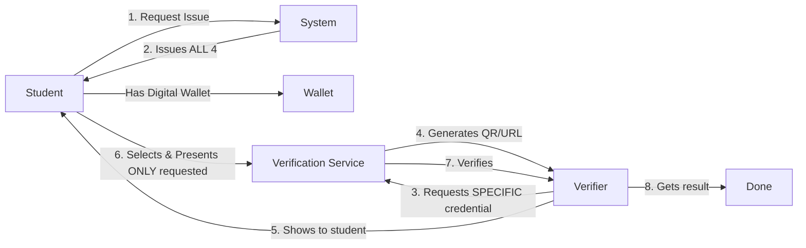

# Selective Verification - Design Decision & Rationale

## 📋 Overview

This document explains why the ULHT Digital Credential System implements **selective verification** rather than "verify all credentials" approach.

## 🎯 Core Principle: Privacy by Design

### The Question
> "If I issue 2, 3, or 4 credentials, which ones am I verifying? Shouldn't it be all of them?"

### The Answer
**No - and here's why that's a good thing.**

## 🏗️ Architecture

### Credential Issuance (What Students Get)
When a student requests credentials via `/student/issue`, they receive **4 verifiable credentials**:

1. **EducationalID** - Student identity & academic enrollment
2. **IdentityCredential** - Digital identity verification  
3. **EuropeanStudentCard** - International student recognition
4. **UniversityDegree** - Graduation certificate (conditional - graduates only)

### Credential Verification (What Verifiers Request)
When a verifier requests verification via `/student/verify`, they specify **exactly which credential(s) they need**:

```json
{
  "credentialType": "EducationalID",
  "format": "jwt_vc_json",
  "userId": "a12345678"
}
```

**Key Point:** The verifier requests ONE specific credential type, not all of them.

## 💡 Why Selective Verification?

### 1. **Privacy & Data Minimization** 🔒
According to W3C VC standards and GDPR principles:
- Verifiers should only request what they **actually need**
- Users should only share **minimal necessary information**
- Unnecessary data sharing increases privacy risks

**Example:**
- 🏦 Bank verifying identity → Only needs `IdentityCredential`
- 🎟️ Student discount service → Only needs `EducationalID`
- No reason for the bank to see your grades, and no reason for the discount service to see your banking identity!

### 2. **Real-World Use Cases** 🌍

Different verifiers have different needs:

| Verifier | Credential Needed | Why? |
|----------|------------------|------|
| 🏦 **Bank** | `IdentityCredential` | KYC compliance, age verification |
| 🎓 **Erasmus Program** | `EuropeanStudentCard` | International student status |
| 💼 **Employer** | `UniversityDegree` | Graduation verification |
| 🎟️ **Student Discount** | `EducationalID` | Active student status |
| 🏛️ **Government Agency** | `IdentityCredential` | Citizen identification |

Forcing all verifiers to receive all credentials would be:
- ❌ Privacy violation
- ❌ Security risk (more data = more exposure)
- ❌ GDPR non-compliant
- ❌ Poor user experience

### 3. **Security Benefits** 🛡️

**Principle of Least Privilege:**
- Each verifier gets only what they need
- Reduces attack surface
- Limits damage from data breaches
- Prevents credential correlation across services

**Example Attack Scenario:**
If a student discount website is compromised and stores all credentials:
- ✅ With selective verification: Attacker gets `EducationalID` only
- ❌ With "verify all": Attacker gets identity, degree, student card, etc.

### 4. **Regulatory Compliance** ⚖️

**GDPR Article 5(1)(c) - Data Minimization:**
> "Personal data shall be adequate, relevant and **limited to what is necessary** in relation to the purposes for which they are processed."

**eIDAS Regulation:**
- Supports selective disclosure
- Users must control which attributes are shared
- Verifiers must justify data requests

### 5. **W3C Verifiable Credentials Standard** 📜

The W3C VC specification explicitly supports and encourages:

**Selective Disclosure:**
```
"Holders can choose to reveal only specific claims 
from a credential, hiding others even though they 
were attested by the issuer."
```

**Presentation Definition:**
```
"Verifiers specify exactly which credentials and 
which claims they require through a presentation 
definition."
```

## 🔄 How It Works

### The Flow



### Step-by-Step

1. **Issuance (One-Time Setup)**
   ```bash
   POST /student/issue
   # Result: Student receives 4 credentials in wallet
   ```

2. **Verification (Per Use Case)**
   ```bash
   POST /student/verify
   {
     "credentialType": "EducationalID"  # Only this one!
   }
   # Result: Verification URL for this specific credential
   ```

3. **Presentation**
   - Student scans QR code or clicks link
   - Wallet shows: "Cinema wants to verify your EducationalID"
   - Student approves (or rejects)
   - System presents ONLY that credential

4. **Validation**
   - Verifier receives ONLY the requested credential
   - System validates signatures, expiration, policies
   - Result: Valid or Invalid

## 📊 Comparison: Selective vs. All-or-Nothing

| Aspect | Selective Verification ✅ | Verify All ❌ |
|--------|-------------------------|---------------|
| **Privacy** | Minimal disclosure | Over-sharing |
| **Security** | Limited exposure | Maximum exposure |
| **GDPR** | Compliant | Potentially non-compliant |
| **User Control** | High | Low |
| **Flexibility** | Per use-case | One-size-fits-all |
| **W3C VC Spec** | Aligned | Misaligned |
| **Attack Surface** | Minimal | Maximum |

## 🛠️ Implementation

### Single Credential Verification

**Educational ID (Student Discount):**
```bash
curl -X POST http://localhost:8084/api/v1/student/verify \
  -H "Content-Type: application/json" \
  -d '{
    "credentialType": "EducationalID",
    "format": "jwt_vc_json",
    "userId": "a12345678"
  }'
```

**Identity (Bank KYC):**
```bash
curl -X POST http://localhost:8084/api/v1/student/verify \
  -H "Content-Type: application/json" \
  -d '{
    "credentialType": "IdentityCredential",
    "format": "jwt_vc_json",
    "userId": "a12345678"
  }'
```

**Degree (Employer):**
```bash
curl -X POST http://localhost:8084/api/v1/student/verify \
  -H "Content-Type: application/json" \
  -d '{
    "credentialType": "UniversityDegree",
    "format": "jwt_vc_json",
    "userId": "a12345678"
  }'
```

### Multiple Credentials (If Really Needed)

If a verifier legitimately needs multiple credentials, they can:

**Option 1: Sequential Verification**
```bash
# Request 1: Identity
POST /student/verify { "credentialType": "IdentityCredential" }

# Request 2: Degree  
POST /student/verify { "credentialType": "UniversityDegree" }
```

**Option 2: Future Enhancement**
(Not currently implemented - would require API changes)
```json
{
  "credentialTypes": ["IdentityCredential", "UniversityDegree"],
  "format": "jwt_vc_json",
  "userId": "a12345678",
  "justification": "Employment verification requires both identity and degree"
}
```

## 🎓 Educational Use Cases

### Use Case 1: Student Cinema Discount 🎬

**Verifier Needs:** Proof of active student status  
**Credential Required:** `EducationalID`  
**Data Shared:** Student ID, enrollment status  
**Data NOT Shared:** Personal identity, degree, grades

### Use Case 2: Bank Account Opening 🏦

**Verifier Needs:** Identity verification  
**Credential Required:** `IdentityCredential`  
**Data Shared:** Name, date of birth, address  
**Data NOT Shared:** University, courses, grades

### Use Case 3: Job Application 💼

**Verifier Needs:** Graduation proof  
**Credential Required:** `UniversityDegree`  
**Data Shared:** Degree, graduation date, institution  
**Data NOT Shared:** Current enrollment (if pursuing masters), student discounts

### Use Case 4: Erasmus Exchange 🌍

**Verifier Needs:** International student status  
**Credential Required:** `EuropeanStudentCard`  
**Data Shared:** ESI, institution, academic level  
**Data NOT Shared:** Bank details, home address, specific grades

## 🔮 Future Enhancements

### 1. **Selective Attribute Disclosure**
Instead of sharing entire credentials, share specific attributes:
```json
{
  "credentialType": "EducationalID",
  "requestedAttributes": ["studentStatus", "institutionName"],
  "excludedAttributes": ["studentId", "grades"]
}
```

### 2. **Zero-Knowledge Proofs**
Prove claims without revealing data:
```json
{
  "proofRequest": "age_over_18",
  "credential": "IdentityCredential"
}
// Proves age > 18 without revealing actual birthdate
```

### 3. **Credential Bundling**
For legitimate multi-credential use cases:
```json
{
  "verificationBundle": [
    { "credential": "IdentityCredential", "purpose": "KYC" },
    { "credential": "UniversityDegree", "purpose": "Employment" }
  ],
  "justification": "Employment verification at international company"
}
```

## 📚 References

- [W3C Verifiable Credentials Data Model](https://www.w3.org/TR/vc-data-model/)
- [GDPR Article 5 - Principles](https://gdpr-info.eu/art-5-gdpr/)
- [eIDAS Regulation](https://digital-strategy.ec.europa.eu/en/policies/eidas-regulation)
- [OpenID for Verifiable Presentations](https://openid.net/specs/openid-4-verifiable-presentations-1_0.html)
- [Selective Disclosure for JWTs](https://datatracker.ietf.org/doc/html/draft-ietf-oauth-selective-disclosure-jwt)

## ✅ Decision: Option B - Selective Verification

**Chosen Approach:** Selective Verification (Privacy-First)

**Rationale:**
1. ✅ Aligns with W3C VC specification
2. ✅ GDPR compliant (data minimization)
3. ✅ Better privacy for students
4. ✅ Reduced security risk
5. ✅ Flexible for various use cases
6. ✅ Industry best practice

**Trade-offs Accepted:**
- Verifiers requesting multiple credentials need multiple API calls
- Slightly more complex for "verify everything" scenarios
- Requires verifiers to think about what they actually need

**Benefits Gained:**
- Students have control over their data
- Compliance with privacy regulations
- Reduced attack surface
- Future-proof architecture
- Better user experience

---

## 🤝 Summary

**Question:** "Shouldn't we verify all credentials?"  
**Answer:** "No - selective verification is better for privacy, security, and compliance."

**Remember:**
- Issue: **ALL** credentials (students get complete set)
- Verify: **SPECIFIC** credentials (verifiers get what they need)
- Present: **MINIMAL** data (students control disclosure)

This is not a limitation - **it's a feature** that protects student privacy while enabling flexible, secure credential verification.


