# ULHT Digital Credential System - Complete Architecture

**Version:** 2.0  
**Last Updated:** October 2025  
**Status:** Production Ready

---

## Table of Contents

1. [System Overview](#system-overview)
2. [Infrastructure Architecture](#infrastructure-architecture)
3. [Microservices Architecture](#microservices-architecture)
4. [Event-Driven Flow](#event-driven-flow)
5. [API Gateway Architecture](#api-gateway-architecture)
6. [Network Topology](#network-topology)
7. [Data Flow Diagrams](#data-flow-diagrams)
8. [Technology Stack](#technology-stack)

---

## System Overview

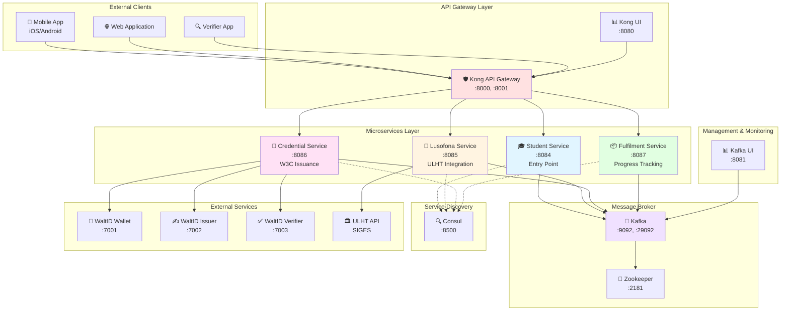

---

## Infrastructure Architecture

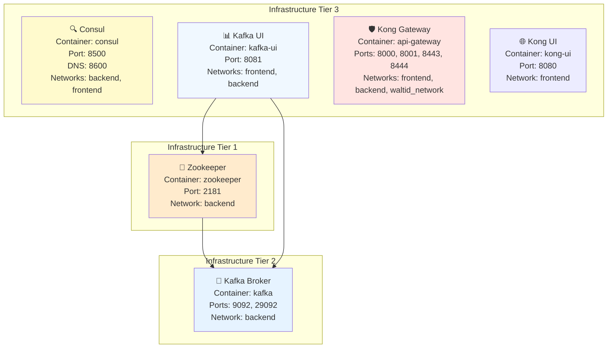

---

## Microservices Architecture

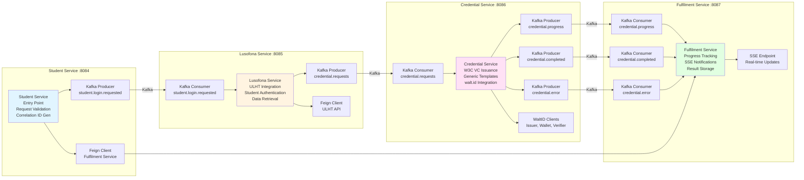

---

## Event-Driven Flow

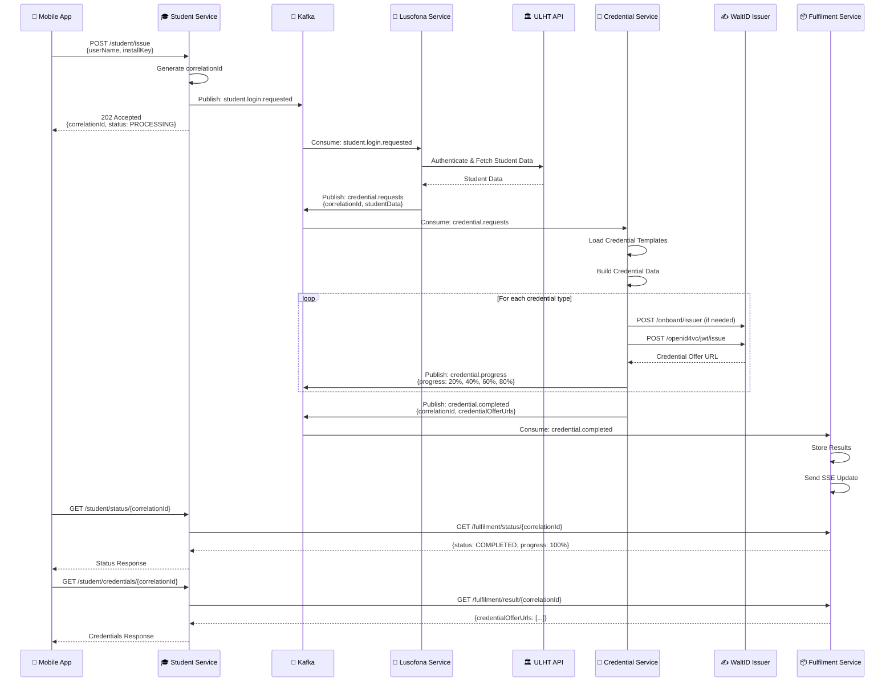

---

## API Gateway Architecture

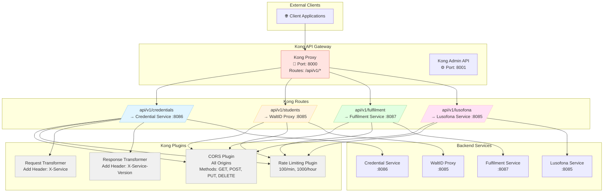

---

## Network Topology

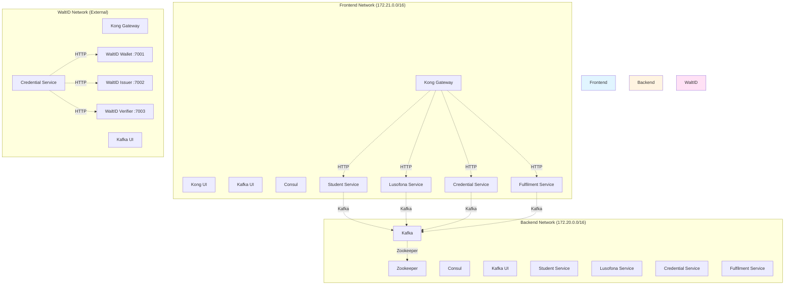

---

## Data Flow Diagrams

### Complete Credential Issuance Flow

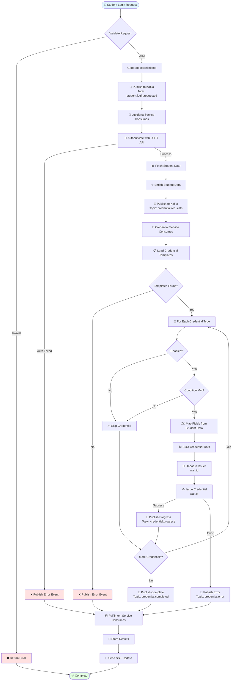

### Kafka Topics Flow

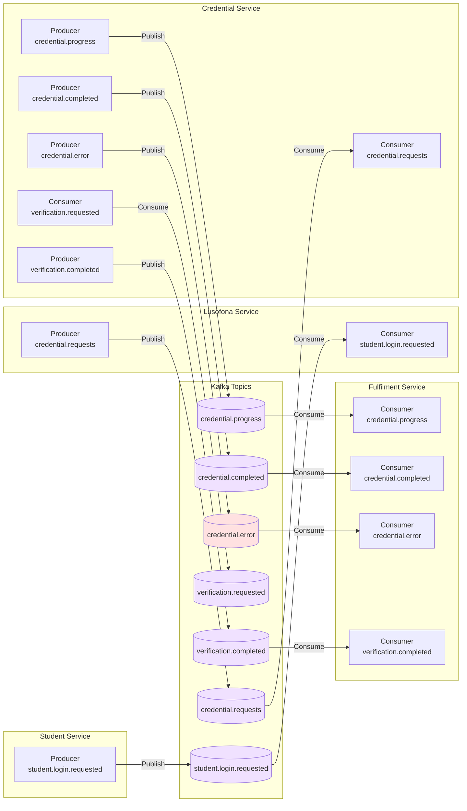

---

## Technology Stack

```mermaid
graph TB
    subgraph "Runtime"
        Java[☕ Java 25]
        SpringBoot[🍃 Spring Boot 3.5.6]
        SpringCloud[☁️ Spring Cloud 2025.0.0]
    end

    subgraph "Messaging"
        Kafka[📨 Apache Kafka 3.x]
        Zookeeper[🐘 Zookeeper 7.4.0]
    end

    subgraph "API Gateway"
        Kong[🛡️ Kong Gateway Latest]
        Nginx[🌐 Nginx Alpine]
    end

    subgraph "Service Discovery"
        Consul[🔍 Consul 1.15.4]
    end

    subgraph "External Integrations"
        WaltID[💼 WaltID v0.15.0<br/>Wallet, Issuer, Verifier]
        ULHTAPI[🏛️ ULHT SIGES API]
    end

    subgraph "Standards"
        W3C[✅ W3C VC Data Model]
        OID4VCI[🔐 OID4VCI Protocol]
        SCHAC[📚 SCHAC 2.0]
        ESC[🇪🇺 European Student Card]
    end

    subgraph "Development Tools"
        Maven[📦 Maven 3.9+]
        Docker[🐳 Docker]
        OpenAPI[📝 OpenAPI 3.0]
        Swagger[📊 Swagger UI]
    end

    Java --> SpringBoot
    SpringBoot --> SpringCloud
    SpringBoot --> Kafka
    Kafka --> Zookeeper
    SpringCloud --> Consul
    Kong --> Nginx
    SpringBoot --> WaltID
    SpringBoot --> ULHTAPI
    SpringBoot --> W3C
    SpringBoot --> OID4VCI
    Maven --> Docker
    OpenAPI --> Swagger

    style Java fill:#ffd700
    style SpringBoot fill:#6db33f
    style Kafka fill:#231f20
    style Kong fill:#003459
    style WaltID fill:#4a90e2
```

---

## Service Ports Summary

| Service | Container Name | Port(s) | Network(s) | Purpose |
|---------|---------------|---------|-------------|---------|
| **Zookeeper** | zookeeper | 2181 | backend | Kafka coordination |
| **Kafka** | kafka | 9092, 29092 | backend | Message broker |
| **Consul** | consul | 8500, 8600 | backend, frontend | Service discovery |
| **Kafka UI** | kafka-ui | 8081 | frontend, backend | Kafka management |
| **Kong Gateway** | api-gateway | 8000, 8001, 8443, 8444 | frontend, backend, waltid_network | API gateway |
| **Kong UI** | kong-ui | 8080 | frontend | Kong management UI |
| **Student Service** | ulht-student-service | 8084 | frontend, backend | Entry point |
| **Lusofona Service** | ulht-waltid-proxy | 8085 | frontend, backend, waltid_network | ULHT integration |
| **Credential Service** | ulht-credential-service | 8086 | frontend, backend, waltid_network | W3C credential issuance |
| **Fulfilment Service** | ulht-fulfilment-service | 8087 | frontend, backend | Progress tracking |
| **WaltID Wallet** | (external) | 7001 | waltid_network | Wallet service |
| **WaltID Issuer** | (external) | 7002 | waltid_network | Credential issuance |
| **WaltID Verifier** | (external) | 7003 | waltid_network | Credential verification |

---

## Kafka Topics Summary

| Topic | Producer | Consumer | Purpose |
|-------|----------|----------|---------|
| `student.login.requested` | Student Service | Lusofona Service | Student login events |
| `credential.requests` | Lusofona Service | Credential Service | Credential issuance requests |
| `credential.progress` | Credential Service | Fulfilment Service | Progress updates (20%, 40%, 60%, 80%, 100%) |
| `credential.completed` | Credential Service | Fulfilment Service | Completion with credential URLs |
| `credential.error` | Credential Service | Fulfilment Service | Error events |
| `verification.requested` | Student Service | Credential Service | Verification requests |
| `verification.completed` | Credential Service | Fulfilment Service | Verification results |
| `wallet.requests` | Credential Service | (Internal) | Wallet operations |
| `wallet.progress` | Credential Service | (Internal) | Wallet progress |
| `wallet.completed` | Credential Service | (Internal) | Wallet completion |

---

## Network Architecture

### Network Segments

1. **Frontend Network (172.21.0.0/16)**
   - Client-facing services
   - API Gateway
   - Management UIs
   - Service endpoints

2. **Backend Network (172.20.0.0/16)**
   - Internal microservices communication
   - Kafka brokers
   - Service discovery
   - Database connections (if any)

3. **WaltID Network (External)**
   - External walt.id services
   - Credential Service (for walt.id integration)
   - Kong Gateway (for walt.id routing)

---

## Deployment Architecture

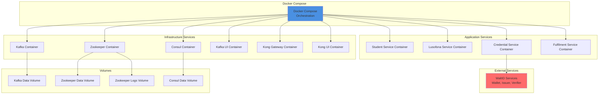

---

## Security Architecture

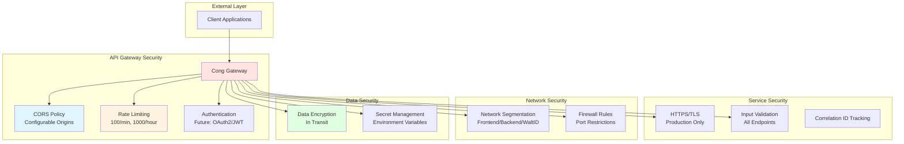

---

## Monitoring & Observability

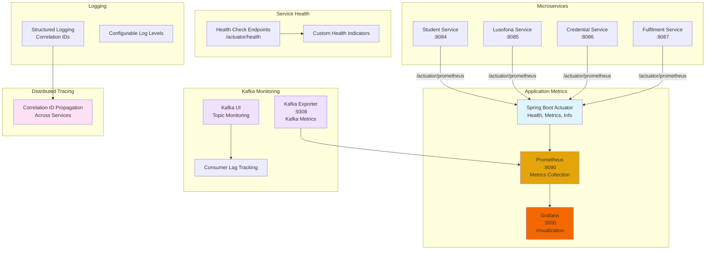

### Monitoring Stack

**Prometheus** (`:9090`)
- Scrapes metrics from all microservices every 15 seconds
- Stores metrics for 30 days
- Provides query interface for metrics analysis

**Grafana** (`:3000`)
- Pre-configured dashboards for:
  - Microservices Overview (Request rate, Error rate, Response time)
  - JVM Metrics (Memory, GC, Threads)
  - Kafka Overview (Topic size, Consumer lag)
- Auto-provisioned data source connection to Prometheus

**Kafka Exporter** (`:9308`)
- Exports Kafka-specific metrics:
  - Topic sizes and offsets
  - Consumer group lag
  - Broker information
  - Partition metrics

**Metrics Exposed by Each Service**
- HTTP request/response metrics (rate, latency, errors)
- JVM metrics (memory, GC, threads, CPU)
- Kafka producer/consumer metrics
- Custom business metrics

For detailed monitoring setup, see [monitoring/README.md](monitoring/README.md)

---

## Credential Types Architecture

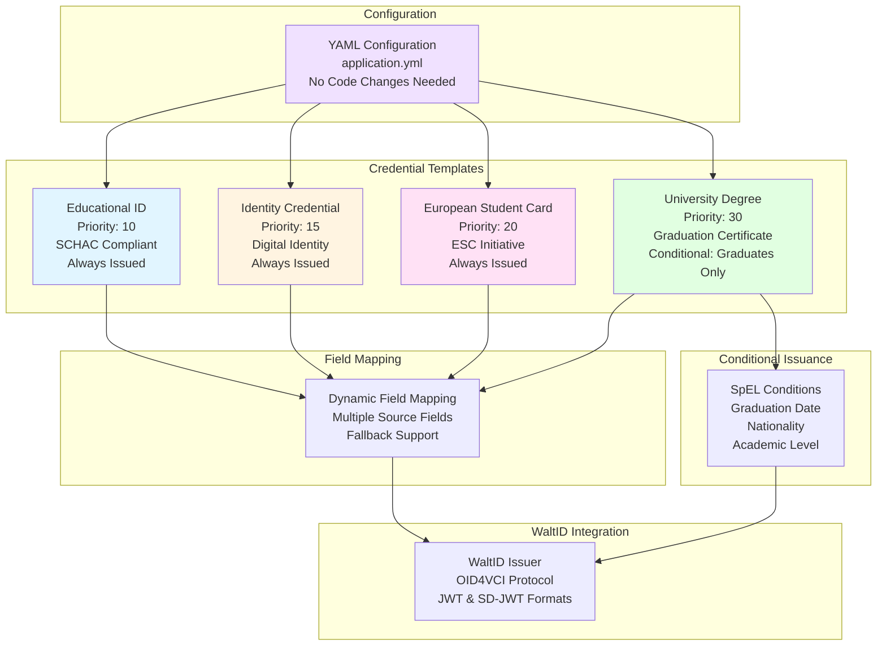

---

## Conclusion

This architecture provides:

- ✅ **Scalable Microservices** - Independent, deployable services
- ✅ **Event-Driven Communication** - Asynchronous processing via Kafka
- ✅ **API Gateway** - Centralized routing and security
- ✅ **Service Discovery** - Dynamic service registration
- ✅ **W3C Compliance** - Standards-based credential issuance
- ✅ **Generic Credential System** - Configuration-driven credential types
- ✅ **Comprehensive Monitoring** - Health checks, metrics, and logging
- ✅ **Network Segmentation** - Security through isolation
- ✅ **Production Ready** - Complete infrastructure setup

---

**For detailed API documentation, see:** [DOCUMENTATION.md](DOCUMENTATION.md)  
**For deployment instructions, see:** [README.md](README.md)

