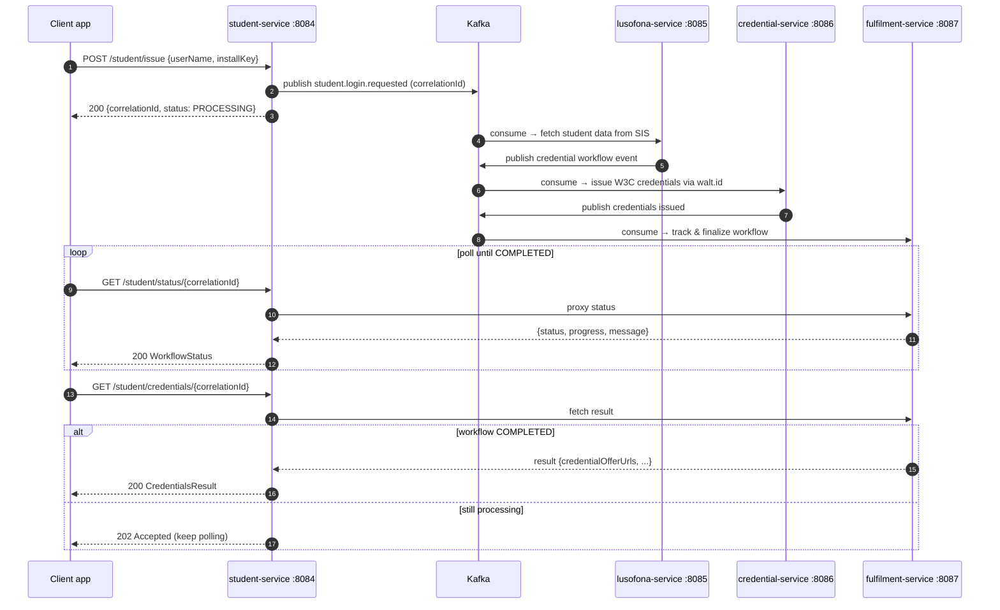

# API Reference

Complete REST reference for the **ULHT Digital Credential System (DCS)**. Every endpoint below is verified against the service controllers and OpenAPI specs in this repository.

See also: [Security](SECURITY.md) · [Configuration](CONFIGURATION.md) · [Architecture](ARCHITECTURE.md) · [Getting Started](GETTING_STARTED.md) · [Deployment](DEPLOYMENT.md) · [Troubleshooting](TROUBLESHOOTING.md) · [Project home](index.md)

!!! info "Public repository — placeholders only"
    All examples use placeholders: `$APP_API_KEY`, `<your-username>`, `<your-install-key>`, `<correlation-id>`, `<credential-type>`. Never use real student identifiers, install keys, or the real SIS URL. The dev default is `APP_API_KEY=ulht-dev-local-CHANGE-ME` — for local use only.

---

## Base URLs

Each service is reachable **directly** on its own loopback port, or through the **Kong** gateway at `http://localhost:8000`. All services use the `/api/v1` context path (`server.servlet.context-path: /api/v1`).

| Service | Direct base URL | Kong route prefix | Responsibility |
| --- | --- | --- | --- |
| student-service | `http://localhost:8084/api/v1` | — | Orchestrates issuance & verification (publishes to Kafka) |
| lusofona-service | `http://localhost:8085/api/v1` | `/api/v1/lusofona` | Academic data — proxies the university SIS / SIGES |
| credential-service | `http://localhost:8086/api/v1` | `/api/v1/credentials`, `/api/v1/wallet`, `/api/v1/students` | W3C issuance, wallet & verifier via walt.id |
| fulfilment-service | `http://localhost:8087/api/v1` | `/api/v1/fulfilment` | Workflow / fulfilment tracking |

!!! note "Kong routing is partial"
    The gateway config in [`kong.yml`](https://github.com/marcelogdomingues/ulht-dcs-public/blob/main/api-gateway/kong.yml) is partial/aspirational and its route prefixes do not always map 1:1 to a service's own paths. For reliable, exhaustive access, call services on their **direct ports**. Authentication is identical either way (see [Security](SECURITY.md)).

---

## Authentication

All endpoints require the `apikey` header **except** the public endpoints listed below.

```
apikey: $APP_API_KEY
```

Missing or invalid keys are rejected with `401 Unauthorized` before any business logic runs. The comparison is constant-time. See [Security](SECURITY.md) for the full model.

Set the key in your shell for the examples:

```bash
export APP_API_KEY="<your-api-key>"   # dev default: ulht-dev-local-CHANGE-ME
```

---

## Public endpoints (no `apikey`)

Available on **every** service under its base URL (from each `SecurityConfig.PUBLIC_PATHS`):

| Method | Path | Description |
| --- | --- | --- |
| GET | `/api/v1/actuator/health` | Liveness/readiness health check |
| GET | `/api/v1/actuator/info` | Build & service info |
| GET | `/api/v1/actuator/prometheus` | Prometheus metrics scrape endpoint |
| GET | `/api/v1/swagger-ui/index.html` | Swagger UI |
| GET | `/api/v1/v3/api-docs` | OpenAPI 3 document |

### Swagger UI per service

| Service | Swagger UI URL |
| --- | --- |
| student-service | `http://localhost:8084/api/v1/swagger-ui/index.html` |
| lusofona-service | `http://localhost:8085/api/v1/swagger-ui/index.html` |
| credential-service | `http://localhost:8086/api/v1/swagger-ui/index.html` |
| fulfilment-service | `http://localhost:8087/api/v1/swagger-ui/index.html` |

---

## Standard responses

| Status | Meaning |
| --- | --- |
| `200 OK` | Success. For async **issuance** via `student-service`, the body carries `correlationId` and `status: PROCESSING` — poll for progress. |
| `202 Accepted` | Async accepted / still processing. `lusofona-service` `/student/login` returns `202` with a `correlationId`; `student-service` `/student/credentials/{id}` returns `202` while a workflow is not yet `COMPLETED`. |
| `400 Bad Request` | Validation failure or malformed body (`VALIDATION_ERROR` / `ILLEGAL_ARGUMENT`). |
| `401 Unauthorized` | Missing or invalid `apikey` header on a protected endpoint. |
| `404 Not Found` | Resource (session / result) not found. |
| `408 Request Timeout` | Upstream call timed out (lusofona-service). |
| `500 Internal Server Error` | Unexpected server error (`INTERNAL_SERVER_ERROR`). |
| `503 Service Unavailable` | An external backend is unavailable — walt.id (issuer `:7002`, verifier `:7003`, wallet `:7001`) for credential-service, or the SIS for lusofona-service. |

### Async issue → poll → fetch pattern

Issuance is asynchronous: `student-service` accepts the request, publishes a Kafka event that fans out across lusofona-service → credential-service → fulfilment-service, and returns immediately with a `correlationId`. Clients then poll status and finally fetch the credential offer URLs.



---

## student-service

Base URL: `http://localhost:8084/api/v1` · All endpoints require the `apikey` header. This service is the single entry point for issuance/verification; it publishes to Kafka and proxies status/results from `fulfilment-service`.
Source: [`StudentController.java`](https://github.com/marcelogdomingues/ulht-dcs-public/blob/main/student-service/src/main/java/pt/ulusofona/student/controller/StudentController.java)

| Method | Path | Description | Auth |
| --- | --- | --- | --- |
| POST | `/student/issue` | Start async credential issuance. Body `{userName, installKey}` → `200` with `{correlationId, status: PROCESSING, monitorAt, credentialsAt}` | ✅ |
| POST | `/student/verify` | Start async credential verification. Body includes `credentialType`, optional `vpPolicies`/`vcPolicies` → `200` with `{correlationId, status: PROCESSING}` | ✅ |
| GET | `/student/status/{correlationId}` | Get workflow status/progress (proxied from fulfilment-service). Returns `PROCESSING` until tracked | ✅ |
| GET | `/student/credentials/{correlationId}` | Fetch issued credential offer URLs. `200` when `COMPLETED`, otherwise `202` (still processing) | ✅ |

!!! note "Issuance returns `200`, not `202`"
    `student-service` `/student/issue` and `/student/verify` return **`200 OK`** with `status: PROCESSING` (the body signals async, per the OpenAPI spec). `/student/credentials/{id}` returns **`202`** while the workflow is not yet `COMPLETED`.

---

## lusofona-service

Base URL: `http://localhost:8085/api/v1` · All endpoints require the `apikey` header. These endpoints proxy the external university SIS / SIGES; each expects a body with the student's `userName` and `installKey` (plus optional `language`, `platform`, `application`, `versionCode`).
Source: [`AuthenticationController.java`](https://github.com/marcelogdomingues/ulht-dcs-public/blob/main/lusofona-service/src/main/java/pt/ulusofona/digital/wallet/controller/AuthenticationController.java) · [`StudentServicesController.java`](https://github.com/marcelogdomingues/ulht-dcs-public/blob/main/lusofona-service/src/main/java/pt/ulusofona/digital/wallet/controller/StudentServicesController.java)

| Method | Path | Description | Auth |
| --- | --- | --- | --- |
| POST | `/student/login` | Authenticate against the SIS, then start the credential workflow → `202` with `{correlationId, status: PROCESSING, expiresAt}` | ✅ |
| POST | `/student/registration` | Register a new student | ✅ |
| POST | `/student/grades` | Retrieve the student's grades | ✅ |
| POST | `/student/enrolment` | Retrieve enrolment information | ✅ |
| POST | `/student/schedule` | Retrieve the student's schedule | ✅ |
| POST | `/student/evaluations` | Retrieve scheduled evaluations | ✅ |
| POST | `/student/course-credits` | Retrieve course credit totals (total / earned / remaining / GPA) | ✅ |

!!! warning "These are POST, not GET"
    Although they read data, all `lusofona-service` student-data endpoints are **POST** because they require a request body containing `userName` and `installKey`. Failures return `503` (SIS unavailable / external error), `408` (timeout), or `400` (validation).

---

## credential-service

Base URL: `http://localhost:8086/api/v1` · All endpoints require the `apikey` header. Wallet, verifier, and issuer operations are backed by **walt.id**; when a walt.id backend is down the service returns `503 Service Unavailable`.

### Wallet

Source: [`WaltidController.java`](https://github.com/marcelogdomingues/ulht-dcs-public/blob/main/credential-service/src/main/java/pt/ulusofona/ulht/credential/controller/WaltidController.java) (`@RequestMapping("/wallet")`)

| Method | Path | Description | Auth |
| --- | --- | --- | --- |
| GET | `/wallet/credentials` | List credentials in a student's wallet (query: `email` **or** `userName`, optional `studentId`) | ✅ |
| POST | `/wallet/present` | Handle an `openid4vp://` presentation request and match wallet credentials (body: request URL; query: `email`/`userName`) | ✅ |
| POST | `/wallet/match-presentation` | Match wallet credentials against a presentation request **without** presenting (returns disclosure info for selective-disclosure UI) | ✅ |
| POST | `/wallet/login` | Wallet login (body `{email, password, type}`) → JWT + session cookie | ✅ |
| POST | `/wallet/register` | Register a wallet user (body `{email, password, name, type}`) | ✅ |
| GET | `/wallet/info` | Get wallet accounts for the authenticated session (`login` cookie) | ✅ |
| GET | `/wallet/{walletId}/keys` | Get keys for a wallet (`login` cookie) | ✅ |
| GET | `/wallet/{walletId}/dids` | Get DIDs for a wallet (`login` cookie) | ✅ |
| POST | `/wallet/onboard-issuer` | Create an issuer signing key + DID (body `{keyType, didMethod}`) | ✅ |
| POST | `/wallet/issue-w3c-jwt-credential` | Issue a W3C VC (JWT) → OID4VCI offer URL | ✅ |
| POST | `/wallet/issue-w3c-sdjwt-credential` | Issue a W3C VC (SD-JWT, selective disclosure) → OID4VCI offer URL | ✅ |
| POST | `/wallet/issue-university-degree` | Issue a University Degree credential → offer URL | ✅ |
| POST | `/wallet/issue-educational-id` | Issue a SCHAC Educational ID credential → offer URL | ✅ |
| POST | `/wallet/issue-european-student-card` | Issue a European Student Card (ESC) credential → offer URL | ✅ |
| POST | `/wallet/issue-jwt-credential` | Legacy JWT issuance (prefer `/wallet/issue-w3c-jwt-credential`) | ✅ |
| GET | `/wallet/issuer-metadata` | OpenID4VCI issuer metadata | ✅ |

!!! note "No standalone `/wallet/register`+`/wallet/login` wallet identity beyond walt.id"
    `/wallet/register` and `/wallet/login` proxy the external walt.id Wallet API; there is no custom-built wallet. There is a wallet **match** endpoint (`/wallet/match-presentation`) but **no** separate `/wallet/presentation-definition` endpoint on this service.

### Verifier

Source: [`VerifierController.java`](https://github.com/marcelogdomingues/ulht-dcs-public/blob/main/credential-service/src/main/java/pt/ulusofona/ulht/credential/controller/VerifierController.java) (`@RequestMapping("/verifier")`)

| Method | Path | Description | Auth |
| --- | --- | --- | --- |
| POST | `/verifier/verify` | Initiate OID4VP verification with a full request (`request_credentials`, optional `vp_policies`/`vc_policies`, per-credential `policies`) → URL/QR + `state` | ✅ |
| POST | `/verifier/verify/basic` | Quick verification. Query `credentialType` (+ `format`, default `jwt_vc_json`); requests **signature**, **expired**, **not-before** policies | ✅ |
| GET | `/verifier/session/{state}` | Get verification status + per-policy results for a session | ✅ |
| GET | `/verifier/session/{sessionId}/credentials` | Inspect presented credentials (`viewMode=simple|verbose`) | ✅ |
| GET | `/verifier/session/{state}/success` | Simple boolean `{success: true|false}` for a session | ✅ |

### Issuer (session management)

Source: [`IssuerController.java`](https://github.com/marcelogdomingues/ulht-dcs-public/blob/main/credential-service/src/main/java/pt/ulusofona/ulht/credential/controller/IssuerController.java) (`@RequestMapping("/issuer")`)

| Method | Path | Description | Auth |
| --- | --- | --- | --- |
| POST | `/issuer/sessions` | Create an issuance/registration session → `201 Created` with a QR-code URL | ✅ |
| GET | `/issuer/sessions` | List sessions (newest first) | ✅ |
| GET | `/issuer/sessions/{sessionId}` | Get a session (`404` if not found) | ✅ |
| PUT | `/issuer/sessions/{sessionId}` | Update a session | ✅ |
| DELETE | `/issuer/sessions/{sessionId}` | Delete a session → `204 No Content` | ✅ |
| POST | `/issuer/sessions/{sessionId}/issue` | Issue a credential for a session (body `{studentId}`) and register the student | ✅ |
| GET | `/issuer/sessions/{sessionId}/registrations` | List students registered in a session | ✅ |

!!! note "Path is `/issuer/sessions/{id}` (plural), no `/issuer/session/{id}/credentials`"
    All issuer paths use the plural `/issuer/sessions/...`. There is no `/issuer/session/{id}/credentials` endpoint; presented credentials are read from the verifier at `/verifier/session/{sessionId}/credentials`.

### Presentation & health

Source: [`PresentationController.java`](https://github.com/marcelogdomingues/ulht-dcs-public/blob/main/credential-service/src/main/java/pt/ulusofona/ulht/credential/controller/PresentationController.java) · [`HealthController.java`](https://github.com/marcelogdomingues/ulht-dcs-public/blob/main/credential-service/src/main/java/pt/ulusofona/ulht/credential/controller/HealthController.java)

| Method | Path | Description | Auth |
| --- | --- | --- | --- |
| POST | `/presentations/holder-initiated/start` | Start a holder-initiated presentation (body `{credentialType, format, vpPolicies, vcPolicies}`) → `{walletUrl, state, presentationId}` | ✅ |
| GET | `/health/status` | Custom aggregate health JSON (distinct from public `/actuator/health`) | ✅ |
| GET | `/health/info` | Custom system info JSON | ✅ |
| GET | `/health/metrics` | Custom example metrics JSON | ✅ |
| GET | `/health/ping` | Simple `{status: OK}` ping | ✅ |

!!! note "`/credentials` and `/flows` are gateway route prefixes, not service paths"
    Kong exposes route prefixes `/api/v1/credentials` and `/api/v1/flows` for the credential service, but the service itself has **no** bare `GET /credentials` or `GET /flows` controller method. Wallet credentials are listed via `GET /wallet/credentials`. The holder-initiated start path is `/presentations/holder-initiated/start`.

---

## fulfilment-service

Base URL: `http://localhost:8087/api/v1` · All endpoints require the `apikey` header. Tracks workflow fulfilment and exposes real-time progress.
Source: [`FulfilmentController.java`](https://github.com/marcelogdomingues/ulht-dcs-public/blob/main/fulfilment-service/src/main/java/pt/ulusofona/ulht/fulfilment/controller/FulfilmentController.java) (`@RequestMapping("/fulfilment")`)

| Method | Path | Description | Auth |
| --- | --- | --- | --- |
| GET | `/fulfilment/status/{correlationId}` | Current status (returns default `PROCESSING` until the workflow is tracked) | ✅ |
| GET | `/fulfilment/progress/{correlationId}` | Current progress as JSON (alias of status) | ✅ |
| GET | `/fulfilment/result/{correlationId}` | Final result; `404` unless `COMPLETED` or `FAILED` | ✅ |
| GET | `/fulfilment/results` | All tracked workflow results (debugging/monitoring) | ✅ |
| POST | `/fulfilment/initialize/{correlationId}` | Initialize a workflow immediately (before Kafka events land) | ✅ |
| GET | `/fulfilment/track/{correlationId}` | **SSE** stream (`text/event-stream`) of live progress updates | ✅ |
| GET | `/fulfilment/health` | Service health + active connection / tracked-workflow counts | ✅ |

---

## Examples

All examples use the `apikey` header and placeholders — never real student values.

### 1. Issue a credential (async)

```bash
curl -X POST http://localhost:8084/api/v1/student/issue \
  -H "apikey: $APP_API_KEY" \
  -H "Content-Type: application/json" \
  -d '{
    "userName": "<your-username>",
    "installKey": "<your-install-key>"
  }'
```

Response (`200 OK`):

```json
{
  "correlationId": "<correlation-id>",
  "status": "PROCESSING",
  "message": "Credential issuance initiated, processing...",
  "monitorAt": "/student/status/<correlation-id>",
  "credentialsAt": "/student/credentials/<correlation-id>"
}
```

### 2. Poll issuance status

```bash
curl http://localhost:8084/api/v1/student/status/<correlation-id> \
  -H "apikey: $APP_API_KEY"
```

### 3. Fetch issued credentials

Returns `202` while still processing, `200` with `credentialOfferUrls` once `COMPLETED`:

```bash
curl -i http://localhost:8084/api/v1/student/credentials/<correlation-id> \
  -H "apikey: $APP_API_KEY"
```

### 4. Basic verification with explicit policies

Requests **signature**, **expired**, and **not-before** policies. If the walt.id verifier (`:7003`) is down, returns `503`:

```bash
curl -X POST "http://localhost:8086/api/v1/verifier/verify/basic?credentialType=<credential-type>&format=jwt_vc_json" \
  -H "apikey: $APP_API_KEY"
```

### 5. Read academic data from the SIS proxy (POST)

```bash
curl -X POST http://localhost:8085/api/v1/student/grades \
  -H "apikey: $APP_API_KEY" \
  -H "Content-Type: application/json" \
  -d '{
    "userName": "<your-username>",
    "installKey": "<your-install-key>"
  }'
```

### 6. Public health check (no `apikey`)

```bash
curl http://localhost:8086/api/v1/actuator/health
```

---

## Error / status code reference

Protected endpoints return `401` on a missing/invalid `apikey`. Service errors carry a structured `ErrorResponse` body: `{errorCode, message, service, timestamp, path, details?}`. Upstream detail is logged server-side only and **not** leaked to clients.

| HTTP status | When it happens | Typical `errorCode` |
| --- | --- | --- |
| `200 OK` | Success; for async issuance, body `status: PROCESSING` | — |
| `201 Created` | Issuer session created | — |
| `202 Accepted` | `lusofona-service` login accepted; credentials not yet ready | — |
| `204 No Content` | Issuer session deleted | — |
| `400 Bad Request` | Validation failure / malformed request | `VALIDATION_ERROR` (`CRED-002`), `ILLEGAL_ARGUMENT` (`CRED-003-ARG`) |
| `401 Unauthorized` | Missing/invalid `apikey` | — |
| `404 Not Found` | Session/result not found | `WALTID_NOT_FOUND` (`CRED-WALTID-404`) |
| `408 Request Timeout` | Upstream/SIS call timed out (lusofona-service) | `TIMEOUT` |
| `409 Conflict` | Wallet user already exists | `USER_ALREADY_EXISTS` |
| `500 Internal Server Error` | Unexpected server error | `INTERNAL_SERVER_ERROR` (`CRED-999`) |
| `503 Service Unavailable` | walt.id (`:7001/:7002/:7003`) or SIS unavailable | `EXTERNAL_SERVICE_ERROR` (`CRED-001`), `WALTID_UNAVAILABLE` (`CRED-WALTID-503`) |

### credential-service error codes (selected)

From [`ErrorCodes.java`](https://github.com/marcelogdomingues/ulht-dcs-public/blob/main/credential-service/src/main/java/pt/ulusofona/ulht/credential/exception/ErrorCodes.java):

| Code | Meaning |
| --- | --- |
| `CRED-001` | External service (e.g. walt.id) not responding / errored → mapped to `503` |
| `CRED-002` | Validation failed → `400` |
| `CRED-003` / `CRED-003-ARG` | Bad request / illegal argument → `400` |
| `CRED-004`…`CRED-007` | Credential creation / signing / issuance failed / not found |
| `CRED-WALTID-400/401/403/404/500/503` | walt.id-specific upstream errors |
| `CRED-999` | Internal server error → `500` |

See [Troubleshooting](TROUBLESHOOTING.md) for diagnosing `503`/timeout conditions and [Security](SECURITY.md) for the authentication error path.
