# Architecture

This document is the **complete architecture reference** for the **Digital Credential System (DCS)** — an event-driven microservices platform that issues, stores, and selectively verifies **W3C Verifiable Credentials** for university students, backed by [walt.id](https://walt.id).

> See also: [Deployment](DEPLOYMENT.md) · [Configuration](CONFIGURATION.md) · [Security](SECURITY.md) · [Getting Started](GETTING_STARTED.md) · [API](API.md) · [Troubleshooting](TROUBLESHOOTING.md) · [Project README](index.md)

!!! note "Public repository — placeholders only"
    This is the **public** repository. Institution-specific values (the real SIS base URL, student identifiers, installation keys, API keys) are **never** committed here. Wherever a real endpoint would appear, this document uses the placeholder `https://university-sis.example.edu/api`. Real values are injected privately at runtime via environment/`SPRING_APPLICATION_JSON` — see [Configuration](CONFIGURATION.md).

---

## 1. System context & goals

### The problem

Universities need to give students **portable, cryptographically verifiable proof** of who they are and what they have achieved — student status, identity, European Student Card membership, and (for graduates) a degree. Traditional PDFs and plastic cards are trivially forged, cannot be checked offline, and force verifiers to over-collect personal data.

The DCS solves this by issuing **W3C Verifiable Credentials (VCs)** into a student-controlled wallet and by supporting **selective verification** — a verifier requests only the single credential it needs, and nothing else is disclosed.

### Goals

| Goal | How the DCS achieves it |
| --- | --- |
| **Tamper-proof credentials** | VCs are cryptographically signed by the issuer DID via walt.id |
| **Student-held wallet** | Each student gets a walt.id wallet + DID; credentials are offered to that wallet |
| **Privacy / data minimisation (GDPR)** | [Selective verification](#8-selective-verification) — verifiers get only the required credential type |
| **Interoperability** | Standards-aligned types: SCHAC `EducationalID`, `EuropeanStudentCard` (ESC), W3C `IdentityCredential`, `UniversityDegree` |
| **Resilience & decoupling** | Asynchronous Kafka pipeline; services fail independently; SIS calls guarded by circuit breaker + retry |
| **Observability** | Prometheus / Grafana / Loki / Promtail across every service |

### Context diagram

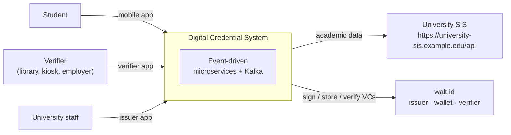

---

## 2. High-level component diagram

The DCS is composed of **four Spring Boot microservices** communicating asynchronously over **Apache Kafka** (Confluent `cp-kafka` in **KRaft** mode — no ZooKeeper). Supporting infrastructure provides service discovery ([Consul](#10-service-discovery-consul)), an API gateway ([Kong](#9-api-gateway-kong)), and a full observability stack.

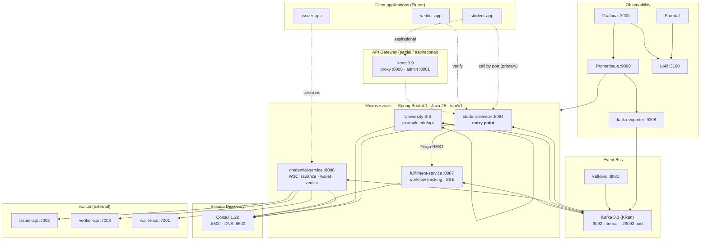

!!! tip "Two integration styles"
    Services talk to each other **asynchronously over Kafka** for the credential pipeline, but `student-service` also makes a **synchronous Feign REST call** to `fulfilment-service` to initialise/poll workflow status (see [§4](#4-service-to-service-communication)).

---

## 3. Microservices in depth

All four services are **Spring Boot 4.1.0** applications on **Java 25**, exposed under context path `/api/v1`, bound to `127.0.0.1` (loopback only) by default, and protected by an API-key filter that checks the `apikey` header with a **constant-time comparison** (`MessageDigest.isEqual`) to avoid timing attacks — see `ApiKeyAuthFilter` in each service and [Security](SECURITY.md).

| Service | Port | Group id | Responsibility |
| --- | --- | --- | --- |
| **student-service** | `8084` | — (producer + `student-app` reply group) | Entry point: login → issuance, verify → verification; polls status |
| **sis-service** | `8085` | `sis-service-group` | SIS integration; resolves academic record; requests issuance |
| **credential-service** | `8086` | `credential-service-*-group` | W3C issuance, wallet, and verification via walt.id |
| **fulfilment-service** | `8087` | `fulfilment-service-workflow-group` | Workflow lifecycle tracking; SSE streaming |

### 3.1 student-service (:8084) — the entry point

The single public entry point. It is deliberately thin: **receive a request, publish to Kafka, return a correlation id.** It never talks to the SIS or walt.id directly.

**Key classes**

| Class | Role |
| --- | --- |
| `StudentController` implements generated `StudentApi` | `POST /student/issue`, `POST /student/verify`, `GET /student/status/{id}`, `GET /student/credentials/{id}` |
| `StudentLoginProducer` | Publishes `student.login.requested` (synchronous send with confirmation by default) |
| `VerificationRequestProducer` | Publishes `verification.requested` |
| `FulfilmentClient` (Feign) | Initialises workflow + proxies status/result from `fulfilment-service` |
| `ApiKeyAuthFilter` | `apikey` header auth |

**`POST /student/issue` behaviour** — generates a random `correlationId` (UUID), publishes it on `student.login.requested`, and immediately returns a `LoginResponse` with `status = PROCESSING` plus `monitorAt` / `credentialsAt` URLs. This is the **async 202-style pattern**: the HTTP call returns instantly while the pipeline runs in the background.

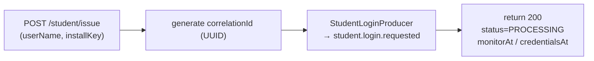

**Status polling** — `getWorkflowStatus` proxies to `fulfilment-service` and **maps** its granular internal states (`INITIATED`, `VALIDATING`, `PREPARING_ISSUER`, `ISSUING_CREDENTIALS`, …) down to the client-facing enum `PROCESSING · COMPLETED · FAILED · CANCELLED`. `getCredentials` returns **HTTP 202** while the workflow is not yet `COMPLETED`, and `200` with the credential offer URLs once it is.

### 3.2 sis-service (:8085) — SIS integration

Bridges the DCS to the **university Student Information System (SIS)**. It consumes `student.login.requested`, calls the SIS to fetch the **full** academic record, and publishes `credential.requests` for the credential engine.

!!! warning "No mock fallback for real data"
    If the SIS call fails, `sis-service` does **not** fabricate student data. It publishes a `credential.error` event and fails the workflow. Credentials are only ever minted from real SIS data.

**Key classes**

| Class | Role |
| --- | --- |
| `StudentLoginConsumer` | `@KafkaListener` on `student.login.requested`; orchestrates the SIS call and forwards to credential-service; uses **request-reply** (`@SendTo`) to confirm the workflow started |
| `SisClient` (Feign) | Typed client to the SIS; base URL injected from config (placeholder `https://university-sis.example.edu/api`) |
| `SisFallback` | Circuit-breaker fallback returning `CIRCUIT_BREAKER_OPEN` sentinels |
| `CredentialWorkflowProducer` | Publishes `credential.requests` — **reusing the original `correlationId`** for end-to-end traceability |
| `ResilienceConfig` | resilience4j circuit breaker + retry registries |
| `SisService`, `ServiceValidator` | Business logic and validation |

**SIS operations** (Feign, all `POST`): `Login`, `Registration`, `GetSIGESEnrolments`, `GetSIGESGrades`, `GetSIGESStudentEvals`, `GetSIGESStudentCourseCredits`, `GetUserScheduleSemester`.

The consumer maps SIS/HTTP failures (`Unauthorized`, `Forbidden`, `NotFound`, `BadRequest`, `Timeout`, `SisApiException`, …) onto internal `ErrorCodes`, publishes a `credential.error`, and returns a structured error reply. See [§13 Resilience](#13-resilience-patterns).

### 3.3 credential-service (:8086) — the credential engine

The core service and the **only** one that talks to walt.id. It handles three workflows — **issuance**, **wallet**, and **verification** — each with its own Kafka consumer group.

**Key classes**

| Class | Role |
| --- | --- |
| `CredentialWorkflowConsumer` | Consumes `credential.requests`; builds + issues VCs; emits `credential.progress/completed/error` |
| `VerificationWorkflowConsumer` | Consumes `verification.requested`; drives walt.id verifier; emits `verification.progress/completed/error` |
| `WalletWorkflowConsumer` | Consumes `wallet.requests`; wallet create/login/DID; emits `wallet.progress/completed/error` |
| `IssuerController` | `POST /issuer/sessions/{id}/issue` — used by the **issuer-app** for session-based batch issuance |
| `VerifierController` | `/verifier/verify`, `/verifier/session/{state}`, `/verifier/session/{id}/credentials` |
| `WaltidService`, `IssuerKeyService`, `StudentWalletService`, `VerifierService` | walt.id integration services |
| `WaltidIssuerClient / WaltidWalletClient / WaltidVerifierClient` | Feign clients to walt.id (:7002 / :7001 / :7003) |
| `GenericCredentialBuilder`, `CredentialDataBuilder` | Assemble the W3C VC JSON from templates + SIS data |
| `CredentialTemplateConfig` / `CredentialTemplate` | Template-driven credential definitions loaded from `application.yml` |
| `CredentialExpirationChecker` | Skips re-issuing a credential type that already exists and is still valid (with a 1-minute in-memory dedupe cache) |

**Template-driven issuance.** Credential types are declared in `application.yml` under `credentials.templates`, not hard-coded. Each template has an `id`, `type`, `enabled` flag, `priority`, `waltidConfigId`, `format`, `fieldMappings` (SIS field → VC field, with fallbacks), `staticFields`, `@context` list, `additionalTypes`, and an optional **SpEL `condition`**. Adding a new credential type is a config change. See [§7 Domain model](#7b-domain-model).

!!! warning "503 when walt.id is down"
    If walt.id is unavailable, issuance/verify return **HTTP 503**. Authentication still succeeds — the 503 signals the downstream dependency, not an auth failure. See [Troubleshooting](TROUBLESHOOTING.md).

### 3.4 fulfilment-service (:8087) — workflow tracking

The "end" of every workflow. It consumes the terminal/progress events and maintains an in-memory `WorkflowStatus` per `correlationId`, and can **stream live updates** to clients over **Server-Sent Events (SSE)**.

**Key classes**

| Class | Role |
| --- | --- |
| `WorkflowEventConsumer` | `@KafkaListener`s on `credential.progress/completed/error` **and** `verification.progress/completed/error`, all in group `fulfilment-service-workflow-group` |
| `FulfilmentService` | Maintains `Map<correlationId, WorkflowStatus>` and `Map<correlationId, SseEmitter>`; pushes updates |
| `FulfilmentController` | `GET /fulfilment/track/{id}` (SSE stream), `GET /fulfilment/status/{id}`, result endpoint |
| `WorkflowStatus`, `WorkflowProgressEvent`, `WorkflowCompletionEvent`, `WorkflowErrorEvent` | Domain events |

`WorkflowStatus` carries `correlationId`, `status`, `progress` (0–100), `message`, `result`, `errorCode`, `errorName`, `errorMessage`, `timestamp`, `lastUpdated`.

---

## 4. Service-to-service communication

There are **two** communication styles in play:

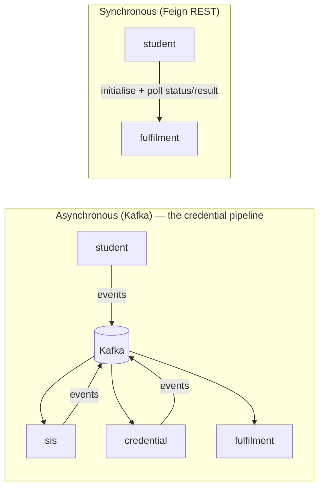

Two consumers additionally use the **Kafka request-reply** pattern (`@SendTo` + a reply template configured on the container factory) so the producer can receive a confirmation that a workflow actually started:

- `sis-service` `StudentLoginConsumer` replies `WORKFLOW_STARTED` / `WORKFLOW_FAILED`.
- `credential-service` `VerificationWorkflowConsumer` replies `VERIFICATION_STARTED` / `VERIFICATION_FAILED`.

---

## 5. End-to-end credential issuance flow

The system is **asynchronous and event-driven**. A student login triggers a chain of Kafka events rather than a synchronous call chain. The **same `correlationId`** is threaded through every hop (Kafka message key + `X-Correlation-ID` header) for end-to-end traceability.

**Pipeline summary**

```
student-service ──student.login.requested──▶ sis-service ──(SIS)──▶
  ──credential.requests──▶ credential-service ──(walt.id)──▶
  ──credential.progress / .completed / .error──▶ fulfilment-service
```

### Detailed sequence

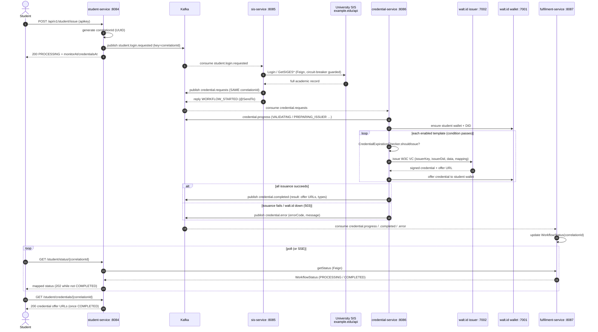

### The correlation-id + async 202 pattern

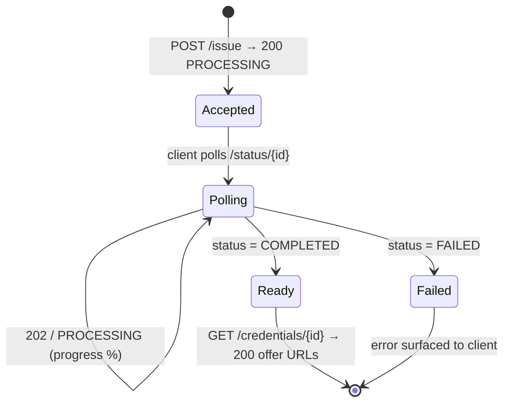

!!! note "Why 202-style?"
    Issuing several signed VCs and offering them to a wallet takes seconds and depends on external systems. Returning immediately with a `correlationId` and letting the client poll (or subscribe to SSE) keeps the API responsive and the pipeline decoupled.

---

## 6. Verification flow

A verifier requests **one** specific credential type. `student-service` publishes `verification.requested`; `credential-service` drives walt.id's **OID4VP** verifier and returns a verification URL (rendered as a QR code) that the student's wallet responds to.

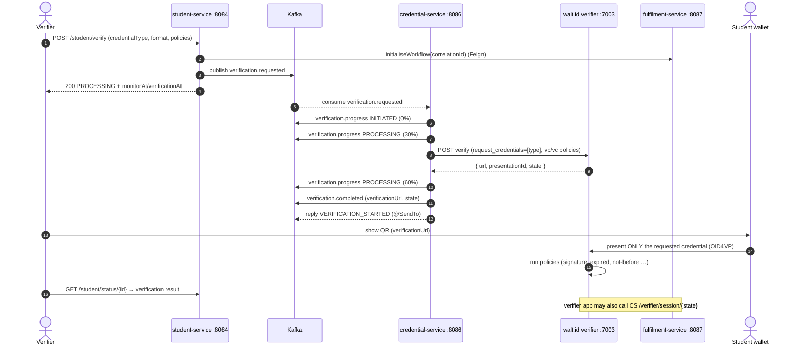

**Verifier endpoints** (`VerifierController`): `POST /verifier/verify` (full request with VP/VC policies), `POST /verifier/verify/basic`, `GET /verifier/session/{state}` (policy results), `GET /verifier/session/{id}/credentials` (`simple` or `verbose` view), `GET /verifier/session/{state}/success`.

---

## 7. Kafka topology

Kafka runs as **Confluent `cp-kafka` 8.3.0 in KRaft mode**.

!!! note "KRaft — no ZooKeeper"
    KRaft (Kafka Raft) removes the external ZooKeeper ensemble; the broker itself hosts the controller quorum. In this single-node dev deployment the broker plays **both** roles: `KAFKA_PROCESS_ROLES = broker,controller`, with `KAFKA_CONTROLLER_QUORUM_VOTERS = 1@kafka:29093`. Replication factors are `1` (single node). `KAFKA_AUTO_CREATE_TOPICS_ENABLE = true`, so topics appear on first use. Default log retention is 7 days (`604800000` ms).

**Listeners** — `CLIENT://kafka:9092` (in-cluster), `EXTERNAL://localhost:29092` (host access, used by services running on the host / dev), `CONTROLLER://…:29093`.

### Topics

| Topic | Producer | Consumer(s) | Purpose |
| --- | --- | --- | --- |
| `student.login.requested` | student-service | sis-service | Student authenticated — start the pipeline |
| `credential.requests` | sis-service | credential-service | Request issuance with full SIS data |
| `credential.progress` | credential-service | fulfilment-service | Intermediate issuance progress (%) |
| `credential.completed` | credential-service | fulfilment-service | Issuance succeeded (offer URLs, types) |
| `credential.error` | credential-service, sis-service | fulfilment-service | Issuance / SIS failure |
| `verification.requested` | student-service | credential-service | Verifier requests a presentation |
| `verification.progress` | credential-service | fulfilment-service | Verification progress (%) |
| `verification.completed` | credential-service | fulfilment-service | Verification URL / result available |
| `verification.error` | credential-service | fulfilment-service | Verification failure |
| `wallet.requests` | credential-service | credential-service | Wallet operation requested |
| `wallet.progress` | credential-service | fulfilment-service | Wallet operation progress |
| `wallet.completed` | credential-service | fulfilment-service | Wallet operation succeeded |
| `wallet.error` | credential-service | fulfilment-service | Wallet operation failed |

Reply topics `credential.reply` / `verification.reply` back the request-reply pattern. Audit topics (`wallet.login`, `wallet.register`, `wallet.account.access`, `wallet.operation`) capture wallet events. A `.DLT` suffix carries dead-letter records when retries are exhausted.

### Producer → topic → consumer graph

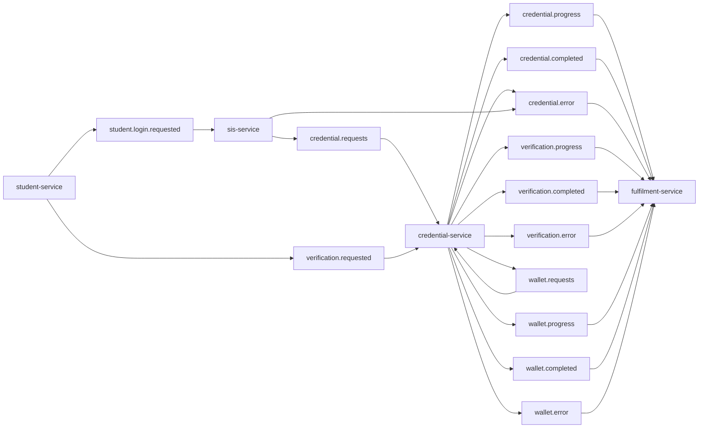

### Consumer groups & partitions

| Group id | Service | Listens to |
| --- | --- | --- |
| `sis-service-group` | sis-service | `student.login.requested` |
| `credential-service-group` | credential-service | `credential.requests` |
| `credential-service-verification-group` | credential-service | `verification.requested` |
| `credential-service-wallet-group` | credential-service | `wallet.requests` |
| `fulfilment-service-workflow-group` | fulfilment-service | all `credential.*` + `verification.*` progress/terminal topics |

The retry defaults create topics with **3 partitions** and listener **concurrency 3** (`default-num-partitions: 3`, `default-concurrency: 3`), so up to three consumers in a group process partitions in parallel. Because the `correlationId` is the **message key**, all events for one workflow land on the same partition and are processed **in order**.

### JSON (de)serialization with trusted packages

Messages are **JSON**, not Avro (the Avro classes under `domain/avro` are legacy). Producers use Spring Kafka `JsonSerializer` with `ADD_TYPE_INFO_HEADERS = false` (no `__TypeId__` header). Consumers use `ErrorHandlingDeserializer` wrapping `JsonDeserializer`, configured to deserialize into `java.util.HashMap` (`VALUE_DEFAULT_TYPE`) and to **not** read type headers.

!!! warning "Trusted packages (security)"
    `JsonDeserializer` is restricted to `spring.json.trusted.packages = com.example.dcs.*,java.util,java.lang` rather than the insecure wildcard `*`. This blocks deserialization-gadget attacks. `ErrorHandlingDeserializer` ensures a single poison message cannot crash the listener container. See [Security](SECURITY.md).

Manual acknowledgement (`ack-mode: manual_immediate`, `enable-auto-commit: false`, `auto-offset-reset: earliest`) plus idempotent producers give at-least-once delivery with ordered, replayable streams.

---

## 8. Selective verification

Verifiers do **not** receive a student's entire credential set. A verifier requests **only the specific credential it actually needs** for a given interaction. For example, a library kiosk that only needs to confirm student status requests the `EducationalID` (or `EuropeanStudentCard`) — never the `UniversityDegree` or identity attributes it has no legitimate need to see.

This selective, purpose-bound model is driven through the walt.id **verifier-api** (`verification.requested` → `verification.completed`) using **OID4VP**: the verifier declares `request_credentials: [{ type, format }]`, the wallet presents only the matching credential, and unrelated credentials and attributes are never transmitted. Per-credential and presentation-level **policies** (e.g. `signature`, `expired`, `not-before`, `webhook`) are evaluated by the verifier.

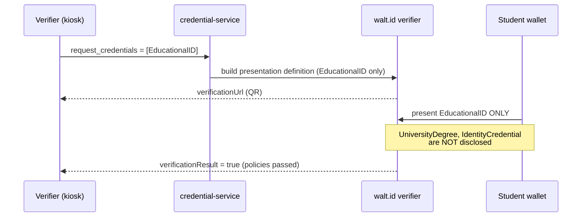

### Example: what each verifier asks for

| Verifier scenario | Credential requested | What is disclosed | What is **not** disclosed |
| --- | --- | --- | --- |
| Library / campus door | `EducationalID` (SCHAC) | Student status, institution | Degree, GPA, home address |
| Cross-border student discount | `EuropeanStudentCard` (ESC) | ESC identifier, validity | Grades, phone number |
| Age-gated service | `IdentityCredential` | `is_over_18` flag only | Exact date of birth, address |
| Employer diploma check | `UniversityDegree` | Degree, classification | Identity address, phone |

This aligns with **data-minimisation (GDPR Art. 5(1)(c))** and limits over-collection. See [Security](SECURITY.md) for the auth model around these endpoints.

---

## 7b. Domain model

### Supported credential types

Four W3C VC types are enabled by default; additional types (KYC, boarding pass, hotel reservation, …) ship **disabled** and can be turned on with `enabled: true` in `application.yml`.

| Type | Standard alignment | walt.id config id | Condition | Notes |
| --- | --- | --- | --- | --- |
| **EducationalID** | SCHAC-aligned | `UniversityDegree_jwt_vc_json` | always | Core educational identity (`@context` includes `europa.eu/.../esi/v1`) |
| **IdentityCredential** | W3C identity | `IdentityCredential_jwt_vc_json` | always | Personal identity + derived `is_over_18/21/65` flags |
| **EuropeanStudentCard** | ESC Initiative | `UniversityDegree_jwt_vc_json` | always | ESC interoperability (`esc/v1` context, `cardType: ESC`) |
| **UniversityDegree** | — | `UniversityDegree_jwt_vc_json` | **conditional** | Graduates only — see below |

The `UniversityDegree` template carries a SpEL **condition** so it is issued only when the SIS record indicates graduation:

```
condition: "#studentData['graduationDate'] != null || #studentData['degreeAwarded'] != null"
```

### Template structure

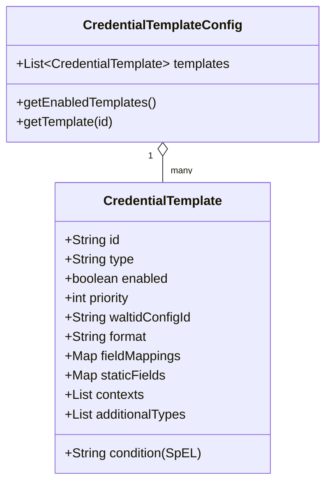

### W3C Verifiable Credential structure

`GenericCredentialBuilder` assembles the VC JSON that walt.id then signs. Note the **issuer is an object `{ "id": <DID> }`** per the W3C VC Data Model, and `credentialSubject.id` is the student's DID.

```mermaid
classDiagram
    class VerifiableCredential {
      +List @context
      +List type
      +Object issuer  "{ id: did:... }"
      +String issuanceDate
      +String expirationDate  "issuance + 365d"
      +Object credentialSubject
    }
    class Issuer { +String id "issuer DID" }
    class CredentialSubject {
      +String id "student DID"
      +mapped fields (studentId, givenName, familyName, email …)
      +static fields (country=PT …)
    }
    VerifiableCredential --> Issuer : issuer
    VerifiableCredential --> CredentialSubject : credentialSubject
```

| VC field | Source | Example |
| --- | --- | --- |
| `@context` | template `contexts` | `["https://www.w3.org/2018/credentials/v1", …]` |
| `type` | `VerifiableCredential` + template `additionalTypes` | `["VerifiableCredential","EducationalID"]` |
| `issuer` | issuer DID (object with `id`) | `{ "id": "did:key:z6Mk…" }` |
| `issuanceDate` | now (ISO-8601) | `2026-07-31T10:00:00Z` |
| `expirationDate` / `validThrough` | now + 365 days | `2027-07-31T10:00:00Z` |
| `credentialSubject.id` | student DID | `did:key:z6Mk…` |
| `credentialSubject.*` | `fieldMappings` from SIS data + `staticFields` | `studentId`, `givenName`, `country: PT` |

Field mappings support **fallback chains** (`studentId: [studentId, studentCode, id]`), **nested grouping** (address fields collapse into an `address` object), and **derived fields** (age flags computed from `birthdate`).

---

## 9. API gateway (Kong)

The gateway is **Kong 3.9**, configured declaratively in [`infra/api-gateway/kong.yml`](https://github.com/marcelogdomingues/ulht-dcs-public/blob/main/api-gateway/kong.yml). It defines a `key-auth` consumer (`apikey` header, `hide_credentials: false` so the same key reaches the backend), a **CORS allow-list**, `rate-limiting` (100/min, 1000/hour), and request/response header transformers.

!!! warning "Honest note — the gateway is partial / aspirational"
    Kong's routes are incomplete: some routes currently return **HTTP 503**, and route paths (`/api/v1/credentials`, `/api/v1/students`, …) do not yet line up with every service. As a result, **clients and the mobile apps call the microservices directly by their loopback ports** (`:8084`–`:8087`). Treat Kong as a work in progress intended to become the single front door.

| Kong endpoint | Port | Notes |
| --- | --- | --- |
| Proxy (HTTP) | `8000` | Intended public entry (partial) |
| Proxy (HTTPS) | `8443` | |
| Admin API | `8001` | **Loopback only** — never expose |
| Admin (HTTPS) | `8444` | |
| Kong-UI (nginx) | `8080` | Static admin UI |

---

## 10. Service discovery (Consul)

**HashiCorp Consul 1.22** provides service discovery and health tracking. Each microservice registers with Consul on startup so peers (and, eventually, the gateway) resolve services by name rather than hard-coded addresses.

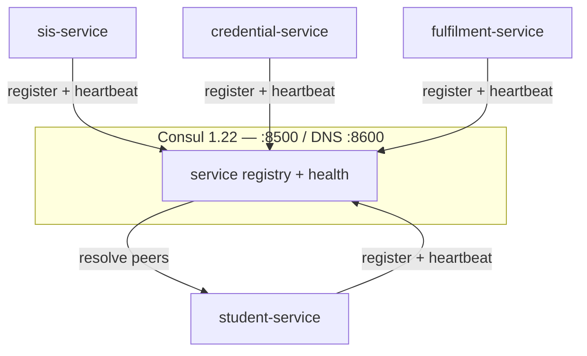

| Consul endpoint | Port |
| --- | --- |
| HTTP API / UI | `8500` |
| DNS interface | `8600` (tcp + udp) |

State is persisted in the `consul_data` volume.

---

## 11. Network topology

The stack is segmented into three Docker bridge networks to isolate concerns. **Every published port binds to `127.0.0.1` only** — nothing is exposed on `0.0.0.0` by default.

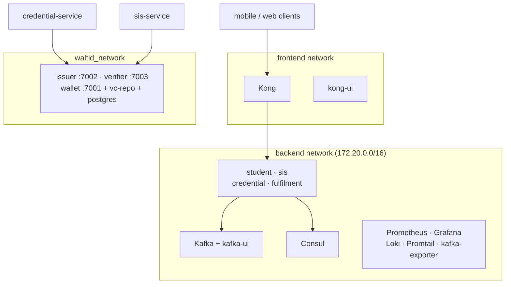

- **frontend** — public-facing edge (Kong, kong-ui). All four services also attach here for gateway reachability.
- **backend** — internal service-to-service, Kafka, Consul, and observability traffic (subnet `172.20.0.0/16`).
- **waltid_network** — the shared external network on which walt.id runs; joined by `credential-service`, `sis-service`, Kong, and kafka-ui.

!!! tip "Loopback binding"
    Bindings such as `127.0.0.1:8086:8086` mean the ports are reachable only from the host machine. For remote access, front the stack with a reverse proxy / SSH tunnel — see [Deployment](DEPLOYMENT.md) and [Security](SECURITY.md).

---

## 12. Deployment view

The stack is split across compose files: [`compose/infrastructure.yml`](https://github.com/marcelogdomingues/ulht-dcs-public/blob/main/compose/infrastructure.yml) (Kafka, Consul, Kong, monitoring), [`compose/microservices.yml`](https://github.com/marcelogdomingues/ulht-dcs-public/blob/main/compose/microservices.yml) (the four services), and a consolidated [`docker-compose.yml`](https://github.com/marcelogdomingues/ulht-dcs-public/blob/main/docker-compose.yml). walt.id runs from its own external compose on `waltid_network`.

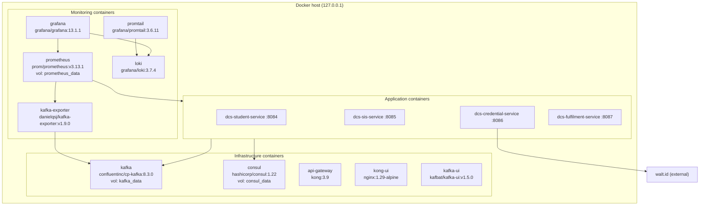

**Volumes:** `kafka_data` (broker logs/state), `consul_data` (registry state), `prometheus_data` (metrics TSDB).

**Images (pinned):** `confluentinc/cp-kafka:8.3.0`, `hashicorp/consul:1.22`, `kong:3.9`, `kafbat/kafka-ui:v1.5.0`, `prom/prometheus:v3.13.1`, `grafana/grafana:13.1.1`, `grafana/loki:3.7.4`, `grafana/promtail:3.6.11`, `danielqsj/kafka-exporter:v1.9.0`, `nginx:1.29-alpine`. See [Deployment](DEPLOYMENT.md).

---

## 13. Resilience patterns

`sis-service` guards **every SIS call** with **resilience4j** circuit breakers and retries (`ResilienceConfig`), because the SIS is the least controllable dependency in the system.

**Circuit breaker** — 50% failure-rate threshold over a sliding window of 10 calls (min 5 calls), 30 s open state, 5 permitted calls in half-open. Records `ConnectException`, `SocketTimeoutException`, `IOException`, `ResourceAccessException`, `FeignException`.

**Retry** — up to 5 attempts, 1 s base wait (exponential backoff), retries the same transport exceptions, **ignores** `IllegalArgumentException` / `NullPointerException`.

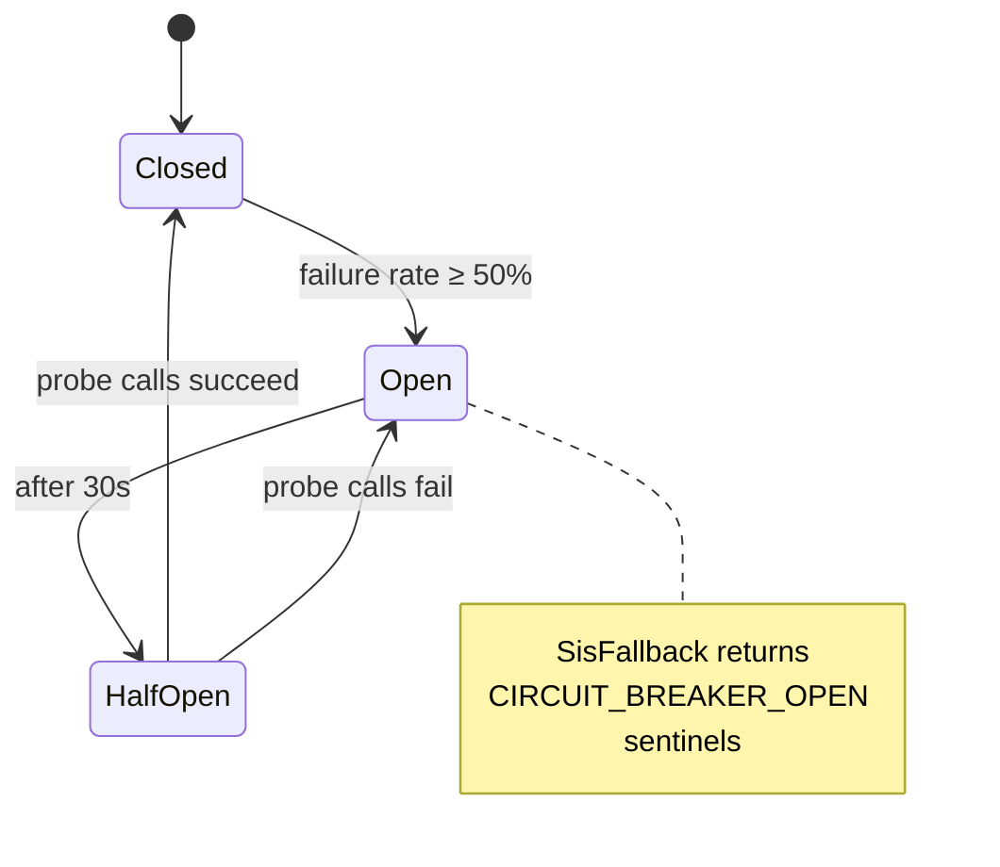

When the breaker is open, `SisFallback` returns sentinel responses (`errorCode = CIRCUIT_BREAKER_OPEN`) instead of throwing, so the consumer can fail the workflow cleanly via `credential.error`. On the credential side, walt.id calls have their own retry config and surface **503** when unavailable. Kafka listeners add **retry topics + a `.DLT`** dead-letter topic and `ErrorHandlingDeserializer` so poison messages don't stall the pipeline.

---

## 14. Observability

Every service exposes Actuator/Micrometer metrics scraped by **Prometheus**; logs flow to **Loki** via **Promtail**; **Grafana** unifies dashboards over both. `credential-service` also emits **business metrics** (`BusinessMetricsService`) such as credentials issued per type.

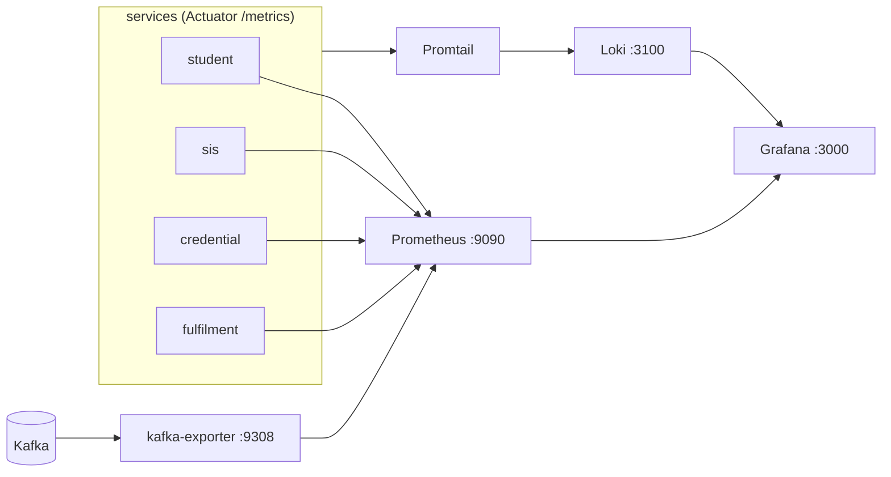

| Component | Port | Role |
| --- | --- | --- |
| Prometheus | `9090` | Metrics scraping + storage |
| Grafana | `3000` | Dashboards (metrics + logs) |
| Loki | `3100` | Log aggregation |
| Promtail | — | Log shipper → Loki |
| kafka-exporter | `9308` | Kafka lag / topic metrics |
| kafka-ui | `8081` | Topic/consumer-group inspection |

!!! tip "Sensitive-data masking"
    Each service ships a `DataMasker` / `KafkaDataMaskingInterceptor` / `DataMaskingFilter` that redacts PII in logs and on Kafka records, controlled by `logging.security.enabled`. See [Security](SECURITY.md).

---

## 15. Error handling

- **HTTP** — every service has a `GlobalExceptionHandler` returning a structured `ErrorResponse` (code, name, message) and consistent status codes; typed exceptions (`UnauthorizedException`, `ForbiddenException`, `NotFoundException`, `ConflictException`, `TimeoutException`, `ExternalServiceException`, `ValidationException`).
- **SIS errors** are mapped from `SisErrorCode` to internal `ErrorCodes` (e.g. `AUTHENTICATION_FAILURE → SIS_AUTH_FAILURE`) and published to `credential.error`, which `fulfilment-service` records with an `errorCode` / `errorName` for the client.
- **Kafka** — `ErrorHandlingDeserializer`, retry topics, `.DLT` dead-letter topics; manual acks prevent premature offset commits on failure.
- **walt.id down** — issuance/verify return **503**; the workflow surfaces the failure rather than issuing bad data.
- **Async status** — `student-service` returns **202** for not-yet-complete workflows and maps unknown/absent status to `PROCESSING` so clients get a stable contract.

---

## 16. Technology stack

| Layer | Technology | Version |
| --- | --- | --- |
| Language / runtime | Java | 25 |
| Framework | Spring Boot | 4.1.0 |
| Cloud / discovery | Spring Cloud | 2025.1.2 |
| API docs | springdoc-openapi | 3.0.3 |
| Resilience | resilience4j-spring-boot4 | 2.4.0 |
| REST client | Spring Cloud OpenFeign | (Spring Cloud 2025.1.2) |
| Build | Maven | 3.9 |
| Event bus | Confluent cp-kafka (KRaft, no ZooKeeper) | 8.3.0 |
| Kafka UI | kafbat/kafka-ui | v1.5.0 |
| Service discovery | HashiCorp Consul | 1.22 |
| API gateway | Kong | 3.9 |
| Metrics | Prometheus | v3.13.1 |
| Dashboards | Grafana | 13.1.1 |
| Logs | Loki / Promtail | 3.7.4 / 3.6.11 |
| Kafka metrics | danielqsj/kafka-exporter | v1.9.0 |
| Credentials | walt.id (external) | issuer :7002 · verifier :7003 · wallet :7001 |
| Clients | Flutter apps | student · verifier · issuer |

---

## Related documentation

- [Deployment](DEPLOYMENT.md) — running the stack
- [Configuration](CONFIGURATION.md) — environment variables
- [Security](SECURITY.md) — API-key auth, masking, hardening
- [Getting Started](GETTING_STARTED.md)
- [API](API.md)
- [Troubleshooting](TROUBLESHOOTING.md)
- [Project README](index.md)
