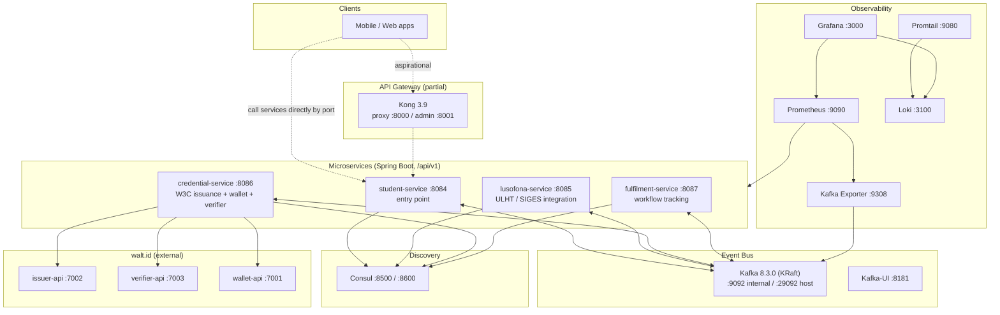
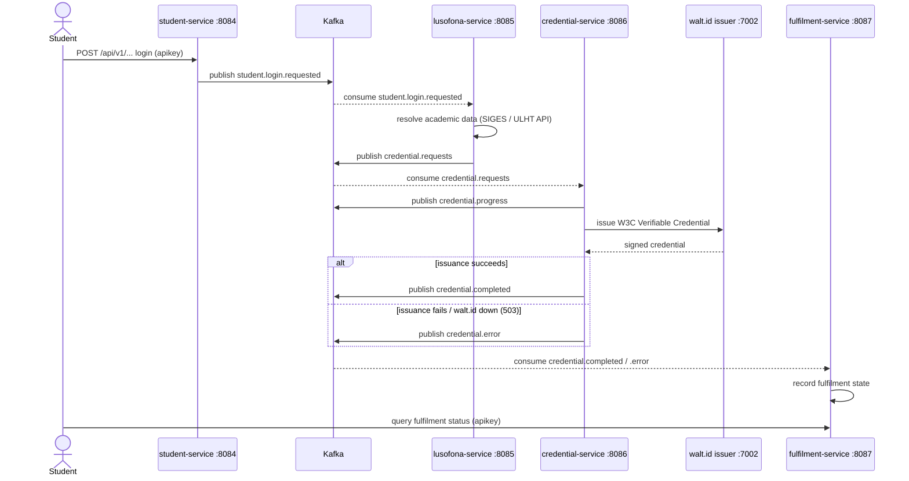
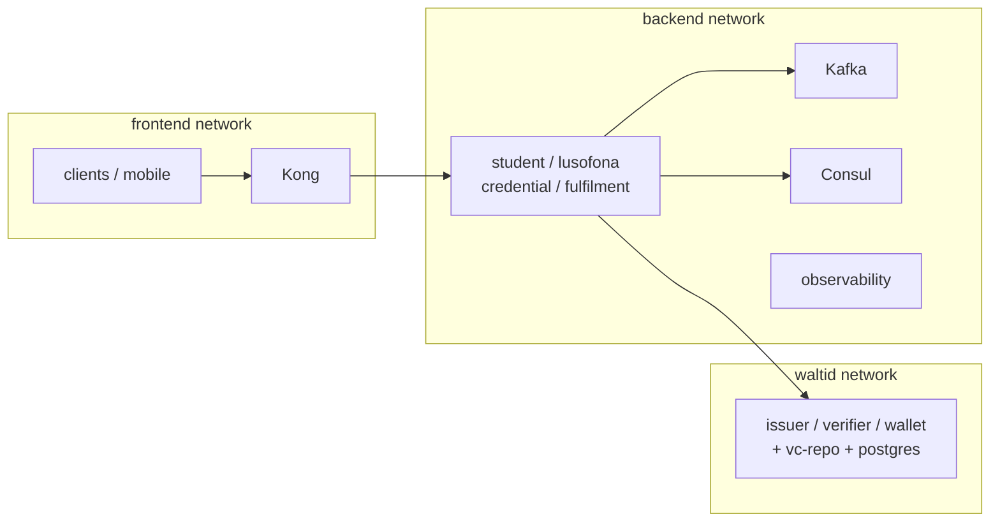

# Architecture

This document describes the architecture of the **ULHT Digital Credential System (DCS)** — an event-driven microservices platform that issues, stores, and verifies W3C Verifiable Credentials for Universidade Lusófona (ULHT) students, backed by [walt.id](#waltid-integration).

> See also: [Deployment](DEPLOYMENT.md) · [Configuration](CONFIGURATION.md) · [Security](SECURITY.md) · [Getting Started](GETTING_STARTED.md) · [API](API.md) · [Troubleshooting](TROUBLESHOOTING.md) · [Project README](../README.md)

---

## System overview

The DCS is composed of **four Spring Boot microservices** communicating asynchronously over **Apache Kafka** (Confluent `cp-kafka` in KRaft mode). Each service owns a slice of the credential lifecycle: authentication entry point, academic data integration, credential issuance/verification, and workflow fulfilment tracking.

Supporting infrastructure provides service discovery ([Consul](#service-discovery-consul)), an API gateway ([Kong](#api-gateway-kong)), an event bus (Kafka + Kafka-UI), and an observability stack (Prometheus, Grafana, Loki, Promtail, Kafka Exporter).

### Technology stack

| Layer | Technology | Version |
| --- | --- | --- |
| Language / runtime | Java | 25 |
| Framework | Spring Boot | 4.1.0 |
| Cloud / discovery | Spring Cloud | 2025.1.2 |
| API docs | springdoc-openapi | 3.0.3 |
| Resilience | resilience4j-spring-boot4 | 2.4.0 |
| Build | Maven | 3.9 |
| Event bus | Confluent cp-kafka (KRaft) | 8.3.0 |
| Service discovery | HashiCorp Consul | 1.22 |
| API gateway | Kong | 3.9 |
| Credentials | walt.id (external) | issuer/verifier/wallet |

### Component diagram



---

## Microservices

All four services are Spring Boot 4.1.0 applications, exposed under the context path `/api/v1`, and bound to `127.0.0.1` (loopback only) by default. Every business endpoint requires the `apikey` header — see [Security](SECURITY.md).

| Service | Port | Responsibility |
| --- | --- | --- |
| **student-service** | `8084` | **Entry point.** Handles student login and initiates the credential flow by publishing `student.login.requested`. |
| **lusofona-service** | `8085` | ULHT / **SIGES** integration and academic data. Resolves the student's academic record and requests credential issuance. |
| **credential-service** | `8086` | **W3C credential issuance, wallet, and verifier** via [walt.id](#waltid-integration). Emits progress/completed/error events. |
| **fulfilment-service** | `8087` | **Workflow tracking.** Consumes completion/error events to record the end-to-end state of each credential request. |

### student-service (:8084)

The single public entry point. A student authenticates here; on success the service emits `student.login.requested` onto Kafka, kicking off the asynchronous pipeline. It does not talk to walt.id or SIGES directly.

### lusofona-service (:8085)

Integrates with the university's **SIGES** systems and ULHT APIs to fetch academic data (enrolment, programme, degree status). It consumes `student.login.requested`, enriches with academic context, and publishes `credential.requests`. The real ULHT API endpoint is injected at runtime via `SPRING_APPLICATION_JSON` in the compose override — see [Deployment](DEPLOYMENT.md).

### credential-service (:8086)

The core credential engine. It:

- Consumes `credential.requests` and calls the walt.id **issuer-api** to mint W3C Verifiable Credentials.
- Manages the student **wallet** via the walt.id **wallet-api** (wallet lifecycle events on `wallet.*` topics).
- Handles **verification** via the walt.id **verifier-api** (`verification.*` topics).
- Emits `credential.progress`, `credential.completed`, and `credential.error`.

If walt.id is unavailable, this service returns **HTTP 503** on issuance/verify endpoints (authentication still succeeds — the 503 signals the downstream dependency is down).

### fulfilment-service (:8087)

Tracks the workflow lifecycle. It consumes the terminal credential events and maintains the fulfilment state so clients can query whether a credential request has completed, is in progress, or errored.

---

## Event-driven flow

The system is **asynchronous and event-driven**. A student login triggers a chain of Kafka events across the services rather than a synchronous request/response call chain.

**Pipeline:**

```
student-service → student.login.requested → lusofona-service
  → credential.requests → credential-service
  → credential.progress / credential.completed / credential.error → fulfilment-service
```

### Sequence: login → issuance → fulfilment



### Kafka topics

Auto-creation of topics is enabled on the broker.

| Topic | Producer | Consumer | Purpose |
| --- | --- | --- | --- |
| `student.login.requested` | student-service | lusofona-service | Student authenticated; start the pipeline |
| `credential.requests` | lusofona-service | credential-service | Request credential issuance for a student |
| `credential.progress` | credential-service | fulfilment-service | Intermediate issuance progress |
| `credential.completed` | credential-service | fulfilment-service | Issuance succeeded |
| `credential.error` | credential-service | fulfilment-service | Issuance failed |
| `verification.requested` | credential-service | credential-service | Verifier requests presentation/verification |
| `verification.completed` | credential-service | fulfilment-service | Verification result available |
| `wallet.requests` | credential-service | credential-service | Wallet operation requested |
| `wallet.progress` | credential-service | fulfilment-service | Wallet operation progress |
| `wallet.completed` | credential-service | fulfilment-service | Wallet operation succeeded |
| `wallet.error` | credential-service | fulfilment-service | Wallet operation failed |

---

## API gateway (Kong)

The gateway is **Kong 3.9**, configured declaratively in `api-gateway/kong.yml`. It defines:

- **key-auth** plugin (API-key based auth), and
- a **CORS allow-list**.

> **Honest note — the gateway is partial / aspirational.** Kong's routes are incomplete: some routes currently return **HTTP 503**. As a result, **clients and the mobile apps call the microservices directly by their loopback ports** (`:8084`–`:8087`) rather than going through the gateway. The Kong configuration is intended to become the single front door but is not yet the primary path. Treat the gateway as a work in progress.

| Kong endpoint | Port | Notes |
| --- | --- | --- |
| Proxy (HTTP) | `8000` | Intended public entry (partial) |
| Proxy (HTTPS) | `8443` | |
| Admin API | `8001` | **Loopback only** — never expose |
| Admin (HTTPS) | `8444` | |
| Kong-UI | `8080` | |

---

## Service discovery (Consul)

**HashiCorp Consul 1.22** provides service discovery and health tracking. Each microservice registers with Consul on startup so that services (and, eventually, the gateway) can resolve peers by name rather than hard-coded addresses.

| Consul endpoint | Port |
| --- | --- |
| HTTP API / UI | `8500` |
| DNS interface | `8600` |

State is persisted in the `consul_data` volume.

---

## Network topology

The stack is segmented into distinct Docker networks to isolate concerns:



- **frontend** — public-facing edge (Kong, client traffic).
- **backend** — internal service-to-service, Kafka, Consul, and observability traffic.
- **waltid** — the shared network on which the external walt.id components run, joined by `credential-service`.

---

## walt.id integration

Credential cryptography, wallet storage, and verification are delegated to **[walt.id](https://walt.id)**. These components are **external to this repository** and run on a shared Docker network:

| walt.id component | Port | Role |
| --- | --- | --- |
| **issuer-api** | `7002` | Issues (signs) W3C Verifiable Credentials |
| **verifier-api** | `7003` | Verifies presentations and credentials |
| **wallet-api** | `7001` | Manages student wallets |
| vc-repo + postgres | — | Credential templates and persistence |

Only **credential-service** communicates with walt.id.

> **Known issue.** Some `issuer-api` versions crash with `notBefore cannot be in the past` due to **expired example certificates**. Use a patched / newer issuer-api (for example **0.22.0**). Without walt.id available, `credential-service` returns **503** on issuance/verify — authentication itself still passes. See [Troubleshooting](TROUBLESHOOTING.md).

---

## Selective verification

Verifiers do **not** receive a student's entire credential set. Instead, a verifier requests **only the specific credential it actually needs** for a given interaction. For example, a library kiosk that only needs to confirm student status requests the `EducationalID` (or `EuropeanStudentCard`) — never the `UniversityDegree` or identity attributes it has no legitimate need to see.

This selective, purpose-bound model is driven through the walt.id **verifier-api** (`verification.requested` → `verification.completed`) and keeps disclosure minimal:

- The verifier declares the required credential type.
- The wallet presents only the matching credential.
- Unrelated credentials and attributes are never transmitted.

This aligns with data-minimisation principles and limits over-collection. See [Security](SECURITY.md) for the auth model surrounding these endpoints.

---

## Credential types

Four W3C Verifiable Credential types are supported:

| Type | Standard alignment | Notes |
| --- | --- | --- |
| **EducationalID** | SCHAC-aligned | Core educational identity for the student |
| **IdentityCredential** | — | Student identity attributes |
| **EuropeanStudentCard** | ESC Initiative | European Student Card interoperability |
| **UniversityDegree** | — | **Conditional** — issued to **graduates only** |

---

## Related documentation

- [Deployment](DEPLOYMENT.md) — running the stack
- [Configuration](CONFIGURATION.md) — environment variables
- [Security](SECURITY.md) — API-key auth and hardening
- [Getting Started](GETTING_STARTED.md)
- [API](API.md)
- [Troubleshooting](TROUBLESHOOTING.md)
- [Project README](../README.md)
