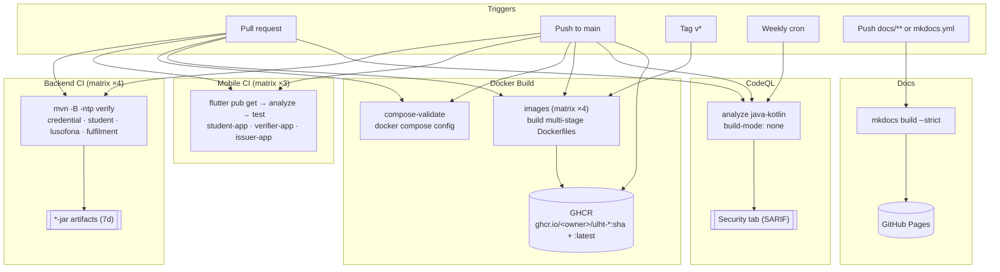

# CI/CD

A thorough guide to continuous integration and delivery for the **ULHT Digital Credential System (DCS)**, implemented with **GitHub Actions**. It explains **every workflow** in `.github/workflows/`, what triggers each one, the path filters that scope them, how to read a failure, the repository settings and secrets they need, and how to reproduce every check locally. Dependabot and the docs-site pipeline are covered too.

> See also: [Contributing](https://github.com/marcelogdomingues/ulht-dcs-public/blob/main/CONTRIBUTING.md) · [Deployment](DEPLOYMENT.md) · [Deployment Checklist](DEPLOYMENT_CHECKLIST.md) · [Security](SECURITY.md) · [Configuration](CONFIGURATION.md) · [Getting Started](GETTING_STARTED.md) · [Project README](index.md)

---

## Overview

| Workflow | File | Purpose | Triggers |
| --- | --- | --- | --- |
| **Backend CI** | `backend.yml` | `mvn -B -ntp verify` (matrix) over the four Maven services on Java 25 | push / PR on backend paths |
| **Mobile CI** | `mobile.yml` | `flutter pub get` → `analyze` → `test` over the three Flutter apps | push / PR on `mobile-apps/**` |
| **Docker Build** | `docker.yml` | Validate Compose config + build 4 service images; push to GHCR on `main`/tags | push / PR / `v*` tags |
| **CodeQL** | `codeql.yml` | Static security analysis of the Java backend (`build-mode: none`) | push/PR on `main` + weekly cron |
| **Docs** | `docs.yml` | Build MkDocs Material site → deploy to GitHub Pages | push on `docs/**`, `mkdocs.yml` + manual |
| **Dependabot** | `dependabot.yml` | Automated dependency-update PRs (maven / pub / docker / actions) | GitHub schedule |

All workflow definitions live in [`.github/workflows/`](https://github.com/marcelogdomingues/ulht-dcs-public/blob/main/.github/workflows) and the Dependabot config in [`.github/dependabot.yml`](https://github.com/marcelogdomingues/ulht-dcs-public/blob/main/.github/dependabot.yml).

!!! note "Backend tests need NO Docker"
    There are **no Testcontainers** in the suite — the tests are plain unit / Spring-context tests. Backend CI runs `mvn -B -ntp verify` on a plain JDK 25 runner with **no Docker daemon**. Avro / OpenAPI code generation is handled automatically by `mvn verify`.

---

## Pipeline at a glance



---

## Backend CI (`backend.yml`)

**What it does.** A build matrix — one job per service, `fail-fast: false` so all four report — over:

- `credential-service`
- `student-service`
- `lusofona-service`
- `fulfilment-service`

Each job checks out the repo, sets up **JDK 25 (Temurin)** via `actions/setup-java@v4` with `cache: maven`, changes into the service directory, and runs:

```bash
mvn -B -ntp verify
```

`-B` is batch (non-interactive) mode; `-ntp` suppresses transfer-progress noise. `verify` compiles, runs the unit/slice tests, and packages the JAR. On success, `actions/upload-artifact@v4` publishes `target/*.jar` as `<service>-jar` (retained **7 days**, `if-no-files-found: warn`).

Because the four services are **independent** Maven projects (no parent/aggregator POM), each is built in isolation — a failure in one does not mask the others.

**Triggers & path filters.** Push and pull request, scoped to the four service directories and `backend.yml` itself:

```yaml
paths:
  - "credential-service/**"
  - "student-service/**"
  - "lusofona-service/**"
  - "fulfilment-service/**"
  - ".github/workflows/backend.yml"
```

`concurrency` cancels superseded runs on the same ref to save minutes.

---

## Mobile CI (`mobile.yml`)

**What it does.** A matrix (`fail-fast: false`) over the three Flutter apps:

- `mobile-apps/student-app`
- `mobile-apps/verifier-app`
- `mobile-apps/issuer-app`

Each job sets up Flutter on the **`stable`** channel (`subosito/flutter-action@v2`, `cache: true`; the project targets Flutter 3.44.x / Dart 3.12), prints the version, then in the app directory runs:

```bash
flutter pub get
flutter analyze
flutter test      # guarded — skipped if the app has no test/ directory
```

**What it checks.** Dependencies resolve cleanly and the Dart analyzer is **clean** — any analyzer warning/error fails the job. The `test` step is wrapped in an `if [ -d test ]` guard so an app without tests does not fail the pipeline.

**Triggers & path filters.** Push / PR on `mobile-apps/**` and `.github/workflows/mobile.yml`.

---

## Docker Build (`docker.yml`)

Two jobs.

### `compose-validate`

Statically validates that the Compose files parse and fully render. Because `.env` and the override are git-ignored, the job exports dummy values inline just for validation:

```yaml
env:
  APP_API_KEY: dummy-api-key
  WALLET_PASSWORD_SECRET: dummy-secret
  WALLET_PASSWORD_SALT: dummy-salt
  GRAFANA_ADMIN_PASSWORD: dummy-grafana-pass
  KAFKA_UI_PASSWORD: dummy-kafka-pass
```

Then it runs `docker compose -f docker-compose.microservices.yml config` and `docker compose -f docker-compose.infrastructure.yml config`.

### `images`

A matrix (`fail-fast: false`) over the four services. Each job sets up Buildx and builds the service image from its **multi-stage Dockerfile** (`maven:3.9-eclipse-temurin-25` build stage → `eclipse-temurin:25-jre-alpine` runtime, non-root — see [Deployment](DEPLOYMENT.md)). It uses the GitHub Actions cache (`cache-from`/`cache-to: type=gha`).

- On **pull requests**: images are **built but not pushed**.
- On **push to `main`** or a **`v*` tag**: after `docker/login-action` to `ghcr.io` (username `github.actor`, password `GITHUB_TOKEN`), images are **pushed to GHCR**:

```
ghcr.io/<owner>/ulht-<service>:<git-sha>
ghcr.io/<owner>/ulht-<service>:latest
```

The `images` job declares `permissions: packages: write` so `GITHUB_TOKEN` can push.

**Triggers & path filters.** Push to `main`, `v*` tags, and PRs — scoped to the service directories, `**/Dockerfile`, `docker-compose.*.yml`, and `docker.yml`.

---

## CodeQL (`codeql.yml`)

**What it does.** Static security analysis of the Java backend (`language: java-kotlin`). Because the four services are independent Maven modules that rely on Avro / OpenAPI code generation, CodeQL's `autobuild` is unreliable here, so the workflow uses **`build-mode: none`** — it analyses the source directly without compiling. Generated sources are not analysed (they are not hand-written).

Results are uploaded to the repo's **Security** tab as SARIF (`permissions: security-events: write`).

**Triggers.** Push and PR on `main`, plus a **weekly cron** (Mondays 06:00 UTC) to pick up new query updates.

---

## Docs (`docs.yml`)

**What it does.** Builds the **MkDocs Material** documentation site and deploys it to **GitHub Pages**.

- `build` job: `actions/setup-python@v5` with `cache: pip` and **`cache-dependency-path: requirements-docs.txt`**, then `pip install -r requirements-docs.txt`, then `mkdocs build --strict` (fails on warnings/broken links), then uploads the `site/` Pages artifact.
- `deploy` job: `actions/deploy-pages@v4` into the `github-pages` environment.

`permissions: pages: write` + `id-token: write`; `concurrency: group: pages` allows one deploy at a time without cancelling an in-progress one.

!!! note "The pip cache needs `requirements-docs.txt`"
    The Python dependency cache is keyed on [`requirements-docs.txt`](https://github.com/marcelogdomingues/ulht-dcs-public/blob/main/requirements-docs.txt) — that file must exist (it pins `mkdocs-material`), or the cache step and the install fail.

**Triggers.** Push on `main` when `docs/**`, `mkdocs.yml`, or `docs.yml` change, plus manual `workflow_dispatch`.

!!! tip "One-time setup"
    Enable Pages once under **Settings → Pages → Build and deployment → Source: GitHub Actions**, or the deploy step has nowhere to publish.

---

## Dependabot (`dependabot.yml`)

Automated dependency-update pull requests across four ecosystems:

| Ecosystem | Covers |
| --- | --- |
| `maven` | Backend service dependencies (one entry per service directory) |
| `pub` | Flutter/Dart packages in each mobile app |
| `docker` | Base images in the service Dockerfiles |
| `github-actions` | Action versions used by the workflows |

Each Dependabot PR runs the normal CI checks, so you only merge an update once Backend / Mobile / Docker CI (and CodeQL) pass against it. Review changelogs for majors before merging.

---

## Reading a failure

1. Open the **Actions** tab (or the **Checks** section of the PR) and click the red job.
2. Expand the failed step; the last lines usually name the cause.

| Symptom | Likely cause | Fix |
| --- | --- | --- |
| `mvn -B -ntp verify` compile error | Java 25 syntax/API issue or missing dependency | Reproduce with `mvn -B -ntp verify` in that service; fix and re-push |
| Test failures in Backend CI | A unit/slice test regressed | Run `mvn -B test` locally; **no Docker needed** |
| `flutter analyze` non-zero exit | Analyzer warning/error introduced | Run `flutter analyze` locally; resolve, don't suppress |
| `flutter test` failure | A widget/unit test broke | Run `flutter test` in the app dir |
| `docker compose ... config` error | Broken Compose YAML or unresolved `${VAR}` | Validate locally; check `.env` interpolation and the dummy-env pattern |
| Image build fails | Dockerfile / build-stage issue | Build the image locally to reproduce |
| GHCR push denied | Missing `packages: write` or packages disabled | See required settings below |
| CodeQL alerts appear | New finding in Java source | Triage in the Security tab; fix or dismiss with justification |
| Docs `mkdocs build --strict` fails | Broken internal link or warning | Build locally with `--strict`; fix links (bare filenames, no `../`) |
| pip cache step fails | `requirements-docs.txt` missing/renamed | Ensure the file exists at repo root |

Re-run a single failed job from the Actions UI ("Re-run failed jobs") once fixed; avoid re-running the whole matrix unnecessarily.

---

## Required repository settings & secrets

| Item | Needed for | Notes |
| --- | --- | --- |
| `GITHUB_TOKEN` | All workflows, GHCR push, Pages deploy | **Automatic** — GitHub injects it per run; nothing to create |
| GHCR package writes | Docker Build push step | Grant Actions **`packages: write`** (the workflow's `permissions:` block and/or Settings → Actions → Workflow permissions). The first push creates the package; then set its visibility |
| Pages source = GitHub Actions | Docs deploy | Settings → Pages → Build and deployment → Source: **GitHub Actions** |
| `security-events: write` | CodeQL | Declared in the workflow; enables SARIF upload to the Security tab |
| Branch protection | Enforcing green CI on `main` | Settings → Branches → protect `main` → **require status checks** (Backend CI, Mobile CI, Docker Build, CodeQL) before merge |
| Dependabot | Update PRs | Enabled by committing `.github/dependabot.yml`; ensure Dependabot is allowed in repo/org settings |

No third-party secrets are required for the core pipeline — GHCR uses the built-in `GITHUB_TOKEN`. If you later push to an external registry, add its credentials as **encrypted repository secrets** (Settings → Secrets and variables → Actions) and never place them in workflow YAML. See [Security](SECURITY.md).

---

## Run the same checks locally

Reproduce each CI gate before pushing:

```bash
# Backend — per service (NO Docker required)
cd credential-service && mvn -B -ntp verify   # repeat for student/lusofona/fulfilment

# Mobile — per app
cd mobile-apps/student-app && flutter pub get && flutter analyze && flutter test

# Docker — validate compose config, then build images
APP_API_KEY=dummy WALLET_PASSWORD_SECRET=dummy WALLET_PASSWORD_SALT=dummy \
GRAFANA_ADMIN_PASSWORD=dummy KAFKA_UI_PASSWORD=dummy \
  docker compose -f docker-compose.microservices.yml config >/dev/null
docker build ./credential-service    # repeat per service (matches the CI build context)

# Docs — build the site strictly (fails on warnings/broken links)
pip install -r requirements-docs.txt
mkdocs build --strict
```

Matching CI locally is the fastest way to keep PRs green. For day-to-day conventions, see [Contributing](https://github.com/marcelogdomingues/ulht-dcs-public/blob/main/CONTRIBUTING.md).

---

## Related documentation

- [Contributing](https://github.com/marcelogdomingues/ulht-dcs-public/blob/main/CONTRIBUTING.md) — build, test, branch & PR conventions
- [Deployment](DEPLOYMENT.md) — Compose files, images, KRaft, healthchecks
- [Deployment Checklist](DEPLOYMENT_CHECKLIST.md) — pre-deployment readiness
- [Security](SECURITY.md) — secrets handling and hardening
- [Configuration](CONFIGURATION.md) — environment variables
- [Project README](index.md)
