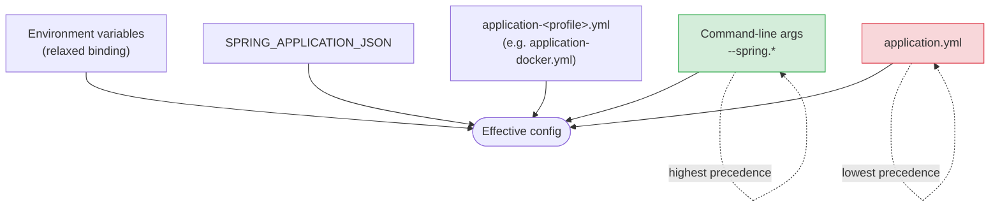

# Configuration

Exhaustive configuration reference for the **ULHT Digital Credential System (DCS)**: every environment variable, the `.env` workflow, Spring profiles and how config is resolved, the complete ports map, a per-service deep-dive, Kafka client settings, and every override mechanism.

Related docs: [Getting Started](GETTING_STARTED.md), [Architecture](ARCHITECTURE.md), [Security](SECURITY.md), [Deployment](DEPLOYMENT.md), [API](API.md), [Mobile Apps](MOBILE_APPS.md), [Troubleshooting](TROUBLESHOOTING.md), and the [project home](index.md).

Stack facts referenced throughout: **Java 25 · Spring Boot 4.1.0 · Spring Cloud 2025.1.2 · Confluent `cp-kafka` 8.3.0 (KRaft, no ZooKeeper) · services `8084`–`8087` · context-path `/api/v1` · API-key `apikey` header**.

---

## Environment variables

All variables are read from the root `.env` file (copied from [`.env.example`](https://github.com/marcelogdomingues/ulht-dcs-public/blob/main/.env.example)). Variables marked **REQUIRED** have no default — `docker compose up` (or the app) fails fast if they are unset.

| Variable | Required? | Default | Used by | Description |
| --- | --- | --- | --- | --- |
| `APP_API_KEY` | No | `ulht-dev-local-CHANGE-ME` | All 4 services | Shared client/gateway key. Every business endpoint expects this in the `apikey` header. Bound in each `application.yml` as `app.security.api-key`. |
| `WALLET_PASSWORD_SECRET` | **Yes** | _(none)_ | credential-service | Secret used to derive per-student wallet passwords (`wallet.password.secret`). No default — the app **fails to start** if unset. |
| `WALLET_PASSWORD_SALT` | **Yes** | _(none)_ | credential-service | Salt combined with the secret for wallet password derivation (`wallet.password.salt`). No default — the app **fails to start** if unset. |
| `APP_CORS_ALLOWED_ORIGINS` | No | `http://localhost:8000,http://localhost:3000` | All 4 services | Comma-separated CORS allow-list (`app.cors.allowed-origins`). |
| `LUSOFONA_API_URL` | No | `https://university-sis.example.edu/api` | lusofona-service | SIS base URL for the `lusofonaClient` Feign client. Placeholder default; override per environment. |
| `GRAFANA_ADMIN_USER` | No | `admin` | Grafana | Grafana admin username. |
| `GRAFANA_ADMIN_PASSWORD` | **Yes** | _(none)_ | Grafana | Grafana admin password. Empty value prevents startup. |
| `KAFKA_UI_USER` | No | `admin` | Kafka-UI | Kafka-UI login username. |
| `KAFKA_UI_PASSWORD` | **Yes** | _(none)_ | Kafka-UI | Kafka-UI login password. |
| `JVM_XMS` / `JVM_XMX` | No | `-Xms256m` / `-Xmx512m` | Kafka-UI | JVM sizing passed via `JVM_OPTS`. |
| `SERVER_PORT` | No | `8084` | student-service | Overrides the student-service HTTP port. |
| `FULFILMENT_SERVICE_URL` | No | `http://localhost:8087/api/v1` | student-service | Base URL of the fulfilment-service Feign client. |
| `KAFKA_PRODUCER_TIMEOUT` | No | `10` | student-service | Seconds to wait for a Kafka send ack. |
| `KAFKA_PRODUCER_SYNCHRONOUS` | No | `true` | student-service | Synchronous send (wait for ack) vs fire-and-forget. |
| `KAFKA_REPLY_ENABLED` | No | `false` | student-service | Enable the request-reply pattern. |
| `KAFKA_REPLY_TIMEOUT` | No | `30000` | student-service | Reply wait timeout (ms). |
| `MYSQL_*` | No | _(placeholder)_ | — | Present in `.env.example` for parity/future use; **not currently wired** into any compose service. |

!!! warning "REQUIRED means fail-fast"
    `WALLET_PASSWORD_SECRET`, `WALLET_PASSWORD_SALT`, `GRAFANA_ADMIN_PASSWORD`, and `KAFKA_UI_PASSWORD` have no defaults. Missing any of them stops the corresponding component from starting. This is intentional — no insecure fallbacks. See the fail-fast notes in [Getting Started](GETTING_STARTED.md).

### The `.env` / `.env.example` workflow

1. Copy the template: `cp .env.example .env`
2. Fill in the required variables (table above). Missing required secrets cause fail-fast startup errors.
3. `.env` is **git-ignored** — never commit real secrets. Keep `.env.example` as the shared, **placeholder-only** template.

!!! note "Placeholders only (public repo)"
    Use placeholders such as `<your-username>`, `<your-install-key>`, and the SIS endpoint `https://university-sis.example.edu/api` in any documentation or examples — never real student values or the real institutional SIS URL.

---

## Spring profiles

Two profiles drive the backend. Locally (Maven/IDE) the **default** profile applies; inside containers the **docker** profile is activated, layering `application-docker.yml` on top of `application.yml`.

| Profile | Where it runs | Purpose |
| --- | --- | --- |
| `default` (local) | Local runs (Maven / IDE) | Local development defaults |
| `docker` | Inside containers | Container-network wiring |

### default vs docker — what actually differs

| Setting | `default` (local) | `docker` |
| --- | --- | --- |
| Kafka bootstrap | `localhost:29092` | `kafka:9092` |
| Consul host | `localhost:8500` | `consul:8500` |
| walt.id issuer / wallet / verifier | `http://localhost:7002 / 7001 / 7003` | `http://issuer-api:7002 / wallet-api:7001 / verifier-api:7003` |
| lusofona SIS client (`lusofonaClient`) | `${LUSOFONA_API_URL:https://university-sis.example.edu/api}` | usually injected via `SPRING_APPLICATION_JSON` (see override) |
| Actuator base-path | `/actuator` | `/actuator` |
| Health path (with `/api/v1` context) | `/api/v1/actuator/health` | `/api/v1/actuator/health` |
| `management.endpoint.health.show-details` | `when-authorized` | `when-authorized` |
| Exposed actuator endpoints | `health,info,prometheus` | `health,info,prometheus` |
| Consul health-check-path | `/api/v1/actuator/health` | `/api/v1/actuator/health` |

The actuator base-path is `/actuator` in **both** profiles, so combined with the `/api/v1` servlet context-path the health endpoint is always at **`/api/v1/actuator/health`**. Public (unauthenticated) endpoints are `/api/v1/actuator/health`, `/api/v1/actuator/info`, plus Swagger (`/api/v1/swagger-ui.html`, `/api/v1/api-docs`). `prometheus` is exposed for scraping but sits behind the security filter (requires `apikey`). See [Security](SECURITY.md).

### Config resolution precedence

Spring Boot merges configuration from several sources. Higher sources win. This is why an env var overrides anything in the YAML files:



!!! note "Precedence order (highest → lowest)"
    1. Command-line arguments (`--spring.kafka.bootstrap-servers=...`)
    2. Environment variables (relaxed binding: `APP_CORS_ALLOWED_ORIGINS` → `app.cors.allowed-origins`)
    3. `SPRING_APPLICATION_JSON`
    4. Profile-specific `application-<profile>.yml`
    5. Base `application.yml`

---

## Ports

All ports are bound to `127.0.0.1` (loopback only) — nothing is exposed to the network by default.

| Component | Host port(s) | Container | Notes |
| --- | --- | --- | --- |
| student-service | `8084` | 8084 | context-path `/api/v1` |
| lusofona-service | `8085` | 8085 | context-path `/api/v1` |
| credential-service | `8086` | 8086 | context-path `/api/v1` |
| fulfilment-service | `8087` | 8087 | context-path `/api/v1` |
| Kong proxy (HTTP) | `8000` | 8000 | API gateway proxy (partial/aspirational) |
| Kong admin API | `8001` | 8001 | loopback admin — never expose |
| Kong proxy / admin (TLS) | `8443` / `8444` | 8443 / 8444 | TLS proxy / TLS admin |
| Kong-UI | `8082` | 80 | nginx static UI (remapped from 8080 to avoid a clash) |
| Kafka | `9092` & `29092` | 9092 / 29092 | KRaft; client & external listeners |
| Kafka controller | — (internal `29093`) | 29093 | KRaft controller listener (not host-published) |
| Consul | `8500` & `8600` | 8500 / 8600 | HTTP+UI / DNS (tcp+udp) |
| Kafka-UI | `8081` → **`8181`** (override) | 8080 | override remaps host port to `8181` |
| Grafana | `3000` | 3000 | |
| Prometheus | `9090` | 9090 | |
| Loki | `3100` | 3100 | |
| Promtail | `9080` | 9080 | |
| Kafka Exporter | `9308` | 9308 | Kafka metrics for Prometheus |

!!! note "Port remaps you will see"
    - **Kafka-UI** publishes to `8081` in `docker-compose.microservices.yml`, but the local override re-publishes it to **`8181`** (a process commonly holds `8081`). Access it at `http://127.0.0.1:8181`.
    - **Kong-UI** is nginx on host **`8082`** (container port `80`); it was moved off `8080` to avoid a conflict.

!!! note "walt.id ports are external"
    The external walt.id backend (wallet `7001` / issuer `7002` / verifier `7003`) is **not** part of this compose project. See [walt-id-backend](GETTING_STARTED.md#walt-id-backend).

---

## Per-service configuration deep-dive

### Common to all four services

- **Context path:** `server.servlet.context-path: /api/v1`.
- **API key:** business endpoints require the `apikey` header matching `app.security.api-key` (`${APP_API_KEY:ulht-dev-local-CHANGE-ME}`).
- **CORS:** `app.cors.allowed-origins` from `${APP_CORS_ALLOWED_ORIGINS:http://localhost:8000,http://localhost:3000}` (comma-separated).
- **Actuator:** `management.endpoints.web.exposure.include: health,info,prometheus`, `base-path: /actuator`, `health.show-details: when-authorized`, Prometheus registry enabled with `application`/`version` tags.
- **Consul discovery:** `health-check-path: /api/v1/actuator/health`, `health-check-interval: 10s`.

### student-service (:8084)

The public entry point. Publishes `student.login.requested` and orchestrates the async flow. Notable extras:

- Configurable port via `${SERVER_PORT:8084}`.
- Fulfilment Feign client base URL `${FULFILMENT_SERVICE_URL:http://localhost:8087/api/v1}`; the client attaches the `apikey` header to every internal call.
- Producer tuning: `kafka.producer.send-timeout` (`${KAFKA_PRODUCER_TIMEOUT:10}` s) and `kafka.producer.synchronous` (`${KAFKA_PRODUCER_SYNCHRONOUS:true}`).
- Optional request-reply pattern: `kafka.reply.enabled` (`${KAFKA_REPLY_ENABLED:false}`), reply topic `student.login.reply`, `timeout` `${KAFKA_REPLY_TIMEOUT:30000}` ms.
- Default Feign timeouts: connect/read `5000` ms, `loggerLevel: basic`.

### lusofona-service (:8085)

SIS / SIGES integration. Notable extras:

- **SIS client URL:** `lusofonaClient` Feign client → `${LUSOFONA_API_URL:https://university-sis.example.edu/api}`. In containers this is typically injected via `SPRING_APPLICATION_JSON` in the override; use the placeholder SIS URL in any shared copy.
- **resilience4j — circuit breaker** (`lusofonaClient`): `failure-rate-threshold: 50`, `wait-duration-in-open-state: 30s`, `permitted-number-of-calls-in-half-open-state: 5`, `sliding-window-size: 10`, `minimum-number-of-calls: 5`.
- **resilience4j — retry** (`lusofonaClient`): `max-attempts: 5`, `wait-duration: 1s`, `exponential-backoff-multiplier: 2`, `max-wait-duration: 30s`.
- Consul `service-name: waltid-proxy`; topics `student.login.requested` (in) and `student.login.reply`.
- Feign/PII logging is deliberately set to `WARN` to avoid leaking `installKey`, passwords, and PII.

### credential-service (:8086)

The credential engine and the only service that talks to walt.id.

- **Wallet password derivation (mandatory):** `wallet.password.secret: ${WALLET_PASSWORD_SECRET}` and `wallet.password.salt: ${WALLET_PASSWORD_SALT}` — **no defaults**, so the service fails fast if unset. Passwords are derived deterministically from student data using these values.
- **walt.id endpoints:** `waltid.issuer.url`, `waltid.wallet.url`, `waltid.verifier.url` (localhost:700x in `default`, `*-api:700x` in `docker`). Feign clients `waltidIssuerClient`, `waltidWalletClient`, `waltidVerifierClient`, `waltidCredentialClient`.
- **Issuance defaults:** `key-type: secp256r1`, `did-method: jwk`, `standard-version: DRAFT13`, `authentication-method: PRE_AUTHORIZED`, `credential-expiry-days: 365`.
- **Verifier defaults:** `authorize-base-url: openid4vp://authorize`, `response-mode: direct_post`, VP policies `[signature]`, VC policies `[signature, expired, not-before]`.
- **Credential templates:** four are enabled by default — `EducationalID` (SCHAC), `IdentityCredential`, `EuropeanStudentCard` (ESC), and `UniversityDegree` (conditional — graduates only, via a SpEL `condition`). Additional types (KYC, boarding pass, hotel reservation) ship disabled. Add/enable types by editing the `credentials.templates` block.
- **Log masking:** `logging.security` masks sensitive fields/headers (passwords, tokens, `apikey`, etc.) in request/response bodies and headers.

### fulfilment-service (:8087)

Workflow tracking. Consumes the terminal credential/wallet/verification events and serves status/progress/result lookups (`/fulfilment/status|progress|result/{correlationId}`) that student-service proxies.

---

## Kafka client configuration

Kafka runs in **KRaft** mode (`confluentinc/cp-kafka:8.3.0`, no ZooKeeper). Bootstrap addresses differ by network vantage point:

| Access path | Bootstrap address |
| --- | --- |
| Inside the container network (docker profile) | `kafka:9092` |
| From the host machine (default/local profile) | `localhost:29092` |

The internal KRaft **controller** listener is `29093` (not host-published).

### Producer / consumer settings (shared across services)

- **Producer:** key serializer `StringSerializer`, value serializer `JsonSerializer`; `max-request-size: 10485760` (10 MB), `buffer-memory: 33554432`, `compression-type: snappy`, `batch-size: 16384`, `linger-ms: 1`.
- **Consumer:** key deserializer `StringDeserializer`, value deserializer `JsonDeserializer`; `fetch-max-bytes` / `max-partition-fetch-bytes: 10485760`; per-service `group-id` (e.g. `credential-service-group`, `lusofona-service-group`).
- **Listener:** `ack-mode: manual_immediate`, `concurrency: 3`, `poll-timeout: 3000`.
- **Trusted packages** (JSON deserialization allow-list, `spring.json.trusted.packages`):
    - credential-service: `pt.ulusofona.ulht.credential,java.util,java.lang`
    - lusofona-service: `pt.ulusofona.digital.wallet,java.util,java.lang`
- **credential-service retry/DLT** (`kafka.retry.*`): enabled with DLT (`.DLT` suffix), `default-retry-attempts: 3`, exponential backoff (`initial 1000ms`, `multiplier 2.0`, `max 10000ms`), idempotent producer, `auto-offset-reset: earliest`, `enable-auto-commit: false`, tracing headers (`X-Correlation-ID`, `X-Trace-ID`, etc.).

!!! warning "KRaft data volume"
    If migrating from a non-KRaft (ZooKeeper) layout, wipe the data volume before the first KRaft start:

    ```bash
    docker volume rm ulht-dcs_kafka_data
    ```

---

## Overriding configuration

Spring Boot resolves configuration from multiple sources (see the precedence diagram above). You can override any property **without editing files**.

**1. Environment variables** (relaxed binding) — the primary mechanism via `.env`:

```bash
APP_CORS_ALLOWED_ORIGINS=http://localhost:8000,http://localhost:3000
LUSOFONA_API_URL=https://university-sis.example.edu/api
```

**2. Command-line arguments** (`--spring.*`) — highest precedence:

```bash
java -jar credential-service.jar \
  --spring.profiles.active=docker \
  --spring.kafka.bootstrap-servers=localhost:29092 \
  --management.endpoint.health.show-details=when-authorized
```

**3. `SPRING_APPLICATION_JSON`** — structured overrides, ideal in compose. This is how the SIS client URL is injected for `lusofona-service` at container runtime:

```bash
export SPRING_APPLICATION_JSON='{
  "spring": {
    "cloud": { "openfeign": { "client": { "config": {
      "lusofonaClient": { "url": "https://university-sis.example.edu/api" }
    }}}}
  }
}'
```

In `docker-compose.override.yml` the equivalent lives under the `ulht-lusofona-service` service's `environment.SPRING_APPLICATION_JSON`. Use the placeholder SIS URL in any shared copy.

For the compose commands and profile activation used by the running stack, see [Getting Started](GETTING_STARTED.md) and [Deployment](DEPLOYMENT.md).
</content>
