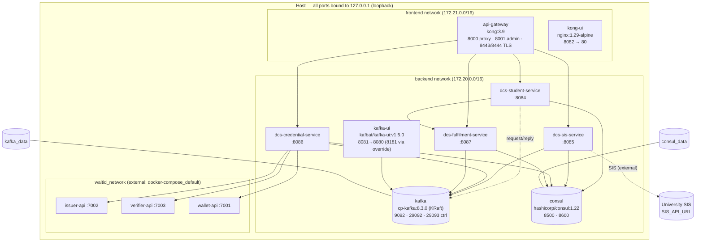
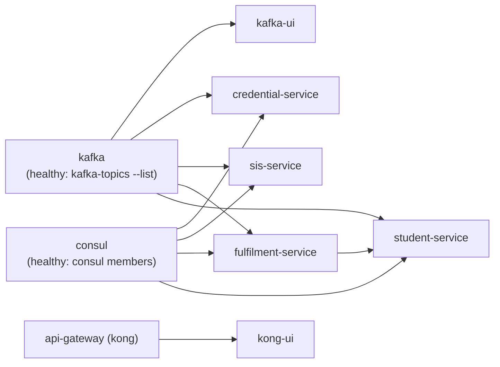
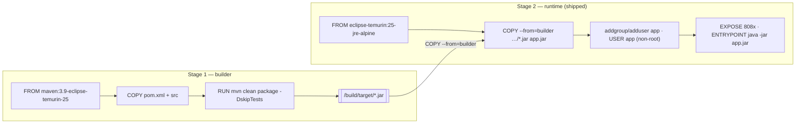

# Deployment

A complete, hands-on guide to building and running the **Digital Credential System (DCS)** with Docker Compose — every container, network, volume, healthcheck, environment variable, and build stage, explained. For the system design behind these components, see [Architecture](ARCHITECTURE.md); for the full variable reference, see [Configuration](CONFIGURATION.md); for the auth model and hardening, see [Security](SECURITY.md).

> See also: [Architecture](ARCHITECTURE.md) · [Configuration](CONFIGURATION.md) · [Security](SECURITY.md) · [Getting Started](GETTING_STARTED.md) · [Troubleshooting](TROUBLESHOOTING.md) · [Deployment Checklist](DEPLOYMENT_CHECKLIST.md) · [CI/CD](CICD.md) · [Project README](index.md)

---

## TL;DR — the one command

```bash
cp .env.example .env          # fill in the REQUIRED secrets first (see below)
docker compose -f docker-compose.microservices.yml -f docker-compose.override.yml up -d --build
```

That builds the four service images and starts the full application stack (Kafka, Consul, Kong, Kafka-UI, Kong-UI, and the four microservices) with the local override applied on top.

!!! warning "Required secrets have no defaults"
    `WALLET_PASSWORD_SECRET`, `WALLET_PASSWORD_SALT`, and `KAFKA_UI_PASSWORD` use the Compose `${VAR:?...}` form — Compose **refuses to start** if they are unset. `GRAFANA_ADMIN_PASSWORD` is additionally required by the infrastructure/observability stack. Copy `.env.example` and fill them in before your first `up`.

---

## Compose files

The repository ships several Compose files. Use the right combination for the job:

| File | Role | Contains |
| --- | --- | --- |
| **`docker-compose.microservices.yml`** | **PRIMARY** — the full application stack | Kafka, Consul, Kafka-UI, Kong (api-gateway), Kong-UI, and the 4 microservices |
| `docker-compose.override.yml` | Local fixes, layered on top of the primary | busybox-`wget` healthchecks, Kafka-UI port remap, SIS endpoint injection |
| `docker-compose.infrastructure.yml` | **Observability + infra** stack | Kafka, Consul, Kafka-UI, Kong, Kong-UI **plus** Prometheus, Grafana, Loki, Promtail, kafka-exporter |
| `docker-compose.dev.yml` | Development variant (run services from your IDE) | infra only, for local IDE workflows |

!!! note "Primary vs. infrastructure"
    `docker-compose.microservices.yml` is what you run day-to-day. The **monitoring** components (Prometheus / Grafana / Loki / Promtail / kafka-exporter) live only in `docker-compose.infrastructure.yml`. Bring up observability separately (see [Observability](#observability)) or compose both files together if you want everything in one `up`.

---

## Deployment topology

The full stack is organised across three Docker bridge networks. `waltid_network` is **external** (it joins the separately-managed walt.id stack), so the credential path can reach the issuer/verifier/wallet.



Every microservice, Kong, Kafka-UI, and Kong-UI attach to both `frontend` and `backend`; only the components that must reach walt.id (Kong, Kafka-UI, credential, sis) also join `waltid_network`. Kafka and Consul sit on `backend` (Consul also on `frontend`).

---

## Run the stack

### 1. Prepare the environment

```bash
cp .env.example .env
# then edit .env — set the REQUIRED secrets and change the defaults you care about
```

| Variable | Default | Required? |
| --- | --- | --- |
| `APP_API_KEY` | `dcs-dev-local-CHANGE-ME` | Change for anything real |
| `APP_CORS_ALLOWED_ORIGINS` | `http://localhost:8000` | No |
| `WALLET_PASSWORD_SECRET` | *(none)* | **Yes — startup fails if unset** |
| `WALLET_PASSWORD_SALT` | *(none)* | **Yes — startup fails if unset** |
| `KAFKA_UI_USER` | `admin` | No |
| `KAFKA_UI_PASSWORD` | *(none)* | **Yes — startup fails if unset** |
| `GRAFANA_ADMIN_USER` | `admin` | No |
| `GRAFANA_ADMIN_PASSWORD` | *(none)* | **Yes for observability stack** |
| `SIS_API_URL` | built-in default | No — point sis-service at your SIS |
| `JVM_XMS` / `JVM_XMX` | `-Xms256m` / `-Xmx512m` | No — Kafka-UI JVM sizing |

See [Configuration](CONFIGURATION.md) for the complete reference.

### 2. Start the full stack

```bash
docker compose -f docker-compose.microservices.yml -f docker-compose.override.yml up -d --build
```

- `-f docker-compose.microservices.yml` — the primary stack.
- `-f docker-compose.override.yml` — local fixes (must be passed explicitly; it is git-ignored and not auto-loaded because the primary file is not named `docker-compose.yml`).
- `-d` — detached.
- `--build` — (re)build the four service images from their Dockerfiles.

### 3. Watch it come up

```bash
docker compose -f docker-compose.microservices.yml -f docker-compose.override.yml ps
docker compose -f docker-compose.microservices.yml -f docker-compose.override.yml logs -f dcs-student-service
```

Wait until every container reports `healthy`. First boot can take a minute or two while Kafka forms its KRaft quorum and the services register with Consul.

---

## Startup ordering & healthchecks

Startup is gated by `depends_on … condition: service_healthy`. Compose will not start a dependent until its dependency's healthcheck passes. The dependency chain:



`student-service` is intentionally last in the application tier: it depends on `kafka`, `consul`, **and** `dcs-fulfilment-service` being healthy (it calls fulfilment synchronously and via Kafka request/reply).

### Healthcheck reference

| Service | Test command (base image) | interval / timeout / retries / start_period |
| --- | --- | --- |
| kafka | `kafka-topics --bootstrap-server localhost:9092 --list` | 30s / 10s / 3 / — |
| consul | `consul members` | 10s / 5s / 5 / 30s |
| kafka-ui | `curl -f http://localhost:8080/actuator/health` | 30s / 10s / 3 / 30s |
| api-gateway (kong) | `kong health` | 30s / 10s / 3 / — |
| credential-service | `curl -f http://localhost:8086/api/v1/actuator/health` | 30s / 10s / 5 / 60s |
| student-service | `curl -f http://localhost:8084/api/v1/actuator/health` | 30s / 10s / 5 / 40s |
| sis-service | `curl -f http://localhost:8085/api/v1/actuator/health` | 30s / 10s / 5 / 60s |
| fulfilment-service | `curl -f http://localhost:8087/api/v1/actuator/health` | 30s / 10s / 5 / 60s |

!!! danger "The `curl` healthchecks fail on the alpine runtime — that's what the override fixes"
    The service runtime image is `eclipse-temurin:25-jre-alpine`, which **does not ship `curl`**. The base `curl`-based healthchecks above will therefore report `unhealthy` even when the app is up. The **override replaces them with busybox `wget`** (see [Override file](#override-file)). Always run with the override.

The public health/metrics endpoints (`/api/v1/actuator/health`, `/info`, `/prometheus`, Swagger UI) do **not** require the `apikey` header — see [Security](SECURITY.md).

---

## Override file

`docker-compose.override.yml` layers **local fixes** on top of the primary Compose file. It is passed explicitly with `-f`. Its three jobs:

### 1. busybox-`wget` healthchecks

The alpine runtime images have no `curl`, so the healthchecks are redefined to use `wget`, which busybox ships:

```yaml
services:
  dcs-student-service:
    healthcheck:
      test: ["CMD", "wget", "-qO-", "http://localhost:8084/api/v1/actuator/health"]
  dcs-credential-service:
    healthcheck:
      test: ["CMD", "wget", "-qO-", "http://localhost:8086/api/v1/actuator/health"]
  # …sis (8085), fulfilment (8087) likewise
```

The same fix applies to `kafka-ui` — the `kafbat/kafka-ui` image ships `wget` but not `curl`, so its default `curl` healthcheck reports unhealthy even though the UI is up.

### 2. Kafka-UI host-port remap

The override moves Kafka-UI off `8081` (a common local conflict) using the `!override` tag so the mapping is replaced, not merged:

```yaml
  kafka-ui:
    ports: !override
      - "127.0.0.1:8181:8080"
```

The **internal** container port is unchanged, so inter-service links still work; only the host port moves to **`8181`**.

### 3. SIS endpoint via `SIS_API_URL` / `SPRING_APPLICATION_JSON`

`sis-service` talks to the university **Student Information System (SIS)**. The override injects the real endpoint at runtime (via `SPRING_APPLICATION_JSON`, wiring the OpenFeign client `url`). In this public repo the value is a **placeholder** — set `SIS_API_URL` in your `.env` to your institution's SIS base URL:

```bash
SIS_API_URL=https://your-sis-endpoint/api
```

!!! tip
    Keep site-specific values (SIS URL, secrets) in `.env` and out of the committed Compose/override files. `.env` is git-ignored.

---

## Kafka in KRaft mode (no ZooKeeper)

Kafka runs as **Confluent `cp-kafka:8.3.0` in KRaft mode** — there is **no ZooKeeper**. A single node acts as both **broker and controller**.

| Setting | Value | Why |
| --- | --- | --- |
| `KAFKA_NODE_ID` | `1` | Node identity in the KRaft quorum |
| `KAFKA_PROCESS_ROLES` | `broker,controller` | Combined mode — one process is both |
| `KAFKA_CONTROLLER_QUORUM_VOTERS` | `1@kafka:29093` | The (single-node) controller quorum |
| `KAFKA_CONTROLLER_LISTENER_NAMES` | `CONTROLLER` | Names the controller listener |
| `CLUSTER_ID` | `MkU3OEVBNTcwNTJENDM2Qk` | Fixed cluster UUID (formats storage on first boot) |
| `KAFKA_LISTENERS` | `CLIENT://0.0.0.0:9092, EXTERNAL://0.0.0.0:29092, CONTROLLER://0.0.0.0:29093` | Three listeners |
| `KAFKA_ADVERTISED_LISTENERS` | `CLIENT://kafka:9092, EXTERNAL://localhost:29092` | In-network vs. host access |
| `KAFKA_INTER_BROKER_LISTENER_NAME` | `CLIENT` | Brokers talk over `CLIENT` |
| Security protocol map | `CLIENT:PLAINTEXT, EXTERNAL:PLAINTEXT, CONTROLLER:PLAINTEXT` | PLAINTEXT for local dev |
| Replication factors | `1` (offsets, txn state) | Single node |

**Listeners at a glance:** services inside the network connect to `kafka:9092` (CLIENT); host tools connect to `localhost:29092` (EXTERNAL); the controller protocol runs on `29093` (CONTROLLER, internal only).

!!! danger "`kafka_data` wipe caveat when migrating from ZooKeeper mode"
    A `kafka_data` volume that was previously written by a **ZooKeeper-mode** broker holds metadata that is **incompatible with KRaft**. The KRaft broker will refuse to start against it. Wipe the volume before the first KRaft start:
    ```bash
    docker compose -f docker-compose.microservices.yml -f docker-compose.override.yml down
    docker volume rm dcs_kafka_data     # volume name = <project>_kafka_data
    docker compose -f docker-compose.microservices.yml -f docker-compose.override.yml up -d
    ```
    Confirm the volume name first with `docker volume ls | grep kafka_data`. `down -v` also removes it.

---

## Container images & versions

| Component | Image | Version | Compose file(s) |
| --- | --- | --- | --- |
| Kafka | `confluentinc/cp-kafka` | `8.3.0` | primary + infra |
| Consul | `hashicorp/consul` | `1.22` | primary + infra |
| API gateway | `kong` | `3.9` | primary + infra |
| Kafka-UI | `kafbat/kafka-ui` | `v1.5.0` | primary + infra |
| Kong-UI / reverse proxy | `nginx` | `1.29-alpine` | primary + infra |
| Prometheus | `prom/prometheus` | `v3.13.1` | infra |
| Grafana | `grafana/grafana` | `13.1.1` | infra |
| Loki | `grafana/loki` | `3.7.4` | infra |
| Promtail | `grafana/promtail` | `3.6.11` | infra |
| Kafka exporter | `danielqsj/kafka-exporter` | `v1.9.0` | infra |
| credential-service | *built locally / GHCR* | Java 25 · Spring Boot 4.1.0 | primary |
| student-service | *built locally / GHCR* | Java 25 · Spring Boot 4.1.0 | primary |
| sis-service | *built locally / GHCR* | Java 25 · Spring Boot 4.1.0 | primary |
| fulfilment-service | *built locally / GHCR* | Java 25 · Spring Boot 4.1.0 | primary |

### Exposed ports

All host ports are bound to **`127.0.0.1` (loopback only)**.

| Component | Host port(s) | Container |
| --- | --- | --- |
| student-service | `8084` | `8084` |
| sis-service | `8085` | `8085` |
| credential-service | `8086` | `8086` |
| fulfilment-service | `8087` | `8087` |
| Kong proxy / admin / TLS | `8000` / `8001` / `8443` / `8444` | same |
| Kong-UI | `8082` | `80` |
| Kafka | `9092`, `29092` | `9092`, `29092` |
| Consul | `8500` (UI/API), `8600` (DNS) | same |
| Kafka-UI | `8081` → **`8181`** via override | `8080` |
| Prometheus *(infra)* | `9090` | `9090` |
| Grafana *(infra)* | `3000` | `3000` |
| Loki *(infra)* | `3100` | `3100` |
| Kafka exporter *(infra)* | `9308` | `9308` |

---

## Dockerfile build (multi-stage)

Each microservice uses a **two-stage** build: a fat Maven+JDK image compiles the JAR, then a slim JRE-alpine runtime image runs it as a **non-root** user. Only the runtime layer ships.



| Aspect | Value |
| --- | --- |
| Build-stage image | `maven:3.9-eclipse-temurin-25` |
| Runtime image | `eclipse-temurin:25-jre-alpine` |
| Runs as | non-root `USER app` (created via `addgroup`/`adduser`) |
| Build cache | `BUILDKIT_INLINE_CACHE: 1` build arg (Compose) + GitHub Actions cache in CI |
| Tests | skipped at image build (`-DskipTests`); run in Backend CI, see [CI/CD](CICD.md) |

!!! note "The Dockerfile bakes a `curl` HEALTHCHECK too"
    The Dockerfile itself declares a `curl`-based `HEALTHCHECK`, but the alpine runtime has no `curl`, so — like the Compose healthchecks — the effective check comes from the busybox-`wget` override. See [Override file](#override-file).

---

## Building & pulling images from GHCR

The **Docker Build** workflow builds one image per service and, on the default branch or a `v*` tag, pushes to the **GitHub Container Registry (GHCR)** using the built-in `GITHUB_TOKEN`. Image tags:

```
ghcr.io/<owner>/dcs-<service>:<git-sha>
ghcr.io/<owner>/dcs-<service>:latest
```

Pull a published image locally (packages must be public, or `docker login ghcr.io` first):

```bash
docker pull ghcr.io/<owner>/dcs-credential-service:latest
```

To run pre-built images instead of building locally, drop `--build` and set an `image:` per service (or add an override that pins `image:` to the GHCR tag). See [CI/CD](CICD.md) for the full pipeline, triggers, and required repo settings.

---

## Volumes & persistence

| Volume | Used by | Contents | Compose file |
| --- | --- | --- | --- |
| `kafka_data` | kafka | KRaft log segments + cluster metadata | primary + infra |
| `consul_data` | consul | Service catalog / KV state | primary + infra |
| `prometheus_data` | prometheus | Time-series TSDB (30d retention) | infra |
| `grafana_data` | grafana | Dashboards, users, plugin state | infra |
| `loki_data` | loki | Aggregated log chunks/index | infra |

Named volumes survive `down`; they are destroyed only by `down -v` or an explicit `docker volume rm`.

---

## Observability

The monitoring stack is defined in **`docker-compose.infrastructure.yml`**: Prometheus, Grafana, Loki, Promtail, and kafka-exporter.

- **Prometheus** (`:9090`) scrapes each service at `/api/v1/actuator/prometheus`, plus `kafka-exporter:9308` and `consul:8500`. Targets are declared in [`monitoring/prometheus.yml`](https://github.com/marcelogdomingues/ulht-dcs-public/blob/main/monitoring/prometheus.yml).
- **Grafana** (`:3000`, admin/`GRAFANA_ADMIN_PASSWORD`) auto-provisions dashboards from [`monitoring/grafana`](https://github.com/marcelogdomingues/ulht-dcs-public/blob/main/monitoring/grafana).
- **Loki** (`:3100`) + **Promtail** ship container logs (Promtail reads `/var/lib/docker/containers`).

Bring it up alongside (or instead of) the primary stack:

```bash
docker compose -f docker-compose.infrastructure.yml up -d
```

---

## Infra-only vs. full stack

**Infrastructure only** (run the microservices from your IDE against containerised Kafka/Consul):

```bash
docker compose -f docker-compose.infrastructure.yml up -d
```

**Full application stack** (primary + override, build included):

```bash
docker compose -f docker-compose.microservices.yml -f docker-compose.override.yml up -d --build
```

---

## walt.id dependency

The [walt.id](ARCHITECTURE.md) components — issuer (`:7002`), verifier (`:7003`), wallet (`:7001`), plus vc-repo + postgres — are **external to this repo** and run on a shared Docker network joined via `waltid_network` (external name `docker-compose_default`). `credential-service`, `sis-service`, Kong, and Kafka-UI join that network.

!!! warning "issuer-api time-bomb"
    Some `issuer-api` versions crash with `notBefore cannot be in the past` (expired example certificates). Use a patched / newer `issuer-api`. Without walt.id reachable, `credential-service` returns **503** on issuance/verify (auth still passes). See [Troubleshooting](TROUBLESHOOTING.md).

---

## Running with real walt.id (bundled)

By default the full stack expects an **external** walt.id. To run a **real** walt.id backend from this repo (so `credential-service` in its normal `docker` profile — **not** `demo` — issues real Verifiable Credentials), use the bundled overlay `docker-compose.waltid.yml` + the config scaffold under `docker/waltid/`.

It stands up walt.id's **issuer** (`:7002`), **verifier** (`:7003`) and **wallet** (`:7001`) APIs on a network **named `docker-compose_default`** — exactly the external network name `docker-compose.microservices.yml` already declares as `waltid_network` — so the app services resolve `issuer-api` / `verifier-api` / `wallet-api` by DNS with **no app-config changes**. The wallet-api uses an embedded SQLite DB (config in `docker/waltid/wallet-api/config/db.conf`), so no extra Postgres container is needed.

Images are **pinned**: `issuer-api:0.22.0` (confirmed to avoid the `notBefore` crash), `verifier-api:0.15.1`, `wallet-api:0.15.1`.

```bash
# 1) Bring up the real walt.id backend FIRST (creates docker-compose_default).
#    The -p docker-compose project name is what makes the network name resolve.
docker compose -f docker-compose.waltid.yml -p docker-compose up -d

# 2) Bring up the app stack; it joins the shared external network.
docker compose -f docker-compose.microservices.yml up -d

# 3) Issue a REAL credential (docker profile — no `demo`):
curl -X POST http://localhost:8084/api/v1/student/issue \
  -H "apikey: $APP_API_KEY" -H "Content-Type: application/json" \
  -d '{"userName":"<student>","installKey":"<key>"}'
```

Verify walt.id is healthy:

```bash
curl -s http://localhost:7002/draft13/.well-known/openid-credential-issuer   # issuer metadata
curl -s http://localhost:7003/openid4vc/policy-list                          # verifier
curl -s http://localhost:7001/livez                                          # wallet
```

Tear down (walt.id last):

```bash
docker compose -f docker-compose.microservices.yml down
docker compose -f docker-compose.waltid.yml -p docker-compose down          # add -v to drop the wallet SQLite volume
```

!!! danger "Dev keys only"
    `docker/waltid/wallet-api/config/auth.conf` ships **non-production placeholder** keys (`encryptionKey`, `signKey`, `tokenKey`) purely so the stack boots out-of-the-box. **Rotate all of them** before any real deployment.

### Revocation-aware issued VCs (ADR 0007)

When issuing against the real walt.id, `credential-service` embeds a W3C `credentialStatus` entry (`type: BitstringStatusListEntry`, `statusPurpose: revocation`, `statusListIndex`, `statusListCredential`) into each VC, pointing at `GET /api/v1/status-list/{listId}`. Set the externally-reachable base URL via `credentials.status.base-url` (default `http://dcs-credential-service:8086/api/v1`) so verifiers can resolve the list. See [ADR 0007](adr/0007-credential-revocation.md).

---

## Running with Keycloak (optional OAuth2)

By default the services authenticate callers with the shared `apikey` header
only. To **additionally** accept an OAuth2 / OIDC Bearer JWT (dual auth — a
request is authenticated with **either** a valid `apikey` **or** a valid
`Authorization: Bearer <jwt>`), layer the optional overlay
`docker-compose.keycloak.yml` on top of the microservices stack. It starts
**Keycloak** (`quay.io/keycloak/keycloak:26.0`, dev mode) importing the realm at
[`docker/keycloak/realm-export.json`](https://github.com/marcelogdomingues/ulht-dcs-public/blob/main/docker/keycloak/realm-export.json)
and sets `SPRING_SECURITY_OAUTH2_RESOURCESERVER_JWT_ISSUER_URI` on every service,
which is what activates the JWT auth leg in `dcs-commons`.

When this overlay is **absent**, no issuer-uri is set, no `JwtDecoder` is created,
and the services stay api-key only (byte-for-byte prior behaviour). The api-key
path keeps working with or without Keycloak.

```bash
# 1) Bring up the app stack WITH the Keycloak overlay.
docker compose \
  -f docker-compose.microservices.yml \
  -f docker-compose.keycloak.yml \
  up -d --build

# 2) Confirm the realm is up (OIDC discovery -> 200).
curl -s http://localhost:8080/realms/dcs/.well-known/openid-configuration | head -c 200

# 3) Obtain an access token (direct-access grant; PLACEHOLDER creds — rotate!).
AT=$(curl -s -X POST \
  http://localhost:8080/realms/dcs/protocol/openid-connect/token \
  -H "Content-Type: application/x-www-form-urlencoded" \
  -d grant_type=password \
  -d client_id=dcs-service \
  -d client_secret=CHANGE-ME-dcs-client-secret \
  -d username=demo-user \
  -d password=CHANGE-ME-demo-user-password \
  | python3 -c 'import sys,json;print(json.load(sys.stdin)["access_token"])')

# 4) Call a protected endpoint with the Bearer token (NO apikey needed).
curl -s -X POST http://localhost:8084/api/v1/student/issue \
  -H "Authorization: Bearer $AT" \
  -H "Content-Type: application/json" \
  -d '{"userName":"<student>","installKey":"<key>"}'

# The apikey path still works too, unchanged:
curl -s -X POST http://localhost:8084/api/v1/student/issue \
  -H "apikey: $APP_API_KEY" -H "Content-Type: application/json" \
  -d '{"userName":"<student>","installKey":"<key>"}'
```

!!! note "Issuer must match the token's `iss`"
    The overlay sets the resource-server issuer-uri to `http://keycloak:8080/realms/dcs`
    (the in-network Keycloak hostname). The `iss` claim in a token is derived from
    the host used to reach the token endpoint. Obtaining a token from the host via
    `http://localhost:8080` yields `iss: http://localhost:8080/realms/dcs`, which
    will **not** match the in-network issuer-uri. For a working end-to-end host
    call, either point the issuer-uri at the same host the token was minted from,
    or fetch the token from inside the compose network
    (`docker compose exec dcs-student-service ...` against `http://keycloak:8080`).
    Keycloak runs with `KC_HOSTNAME_STRICT=false` in dev mode so both hostnames
    resolve.

Tear down:

```bash
docker compose -f docker-compose.microservices.yml -f docker-compose.keycloak.yml down
```

!!! danger "Placeholder credentials"
    The bundled realm ships a confidential client (`dcs-service`), a public
    client (`dcs-public`), and a `demo-user` — all with **placeholder**
    `CHANGE-ME-*` secrets/passwords, plus a `KC_BOOTSTRAP_ADMIN_PASSWORD` default
    of `admin`. **Rotate every one** before any non-local use. See
    [Security → OAuth2 / OIDC (optional)](SECURITY.md#oauth2-oidc-optional).

---

## Production hardening

The defaults are tuned for **local development**. Before any real deployment, work through [Security](SECURITY.md) and the [Deployment Checklist](DEPLOYMENT_CHECKLIST.md), and at minimum:

- **Enable TLS everywhere** — terminate HTTPS at the edge (Kong `8443`/`8444`), and use encrypted listeners between components.
- **Use real secrets** — replace `APP_API_KEY` (default `dcs-dev-local-CHANGE-ME`); set strong `WALLET_PASSWORD_SECRET`, `WALLET_PASSWORD_SALT`, `GRAFANA_ADMIN_PASSWORD`, `KAFKA_UI_PASSWORD`. Never commit `.env`.
- **Do not expose the Kong admin API (`:8001`)** — keep it loopback-only or firewalled; exposing it hands over full gateway control.
- **Restrict CORS** — set `APP_CORS_ALLOWED_ORIGINS` to the exact origins you serve, not a wildcard.
- **Secure Kafka** — enable **SASL/TLS** instead of PLAINTEXT for any non-loopback deployment; the current listeners are PLAINTEXT.
- **Use a secret manager** — inject secrets from Vault / cloud secret store rather than a plaintext `.env` file.
- **Rotate keys** — API keys and wallet secrets on a schedule.

See [Security](SECURITY.md) for the full authentication model and the endpoints exposed without auth.

---

## Tear down

Stop and remove containers (volumes **retained**):

```bash
docker compose -f docker-compose.microservices.yml -f docker-compose.override.yml down
```

Stop and remove containers **and volumes** (destroys `kafka_data`, `consul_data`, and — for the infra file — `prometheus_data`, `grafana_data`, `loki_data`):

```bash
docker compose -f docker-compose.microservices.yml -f docker-compose.override.yml down -v
```

!!! tip
    Use `down -v` for a completely clean slate — it also removes the Kafka log/metadata, which is exactly what you want when reinitialising KRaft.

---

## Related documentation

- [Architecture](ARCHITECTURE.md)
- [Configuration](CONFIGURATION.md)
- [Security](SECURITY.md)
- [Getting Started](GETTING_STARTED.md)
- [Troubleshooting](TROUBLESHOOTING.md)
- [Deployment Checklist](DEPLOYMENT_CHECKLIST.md)
- [CI/CD](CICD.md)
- [Project README](index.md)
