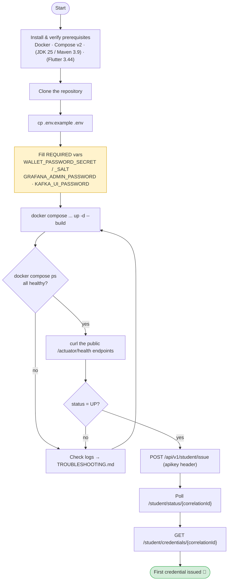
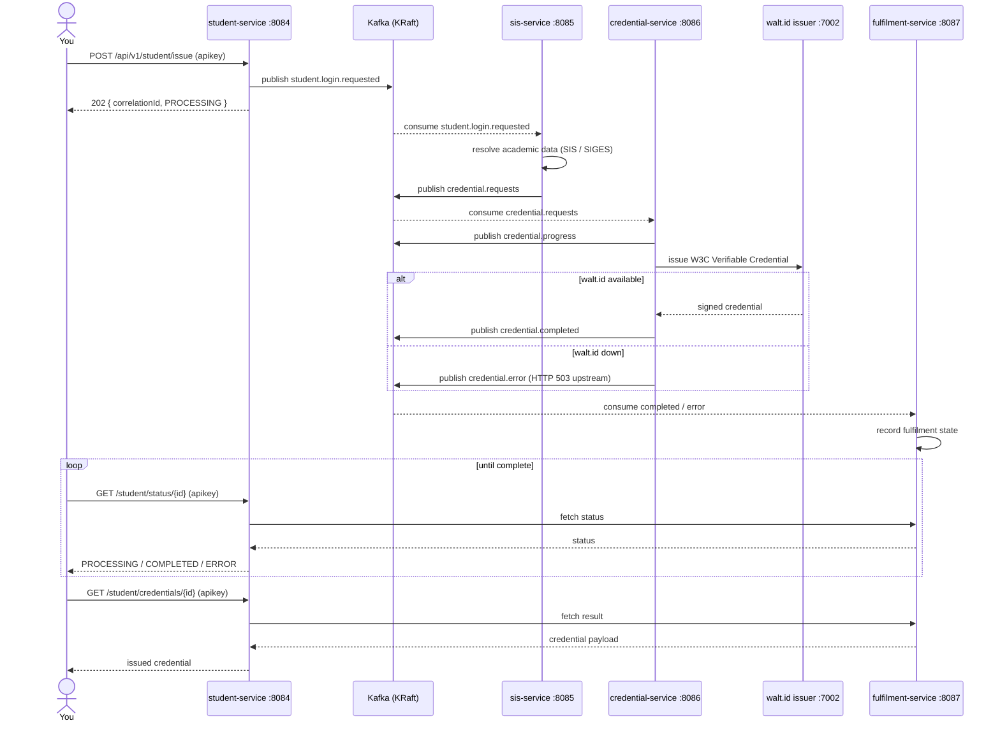

# Getting Started

This guide is a **complete onboarding walkthrough** for the **Digital Credential System (DCS)** — from installing prerequisites to issuing your first W3C Verifiable Credential end-to-end. It explains not just *what* to run, but *why* each step matters and what happens under the hood.

For deeper reference material, see [Configuration](CONFIGURATION.md), [Architecture](ARCHITECTURE.md), [Security](SECURITY.md), [Deployment](DEPLOYMENT.md), [API](API.md), [Mobile Apps](MOBILE_APPS.md), and [Troubleshooting](TROUBLESHOOTING.md). See also the [project home](index.md).

!!! tip "Reading path"
    If you just want the stack running, follow steps 1–4. If you want to see a credential minted, continue through step 5 and the [walt-id-backend](#walt-id-backend) section. If you plan to change code, read [Building a single service locally](#building-a-single-service-locally).

---

## The onboarding journey

The whole process is a linear pipeline: get your tools, configure secrets, build the images, bring the stack up, confirm it is healthy, then issue a credential. If any stage fails, the later stages cannot succeed — so verify as you go.



---

## Prerequisites

You do **not** need Java, Maven, or Flutter to *run* the stack — everything builds and runs inside Docker. You only need those toolchains if you build a backend service locally or work on the mobile apps.

| Tool | Version | When you need it |
| --- | --- | --- |
| Docker Engine | Recent (24+) | **Always** — the whole stack runs in containers |
| Docker Compose | **v2** (`docker compose`, not `docker-compose`) | **Always** — orchestrates the services |
| Java (JDK) | **25** | Only for building a backend service locally with Maven |
| Maven | **3.9** | Only for building a backend service locally |
| Flutter / Dart | **Flutter 3.44 / Dart 3.12** | Only for building/running the mobile apps |

The backend is **Java 25**, **Spring Boot 4.1.0**, **Spring Cloud 2025.1.2**, **springdoc-openapi 3.0.3**, and **resilience4j-spring-boot4 2.4.0**. Kafka runs as **Confluent `cp-kafka` 8.3.0 in KRaft mode (no ZooKeeper)**.

### Verify each tool

```bash
# Docker Engine — expect a version like 24.x or newer
docker --version

# Compose v2 — MUST be the plugin subcommand (space, not hyphen)
docker compose version

# Optional: local backend builds
java -version        # openjdk version "25" ...
mvn -version         # Apache Maven 3.9.x ... Java version: 25

# Optional: mobile apps
flutter --version    # Flutter 3.44.x • Dart 3.12.x
dart --version
```

!!! warning "Compose v1 vs v2"
    This project requires **Compose v2**. The legacy `docker-compose` (hyphenated) binary is not supported. If `docker compose version` errors, install the Compose v2 plugin before continuing.

---

## 1. Clone the repository

```bash
git clone https://github.com/marcelogdomingues/ulht-dcs-public.git dcs
cd dcs
```

The repository layout you will use most:

| Path | What it is |
| --- | --- |
| [`.env.example`](https://github.com/marcelogdomingues/ulht-dcs-public/blob/main/.env.example) | Template for the secrets/config file you must create |
| [`docker-compose.microservices.yml`](https://github.com/marcelogdomingues/ulht-dcs-public/blob/main/docker-compose.microservices.yml) | The compose file that builds & runs the four services + infra |
| `docker-compose.override.yml` | Local-only overrides (health checks, port remaps) — you create this; see below |
| `credential-service/`, `student-service/`, `sis-service/`, `fulfilment-service/` | The four Spring Boot microservices |
| `mobile-apps/` | The Flutter student & verifier apps |

---

## 2. Configure your environment (`.env`)

The stack reads all secrets and tunables from a `.env` file at the repo root. Start from the template:

```bash
cp .env.example .env
```

Then open `.env` and fill in the required variables. **This is not optional.** Several services **fail fast on startup** when a required secret is missing, because the values are used to derive cryptographic material rather than being decorative.

### Which variables are REQUIRED and WHY

| Variable | Required | Why it matters |
| --- | --- | --- |
| `WALLET_PASSWORD_SECRET` | **Yes** | `credential-service` derives each student's wallet password from this secret. It is mapped in `application.yml` as `${WALLET_PASSWORD_SECRET}` **with no default**, so Spring aborts context startup if it is unset. |
| `WALLET_PASSWORD_SALT` | **Yes** | Salt combined with the secret for password derivation. Also `${WALLET_PASSWORD_SALT}` with no default — same fail-fast behaviour. |
| `GRAFANA_ADMIN_PASSWORD` | **Yes** | Grafana refuses to boot with an empty admin password. |
| `KAFKA_UI_PASSWORD` | **Yes** | Kafka-UI login password. |
| `APP_API_KEY` | Recommended | The shared `apikey` gating every business endpoint. Has a dev default (`dcs-dev-local-CHANGE-ME`) — change it, but the stack starts without you setting it. |
| `APP_CORS_ALLOWED_ORIGINS` | No | CORS allow-list; defaults to the Kong proxy origin. |
| `SIS_API_URL` | No | SIS base URL for `sis-service`; overrides the built-in placeholder. |
| `GRAFANA_ADMIN_USER` / `KAFKA_UI_USER` | No | Default to `admin`. |

!!! warning "Fail-fast is intentional"
    If `credential-service` exits immediately on startup with a message about a missing property placeholder, you almost certainly forgot `WALLET_PASSWORD_SECRET` or `WALLET_PASSWORD_SALT`. This is by design — the service will not silently use an insecure default.

Generate strong random values, e.g.:

```bash
# 32-byte base64 secret & salt
openssl rand -base64 32   # → paste into WALLET_PASSWORD_SECRET
openssl rand -base64 16   # → paste into WALLET_PASSWORD_SALT
```

The complete variable reference (defaults, consuming component, precedence) lives in [Configuration](CONFIGURATION.md).

!!! note "Never commit `.env`"
    `.env` is git-ignored. Keep `.env.example` as the shared, **placeholder-only** template. Never put real student IDs, install keys, or the real SIS URL in either file.

---

## 3. Build and run the full stack

Use the **microservices** compose file plus the **override** file. Do **not** use the root `docker-compose.yml` — it is a stale legacy layout.

```bash
docker compose -f docker-compose.microservices.yml -f docker-compose.override.yml up -d --build
```

What this does:

- `-f docker-compose.microservices.yml` — the primary file: builds the four service images and starts Kafka, Consul, Kong, Kafka-UI, and (via included infra) the observability stack.
- `-f docker-compose.override.yml` — local-only tweaks layered on top: it fixes the container health checks (the slim service images ship `wget` but not `curl`) and remaps the Kafka-UI host port to **8181** to avoid clashing with anything on **8081**.
- `up -d` — detached (background).
- `--build` — (re)build the service images from source before starting.

!!! tip "About the override file"
    The public repo does not ship `docker-compose.override.yml`; you create it once. A minimal, working version looks like this — it repairs the health checks and remaps Kafka-UI:

    ```yaml
    services:
      dcs-student-service:
        healthcheck:
          test: ["CMD", "wget", "-qO-", "http://localhost:8084/api/v1/actuator/health"]
      dcs-sis-service:
        healthcheck:
          test: ["CMD", "wget", "-qO-", "http://localhost:8085/api/v1/actuator/health"]
      dcs-credential-service:
        healthcheck:
          test: ["CMD", "wget", "-qO-", "http://localhost:8086/api/v1/actuator/health"]
      dcs-fulfilment-service:
        healthcheck:
          test: ["CMD", "wget", "-qO-", "http://localhost:8087/api/v1/actuator/health"]
      kafka-ui:
        ports: !override
          - "127.0.0.1:8181:8080"
        healthcheck:
          test: ["CMD", "wget", "-qO-", "http://localhost:8080/actuator/health"]
    ```

    `sis-service` additionally needs its SIS client URL pointed at your institution's SIS via `SPRING_APPLICATION_JSON` (see [Configuration](CONFIGURATION.md)); use the placeholder `https://university-sis.example.edu/api` in any shared copy.

!!! warning "Kafka KRaft data volume"
    The broker runs in **KRaft** mode (no ZooKeeper). If you are migrating from an older ZooKeeper-based layout, wipe the Kafka data volume before the first KRaft start, or the broker will refuse to format:

    ```bash
    docker volume rm dcs_kafka_data
    ```

---

## 4. Verify health

First confirm the containers are up and reporting healthy:

```bash
docker compose -f docker-compose.microservices.yml -f docker-compose.override.yml ps
```

Look for `running (healthy)` on each `dcs-*` service. Startup takes a bit — services register with Consul and connect to Kafka before they report `UP`.

Every service exposes a **public** health endpoint (no `apikey` required). Note the context path `/api/v1` and the actuator base-path `/actuator`, so the full path is **`/api/v1/actuator/health`**:

```bash
curl http://127.0.0.1:8084/api/v1/actuator/health   # student-service
curl http://127.0.0.1:8085/api/v1/actuator/health   # sis-service
curl http://127.0.0.1:8086/api/v1/actuator/health   # credential-service
curl http://127.0.0.1:8087/api/v1/actuator/health   # fulfilment-service
```

A healthy service returns `{"status":"UP"}`. (Detailed component breakdowns are only shown `when-authorized`, i.e. with a valid `apikey` — see [Configuration](CONFIGURATION.md).)

Other public surfaces per service:

| URL (per service port) | What it is |
| --- | --- |
| `/api/v1/actuator/health` | Liveness/readiness (public) |
| `/api/v1/actuator/info` | Build/version info (public) |
| `/api/v1/actuator/prometheus` | Metrics scrape (behind `apikey`) |
| `/api/v1/swagger-ui.html` | Interactive API docs |
| `/api/v1/api-docs` | OpenAPI JSON |

Supporting dashboards (all bound to `127.0.0.1`):

| Tool | URL |
| --- | --- |
| Consul UI | `http://127.0.0.1:8500` |
| Kafka-UI | `http://127.0.0.1:8181` (remapped by the override) |
| Grafana | `http://127.0.0.1:3000` |
| Prometheus | `http://127.0.0.1:9090` |

---

## 5. Issue your first credential (end-to-end)

Every business endpoint requires the `apikey` header set to your `APP_API_KEY` value. The flow is **asynchronous**: you request issuance, receive a `correlationId`, then poll until the credential is ready.

### The three calls

**Step 1 — request issuance.** Returns `202 Accepted` with a `correlationId` and `status: PROCESSING`.

```bash
curl -X POST http://127.0.0.1:8084/api/v1/student/issue \
  -H "apikey: <your-app-api-key>" \
  -H "Content-Type: application/json" \
  -d '{"userName":"<your-username>","installKey":"<your-install-key>"}'
```

Response:

```json
{
  "correlationId": "1234-abcd-...",
  "status": "PROCESSING",
  "monitorAt": "/student/status/1234-abcd-...",
  "credentialsAt": "/student/credentials/1234-abcd-..."
}
```

**Step 2 — poll the status** with the returned `correlationId` until it reports completion:

```bash
curl http://127.0.0.1:8084/api/v1/student/status/<correlationId> \
  -H "apikey: <your-app-api-key>"
```

**Step 3 — fetch the issued credential** once the status is complete:

```bash
curl http://127.0.0.1:8084/api/v1/student/credentials/<correlationId> \
  -H "apikey: <your-app-api-key>"
```

!!! warning "Placeholders only"
    Never commit or share real student values. Always use placeholders like `<your-username>` and `<your-install-key>` in examples and docs.

### What happens behind the scenes

The single `POST /student/issue` fans out across four services over Kafka before the credential comes back. This is why you poll rather than block on one request.



See the [API](API.md) reference for the full endpoint catalog.

---

## walt-id-backend

Real credential issuance depends on an **external walt.id stack**, which is **not** part of this compose project. `credential-service` is the only service that talks to it, over these APIs:

| Component | Port | Role |
| --- | --- | --- |
| Wallet API | `7001` | Manages student wallets |
| Issuer API | `7002` | Issues (signs) W3C Verifiable Credentials |
| Verifier API | `7003` | Verifies presentations and credentials |

In the `docker` profile `credential-service` resolves these by container name (`http://issuer-api:7002`, `http://wallet-api:7001`, `http://verifier-api:7003`); locally it uses `http://localhost:7002/7001/7003`. Stand up the walt.id stack on the shared `waltid` Docker network so `credential-service` can reach it.

!!! note "Without walt.id running"
    Authentication still passes (a valid `apikey` is accepted), but issuance/verification calls return **HTTP 503** because the downstream issuer/verifier/wallet APIs are unavailable. A 503 here means "dependency down", not "bad request".

!!! warning "Known issue — expired example certificates"
    Some `issuer-api` versions crash with **`notBefore cannot be in the past`** because the bundled example certificates have expired. Use a **newer / patched `issuer-api`** (for example **0.22.0**). See [Troubleshooting](TROUBLESHOOTING.md) for the certificate / `notBefore` workaround.

---

## Building a single service locally

If you want to build and test just one service with Maven (Java 25 + Maven 3.9 required):

```bash
cd credential-service && mvn -B verify
```

`mvn -B verify` runs a non-interactive (batch) build including unit and integration tests. Swap the directory for `student-service`, `sis-service`, or `fulfilment-service` as needed. For a faster package-only build, use `mvn -q clean package`.

When you run a service outside Docker it uses the **default (local)** Spring profile — Kafka bootstrap `localhost:29092`, Consul on `localhost`, and walt.id on `localhost:700x`. See the profile differences in [Configuration](CONFIGURATION.md).

---

## Running the mobile apps

The Flutter apps (student and verifier) call the services directly by loopback port and are configured at build time via `--dart-define` values. Full setup, run commands, and required defines are documented in [Mobile Apps](MOBILE_APPS.md). You need **Flutter 3.44 / Dart 3.12**.

---

## Common first-run problems

| Symptom | Likely cause | Where to look |
| --- | --- | --- |
| `credential-service` exits on startup | `WALLET_PASSWORD_SECRET` / `WALLET_PASSWORD_SALT` missing from `.env` | [TROUBLESHOOTING.md](TROUBLESHOOTING.md) · [CONFIGURATION.md](CONFIGURATION.md) |
| Grafana / Kafka-UI won't start | Empty `GRAFANA_ADMIN_PASSWORD` / `KAFKA_UI_PASSWORD` | [TROUBLESHOOTING.md](TROUBLESHOOTING.md) |
| Container marked `unhealthy` but service works | Health check uses `curl` (absent) — apply the `wget` override | [TROUBLESHOOTING.md](TROUBLESHOOTING.md) |
| Kafka refuses to start after an upgrade | Stale non-KRaft data volume | `docker volume rm dcs_kafka_data` |
| Business endpoint returns `401` | Missing/incorrect `apikey` header | [SECURITY.md](SECURITY.md) |
| Issuance returns `503` | walt.id backend not running | [walt-id-backend](#walt-id-backend) · [TROUBLESHOOTING.md](TROUBLESHOOTING.md) |
| `issuer-api` crash: `notBefore cannot be in the past` | Expired example certs in old issuer-api | Use patched issuer-api (0.22.0) · [TROUBLESHOOTING.md](TROUBLESHOOTING.md) |
| Port `8081` already in use | Local process on 8081 | Override remaps Kafka-UI to `8181` |

---

## Where to go next

- [Configuration](CONFIGURATION.md) — every environment variable, ports, and Spring profiles
- [Architecture](ARCHITECTURE.md) — how the services fit together
- [API](API.md) — endpoint reference
- [Security](SECURITY.md) — auth model and secrets handling
- [Deployment](DEPLOYMENT.md) — deploying beyond local
- [Mobile Apps](MOBILE_APPS.md) — building and running the Flutter clients
- [Troubleshooting](TROUBLESHOOTING.md) — common failures, including the walt.id `notBefore` issue
</content>
</invoke>
