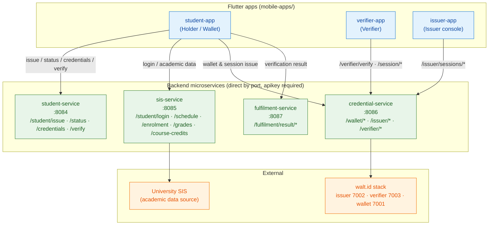
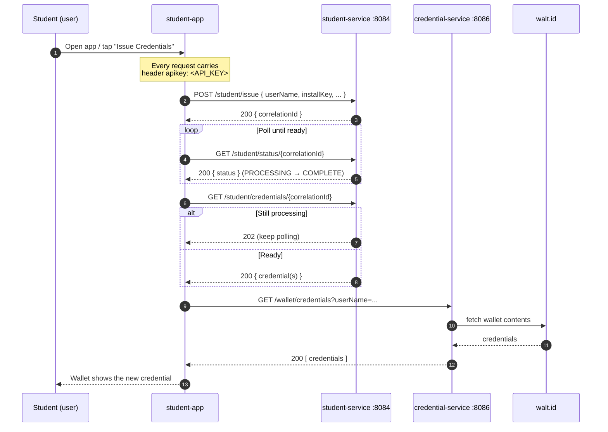
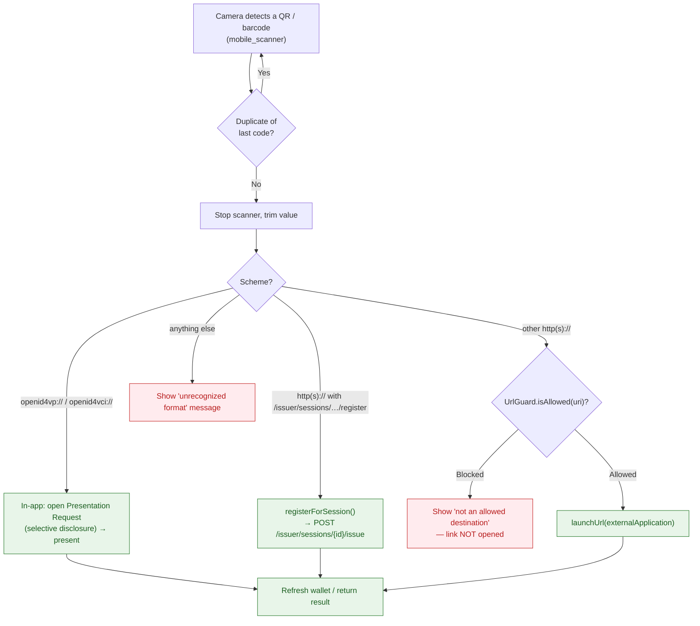

# Mobile Apps

The Digital Credential System ships **three** [Flutter](https://flutter.dev) applications, one per role in the Verifiable Credential (VC) lifecycle. They live under [`mobile-apps/`](https://github.com/marcelogdomingues/ulht-dcs-public/blob/main/mobile-apps) and share the same networking design: **each app talks directly to the backend microservices by port** and authenticates every request with an `apikey` header.

See also: [Getting Started](GETTING_STARTED.md) · [Configuration](CONFIGURATION.md) · [Security](SECURITY.md) · [API](API.md) · [Architecture](ARCHITECTURE.md) · [Troubleshooting](TROUBLESHOOTING.md) · [Project home](index.md)

---

## 1. Overview — the three apps and their roles

The system implements the classic **issuer → holder → verifier** trust triangle of Verifiable Credentials. Each Flutter app plays one corner of that triangle:

| App | Role in the trust triangle | What a user does with it |
| --- | --- | --- |
| **student-app** | **Holder / Wallet** | Log in, view academic data (schedule, enrolment, grades, course credits), request and hold Verifiable Credentials in a wallet, scan QR codes to **present** credentials to a verifier, and scan session QR codes to **receive** new session credentials. |
| **verifier-app** | **Verifier** | Start a verification session, show a QR code for the student to scan, poll for the presentation, then validate the presented credential against the credential service and record / export / share / print the result. |
| **issuer-app** | **Issuer / registration console** | Create conference/event sessions, generate a per-session registration QR code, and view the students who registered. Session credentials are issued to students who scan the QR with the student-app. |

!!! note "Directory layout"
    - [`mobile-apps/student-app/`](https://github.com/marcelogdomingues/ulht-dcs-public/blob/main/mobile-apps/student-app)
    - [`mobile-apps/verifier-app/`](https://github.com/marcelogdomingues/ulht-dcs-public/blob/main/mobile-apps/verifier-app)
    - [`mobile-apps/issuer-app/`](https://github.com/marcelogdomingues/ulht-dcs-public/blob/main/mobile-apps/issuer-app)

### Which backend service each app talks to (by port)

Every app is a thin client over the backend microservices. The diagram below shows exactly which service (and port) each app calls, and what those services depend on.



**Key takeaways**

- **student-app is the only app that touches all four services** — it is the full wallet.
- **verifier-app and issuer-app only touch credential-service (`:8086`)** — the verifier under `/verifier/*`, the issuer under `/issuer/*`.
- The apps **never** call the Kong gateway (`:8000`); see [Networking design](#3-networking-design-direct-service-calls) below.

---

## 2. Tech stack

All three apps are built with the same toolchain.

| Component | Version |
| --- | --- |
| Flutter SDK | 3.44.8 |
| Dart SDK | 3.12.2 (constraint `>=3.0.0 <4.0.0`) |
| Material Design | 3 (`useMaterial3: true`) |
| State management | `provider` (`ChangeNotifierProvider`) |

### Packages by app

The exact dependency set differs per app. Verified from each `pubspec.yaml`:

| Package | Version | student-app | verifier-app | issuer-app | Purpose |
| --- | --- | :---: | :---: | :---: | --- |
| `http` | ^1.2.2 | ✅ | ✅ | ✅ | REST calls to backend services |
| `provider` | ^6.1.2 | ✅ | ✅ | ✅ | State management |
| `qr_flutter` | ^4.1.0 | ✅ | ✅ | ✅ | Render QR codes |
| `url_launcher` | ^6.3.1 | ✅ | ✅ | ✅ | Open external / credential-exchange URLs |
| `intl` | ^0.20.2 | ✅ | ✅ | ✅ | Date/number formatting |
| `shared_preferences` | ^2.x | ✅ | ✅ | ✅ | Non-sensitive UI preferences / local mock data |
| `flutter_secure_storage` | ^10.3.1 | ✅ | — | ✅ | Encrypted storage for tokens / PII |
| `mobile_scanner` | ^7.4.0 | ✅ | — | — | QR / credential-offer scanning (camera) |
| `flutter_local_notifications` | ^22.2.0 | — | ✅ | — | Local verification notifications |
| `share_plus` | ^13.3.0 | — | ✅ | — | Share / export verification results |
| `printing` | ^5.14.3 | — | ✅ | — | Print a verification result / receipt |
| `csv` | ^8.0.0 | — | ✅ | — | Export verification history to CSV |
| `screenshot` | ^3.0.0 | — | ✅ | — | Capture a shareable result image |
| `image_picker` | ^1.2.1 | — | ✅ | — | Pick images (e.g. QR from gallery) |
| `path_provider` | ^2.1.5 | — | ✅ | — | Temp files for export/share |
| `vibration` / `audioplayers` | ^3.x / ^6.x | — | ✅ | — | Haptic + sound feedback on scan/verify |
| `flutter_animate` / `lottie` | ^4.x / ^3.x | — | ✅ | — | Result animations |
| `cupertino_icons` | ^1.0.8 | ✅ | ✅ | ✅ | iOS-style icons |

> Source of truth: each app's `pubspec.yaml` —
> [student-app](https://github.com/marcelogdomingues/ulht-dcs-public/blob/main/mobile-apps/student-app/pubspec.yaml),
> [verifier-app](https://github.com/marcelogdomingues/ulht-dcs-public/blob/main/mobile-apps/verifier-app/pubspec.yaml),
> [issuer-app](https://github.com/marcelogdomingues/ulht-dcs-public/blob/main/mobile-apps/issuer-app/pubspec.yaml).

---

## 3. Networking design — direct service calls

!!! important "The apps do NOT use the Kong gateway"
    The apps do **not** call the Kong gateway (port `8000`). They call each backend service **directly on its own port** (`8084`–`8087`).

Why direct calls instead of a single gateway route (verbatim from the app source, e.g. [`student-app/lib/services/api_service.dart`](https://github.com/marcelogdomingues/ulht-dcs-public/blob/main/mobile-apps/student-app/lib/services/api_service.dart)):

- There is **no single working gateway route** today.
- Different features live on **different services**.
- `student-service` and `sis-service` **both** serve `/api/v1/student/*` paths — a collision a gateway route cannot disambiguate.

Consequences of this design, baked into every `ApiService`:

1. **Four base URLs, not one.** Each service base URL is an independent `--dart-define`.
2. **The `apikey` header on every request.** The backend enforces this via Spring Security — only `/api/v1/actuator/health`, `/info`, `/prometheus`, and Swagger are public; every business endpoint returns `401 Unauthorized` without a valid key. Headers are centralised so no call site can forget the key:

   ```dart
   static Map<String, String> get _headers => {
         'Content-Type': 'application/json',
         'apikey': _apiKey,
       };
   ```
3. **Build-time configuration.** All base URLs and the key come from `--dart-define`; dev defaults point at local ports.

### Sequence — student issuing and receiving a credential (app's perspective)

This is the student-app flow for the SIS-backed credential issuance (`POST /student/issue` → poll status → fetch credentials → they land in the wallet).



---

## 4. Build-time configuration (`--dart-define`)

Every configurable value is a compile-time constant read via `String.fromEnvironment(...)`. Pass them with `--dart-define=KEY=VALUE` on `flutter run` / `flutter build`.

### Shared across apps

| Key | Default | Used by | Description |
| --- | --- | --- | --- |
| `API_KEY` | `dcs-dev-local-CHANGE-ME` | all | Shared API key sent as the `apikey` header on **every** request. |
| `STUDENT_SVC_URL` | `http://localhost:8084/api/v1` | student-app | student-service (`/student/issue`, `/status`, `/credentials`, `/verify`). |
| `SIS_SVC_URL` | `http://localhost:8085/api/v1` | student-app | sis-service (`/student/login`, `/schedule`, `/enrolment`, `/grades`, `/course-credits`). |
| `CREDENTIAL_SVC_URL` | `http://localhost:8086/api/v1` | all | credential-service (`/wallet/*`, `/issuer/*`, `/verifier/*`). |
| `FULFILMENT_SVC_URL` | `http://localhost:8087/api/v1` | student-app | fulfilment-service (`/fulfilment/result/*`). |

!!! note "Which apps read which keys"
    - **student-app** reads all five keys above (plus the two student-only keys below).
    - **verifier-app** reads `API_KEY` + `CREDENTIAL_SVC_URL` only (it derives `…/verifier`).
    - **issuer-app** reads `API_KEY` + `CREDENTIAL_SVC_URL` only (it uses `…/issuer`).

### student-app only

| Key | Default | Description |
| --- | --- | --- |
| `STUDENT_USERNAME` | *(empty)* | Student login username. **Replaced a previously hardcoded credential** that was removed from the source. |
| `STUDENT_INSTALL_KEY` | *(empty)* | Student install key. **Replaced a previously hardcoded credential** that was removed from the source. |

These two are a **temporary dev convenience** with empty defaults. At runtime they are loaded from secure storage first (via `ApiService.loadCredentials()` at startup), falling back to the `--dart-define` values. A real login screen would call `ApiService.setCredentials(...)` to persist them.

!!! danger "Never commit real credentials"
    Use placeholder values in docs and scripts. Real student credential values must be supplied at build time via `--dart-define`, or entered at runtime — **never** compiled in and committed.

---

## 5. Running an app

From the app directory (`mobile-apps/student-app`, `mobile-apps/verifier-app`, or `mobile-apps/issuer-app`):

```bash
# 1. Fetch dependencies
flutter pub get

# 2. Run on a connected device / emulator with the dev defaults
flutter run
```

### With explicit configuration (recommended)

```bash
# student-app — reads all four service URLs
flutter run \
  --dart-define=API_KEY=dcs-dev-local-CHANGE-ME \
  --dart-define=STUDENT_SVC_URL=http://localhost:8084/api/v1 \
  --dart-define=SIS_SVC_URL=http://localhost:8085/api/v1 \
  --dart-define=CREDENTIAL_SVC_URL=http://localhost:8086/api/v1 \
  --dart-define=FULFILMENT_SVC_URL=http://localhost:8087/api/v1 \
  --dart-define=STUDENT_USERNAME=<student-username> \
  --dart-define=STUDENT_INSTALL_KEY=<student-install-key>
```

```bash
# verifier-app / issuer-app — only need the credential service + key
flutter run \
  --dart-define=API_KEY=dcs-dev-local-CHANGE-ME \
  --dart-define=CREDENTIAL_SVC_URL=http://localhost:8086/api/v1
```

### Running in the browser (web)

```bash
flutter run -d web-server --web-port=5001 --web-hostname=127.0.0.1
```

!!! tip "Emulator / device networking"
    `localhost` inside an emulator is the **emulator**, not your host. Use `10.0.2.2` (Android emulator loopback to host) or your host's LAN IP for the `*_SVC_URL` values. Backend ports bound to `127.0.0.1` are unreachable from a physical device — bind to `0.0.0.0` or use an SSH/adb port-forward. See [Troubleshooting](TROUBLESHOOTING.md).

---

## 6. Per-app guide (screens & flows)

### 6.1 student-app (Holder / Wallet)

**Entry point** ([`main.dart`](https://github.com/marcelogdomingues/ulht-dcs-public/blob/main/mobile-apps/student-app/lib/main.dart)): on startup it calls `ApiService.loadCredentials()` (secure storage → `--dart-define` fallback), then mounts a bottom-nav shell with a side drawer. Providers: `CredentialProvider`, `UserProvider`, `ApiService`.

**Main navigation** (bottom nav + drawer):

| Screen | File | What it does |
| --- | --- | --- |
| Home | `screens/home_screen.dart` | Dashboard; shortcuts to academic screens. |
| Wallet | `screens/wallet_screen.dart` | Lists held credentials; buttons to **Scan QR** (receive session credential / present), issue credentials, and open verification history. |
| Schedules | `screens/schedules_screen.dart` | Class schedule from sis-service. |
| Profile | `screens/profile_screen.dart` | Student identity / settings (some items are placeholders). |
| Enrolments | `screens/enrolments_screen.dart` | Enrolment list. |
| Grades | `screens/grades_screen.dart` | Grades. |
| Course Credits | `screens/course_credits_screen.dart` | Course credits / ECTS. |
| QR Scanner | `screens/qr_scanner_screen.dart` | Camera scanner (`mobile_scanner`); routes scanned codes (see [QR flow](#7-security-features)). |
| Presentation Request | `screens/presentation_request_screen.dart` | Selective-disclosure UI: pick which attributes to disclose, then present. |
| Verification History | `screens/verification_history_screen.dart` | Past presentations. |

**Two credential flows the wallet drives:**

- **Receive a session credential:** scan an `…/issuer/sessions/{id}/register` QR → `registerForSession()` calls `POST /issuer/sessions/{id}/issue` on credential-service → wallet refreshes.
- **Present a credential:** scan an `openid4vp://` request → open **Presentation Request** screen → `matchCredentialsForPresentationDefinition()` → select disclosures → `submitPresentationWithDisclosures()` / `handlePresentationRequest()`.

### 6.2 verifier-app (Verifier)

**Entry point** ([`main.dart`](https://github.com/marcelogdomingues/ulht-dcs-public/blob/main/mobile-apps/verifier-app/lib/main.dart)): providers `ProfileProvider`, `VerificationProvider`, `ApiService`; bottom nav across Verification / Statistics / History plus a Profile and Settings screen.

| Screen | File | What it does |
| --- | --- | --- |
| Verification | `screens/verification_screen.dart` | Pick a credential type, start a session, render the QR the student scans, then **poll** for the result. |
| History | `screens/history_screen.dart` | Past verifications (exportable to CSV / shareable / printable). |
| Statistics | `screens/statistics_screen.dart` | Aggregate verification stats. |
| Profile / Profile edit | `screens/profile_screen.dart`, `profile_edit_screen.dart` | Verifier identity / branding. |
| Settings | `screens/settings_screen.dart` | Sound, haptics, notifications, clear history. |

**Verification flow** (from [`verifier-app/lib/services/api_service.dart`](https://github.com/marcelogdomingues/ulht-dcs-public/blob/main/mobile-apps/verifier-app/lib/services/api_service.dart)):

1. `POST /verifier/verify/basic?credentialType=…&format=jwt_vc_json` with body `{ "policies": ["signature","expired","not-before"] }` → returns `{ url, state, presentationId }`.
2. Render `url` as a QR for the student to scan.
3. Poll `GET /verifier/session/{state}` until presented; `GET /verifier/session/{state}/credentials?viewMode=simple` for the decoded data; `GET /verifier/session/{state}/success` for the boolean.

!!! warning "Verification policy enforcement is server-side"
    The client **requests** `signature`, `expired`, and `not-before` policies defensively, but the source notes (TODO) that **expiry and revocation must be enforced server-side** — the client cannot be trusted to decide acceptance.

### 6.3 issuer-app (Issuer console)

**Entry point** ([`main.dart`](https://github.com/marcelogdomingues/ulht-dcs-public/blob/main/mobile-apps/issuer-app/lib/main.dart)): a `SessionProvider` over the credential-service issuer API.

| Screen | File | What it does |
| --- | --- | --- |
| Home | `screens/home_screen.dart` | Lists sessions; FAB to create a session. |
| Create Session | `screens/create_session_screen.dart` | Form: title, description, conference name, start/end, location → `POST /issuer/sessions`. |
| Session Detail | `screens/session_detail_screen.dart` | Shows the session's **registration QR** (`…/issuer/sessions/{id}/register`) for students to scan. |
| Registered Students | `screens/registered_students_screen.dart` | Students who registered (PII read from **secure storage**). |

!!! note "Mock mode"
    The issuer-app's `ApiService` starts in **mock mode** (`_mockMode = true`) and probes `GET /issuer/sessions` on first use. If the backend responds (even `404`) it switches to live mode; otherwise it serves locally-stored demo sessions from `shared_preferences`. Registered-student PII is always stored via `flutter_secure_storage`, not `shared_preferences`. Some issuer endpoints may return `501 Not Implemented`.

---

## 7. Security features

The apps follow the same hardening principles as the backend (see [Security](SECURITY.md)).

- **Secure storage for secrets and PII.** Auth tokens, the install key, and student PII are stored via `flutter_secure_storage` through the [`SecureStore`](https://github.com/marcelogdomingues/ulht-dcs-public/blob/main/mobile-apps/student-app/lib/services/secure_store.dart) wrapper (`read` / `write` / `delete` / `readAll`; a null value deletes the key). Non-sensitive UI preferences and mock session metadata use `shared_preferences`. The issuer-app stores registered-student records (id, name, email) in secure storage.
- **`apikey` on every request; no secrets in source.** The API key and service URLs come from `--dart-define`; the previously hardcoded student credential was removed and is now injected at build time / stored securely.
- **QR / deep-link URL allowlist.** Before launching any scanned or arbitrary `http(s)` URL externally, it is validated against an allowlist ([`url_guard.dart`](https://github.com/marcelogdomingues/ulht-dcs-public/blob/main/mobile-apps/student-app/lib/utils/url_guard.dart)) so a malicious QR cannot drive the wallet to an attacker-controlled site.
- **`debugPrint`, not `print`.** Diagnostic logging uses `debugPrint`, which is stripped in release builds.
- **Duplicate-scan guard.** The scanner uses `DetectionSpeed.noDuplicates` and tracks `_lastProcessedCode` so a QR isn't processed twice.

### URL allowlist (`url_guard.dart`)

Verified from source:

| Category | Allowed values |
| --- | --- |
| **Schemes** (handled in-app, not launched externally) | `openid4vp`, `openid4vci`, `haip` |
| **Exact http(s) hosts** | `localhost`, `127.0.0.1`, `10.0.2.2` (Android emulator loopback) |
| **Host suffixes** (host or any sub-domain) | `university-sis.example.edu`, `usis.pt` |

Any `http(s)` URL whose host is not in the exact-host set and does not match a suffix is **blocked**; the scanner shows a "not an allowed destination" message. Non-`http(s)` schemes are allowed only if they are one of the three credential-exchange schemes.

!!! danger "Production allowlist"
    The `localhost` / example hosts are placeholders for this public repo. In production, replace them with the **real** university gateway / SIS domain suffix(es) over **https only**, and drop `localhost`.

### QR-scan → allowlist-check → action flow



---

## 8. Production notes

- **HTTPS base URLs.** Pass `--dart-define=<SVC>_URL=https://<host>/api/v1` for every service — the dev defaults use plain `http://` on localhost.
- **Real API key.** Pass a real `--dart-define=API_KEY=<secret>`. **Never** ship the dev key `dcs-dev-local-CHANGE-ME`.
- **Tighten the URL allowlist.** Update `url_guard.dart` to the real production host(s) over `https` only, and drop `localhost` / example hosts.
- **Credentials at runtime.** Supply `STUDENT_USERNAME` / `STUDENT_INSTALL_KEY` at build time for dev, or via the (future) login UI persisted to secure storage — never committed.

## 9. Known limitations

- **Per-user login UI is a TODO in student-app.** A real interactive login flow is not yet implemented; `main.dart` and `ApiService` both carry `TODO(security)` notes. Credentials are currently supplied via `--dart-define` / secure storage.
- **TLS required for production.** Dev defaults are plain `http://` on localhost; production must serve every backend over HTTPS.
- **No production gateway.** The Kong gateway (`:8000`) has partial/aspirational routes; the apps call services directly by port. A gateway with correct, non-colliding routes is a future improvement.
- **Some issuer endpoints may be `501`.** The issuer-app degrades to mock mode and shows a guidance dialog when the backend session endpoints are not implemented.
- **Server-side policy enforcement.** Credential expiry and revocation must be enforced by the verifier service, not the client.
