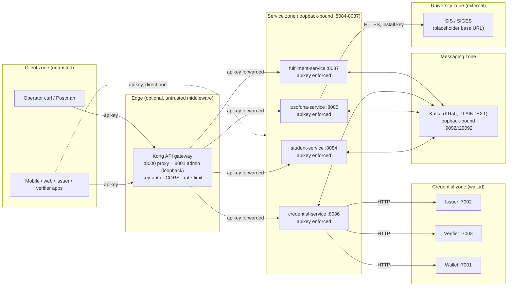
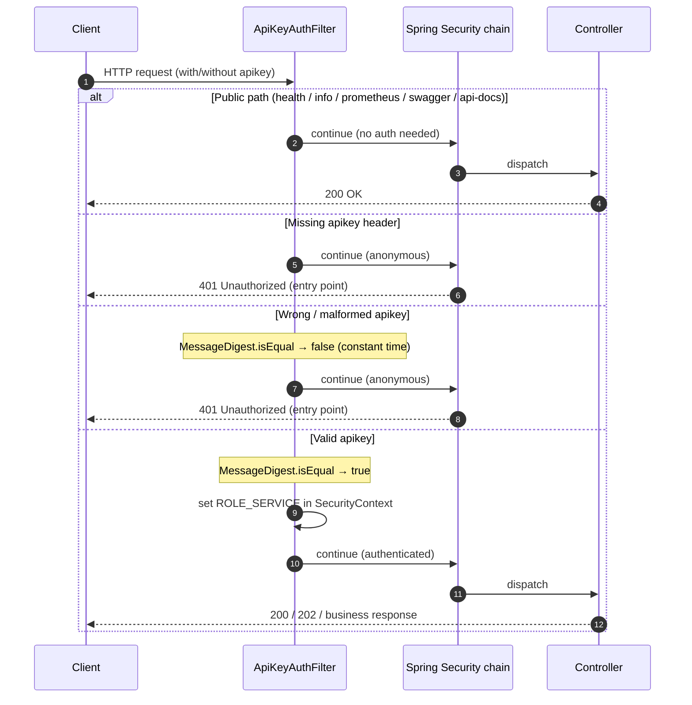

# Security

This document is the complete security reference for the **ULHT Digital Credential System (DCS)**. It describes the trust model, authentication, secrets handling, transport hardening, and the messaging/data-protection posture — and it is deliberately honest about the line between what is already hardened and what still needs manual work before the stack is exposed beyond `localhost`.

The stack is a **hardened development / academic deployment**. Sensible, security-conscious defaults are in place (constant-time API-key checks, loopback-only port bindings, no secrets in git, non-root containers, defense-in-depth authentication at every service). A short list of production steps — TLS everywhere, Kafka SASL/TLS, a real secret manager, rotated keys — is required before shared or internet-facing use. Those are enumerated in [Remaining manual / production steps](#remaining-manual-production-steps).

See also: [Architecture](ARCHITECTURE.md) · [Configuration](CONFIGURATION.md) · [Getting Started](GETTING_STARTED.md) · [Deployment](DEPLOYMENT.md) · [Troubleshooting](TROUBLESHOOTING.md) · [API Reference](API.md) · [Project home](index.md)

!!! info "Public repository — placeholders only"
    This repository is public. Every credential value in this document is a placeholder (`$APP_API_KEY`, `<your-username>`, `<your-install-key>`). The dev default `APP_API_KEY=ulht-dev-local-CHANGE-ME` exists solely to make local bring-up frictionless and **must never be shipped or reused** outside a local machine.

---

## Threat model & trust boundaries

The DCS is a set of Spring Boot microservices behind an optional [Kong](https://konghq.com/) API gateway, coordinating asynchronously over Kafka, and delegating all cryptographic credential work to a **walt.id** stack (issuer, verifier, wallet). Academic data originates from the university **Student Information System (SIS / SIGES)**, reached only by `lusofona-service`.

The core design principle is **the gateway is untrusted middleware**. Authentication is *never* delegated solely to the edge — every backend service independently enforces the API key, so bypassing or removing Kong does not weaken authentication.

### Trust boundaries

| Boundary | What crosses it | Control at the boundary |
| --- | --- | --- |
| Client ↔ Gateway | REST + `apikey` header | Kong `key-auth`, CORS allow-list, rate-limiting (100/min, 1000/hr) |
| Client/Gateway ↔ Service | REST + `apikey` header | Spring Security + `ApiKeyAuthFilter` (constant-time compare) on **every** service |
| Service ↔ Kafka | Event messages | KRaft, PLAINTEXT, loopback-bound (⚠ no auth/TLS yet — see Kafka section) |
| credential-service ↔ walt.id | HTTP issuance/verification/wallet calls | Internal network; upstream errors mapped to `503` without leaking detail |
| lusofona-service ↔ SIS | HTTPS + institutional **install key** | Install key is a secret; must be rotated & kept out of git |

### Assets worth protecting

- **Student PII** (name, identifiers, grades, enrolment, schedule) from the SIS.
- **Verifiable Credentials** and the **issuer signing keys** held/used by walt.id.
- **Wallet passwords**, derived per-student (never stored in plaintext, never committed).
- **The shared API key** and the **SIS install key**.

### Primary threats considered

| Threat | Mitigation in place |
| --- | --- |
| Unauthenticated access to any endpoint | API key required on every non-public path, enforced independently per service |
| Timing side-channel on key comparison | Constant-time `MessageDigest.isEqual` compare in `ApiKeyAuthFilter` |
| Gateway bypass (calling a service directly) | Services enforce the key themselves; Kong is not a trust anchor |
| Secret leakage via git | `.env` git-ignored; only `.env.example` (placeholders) is committed |
| PII leakage in logs | Emails masked; wallet passwords never logged; upstream error detail logged server-side only |
| Cross-origin abuse from a browser | CORS origin allow-list (`APP_CORS_ALLOWED_ORIGINS`), credentials disabled |
| LAN/off-host exposure | All host ports bound to `127.0.0.1` |

### Out of scope (until the production steps are done)

Wire encryption for Kafka, mutual TLS between services, centralized secret rotation, per-caller (rather than shared) API credentials, and HTTPS termination are **not** yet configured. They are listed in [Remaining manual / production steps](#remaining-manual-production-steps).

---

## Authentication

Every service authenticates callers with a single shared **API key**, enforced by Spring Security and a custom filter. The model is intentionally simple and stateless: no sessions, no cookies for service auth, no JWT for the machine-to-machine path.

| Aspect | Detail |
| --- | --- |
| Header name | `apikey` (exact, lowercase) |
| Configured via | `APP_API_KEY` environment variable → `app.security.api-key` |
| Comparison | **Constant-time** (`java.security.MessageDigest.isEqual`) to defeat timing attacks |
| Granted authority | `ROLE_SERVICE` on success |
| Session policy | `STATELESS` — no `HttpSession` is created |
| CSRF | Disabled (there is no cookie/session auth to protect) |
| Failure response | `401 Unauthorized` (missing, wrong, or malformed key) |

### The `ApiKeyAuthFilter`

Each service ships an identical `ApiKeyAuthFilter extends OncePerRequestFilter`, registered *before* Spring's `UsernamePasswordAuthenticationFilter`. It:

1. Reads the `apikey` request header.
2. Compares the provided bytes to the configured expected-key bytes using `MessageDigest.isEqual` — a **constant-time** comparison, so an attacker cannot infer the key one byte at a time from response timing.
3. On a match, populates the `SecurityContext` with a `UsernamePasswordAuthenticationToken` for principal `"service"` holding `ROLE_SERVICE`.
4. On no/invalid key, it does **not** set authentication and simply continues the chain — Spring Security's `authorizeHttpRequests` then rejects the (now anonymous) request on any protected path via the configured `AuthenticationEntryPoint`, which sends `401 Unauthorized`.

Source: [`ApiKeyAuthFilter.java`](https://github.com/marcelogdomingues/ulht-dcs-public/blob/main/student-service/src/main/java/pt/ulusofona/student/config/ApiKeyAuthFilter.java) · [`SecurityConfig.java`](https://github.com/marcelogdomingues/ulht-dcs-public/blob/main/student-service/src/main/java/pt/ulusofona/student/config/SecurityConfig.java) (identical filter/config in `lusofona-service`, `credential-service`, and `fulfilment-service`).

### Request flow through the filter

### Public vs protected paths

These paths are **public** (no `apikey`) on **every** service, taken verbatim from each `SecurityConfig.PUBLIC_PATHS` (remember all services use the `/api/v1` context path):

- `GET /api/v1/actuator/health` (and `/actuator/health/**`)
- `GET /api/v1/actuator/info`
- `GET /api/v1/actuator/prometheus`
- `GET /api/v1/swagger-ui/**` and `/api/v1/swagger-ui.html`
- `GET /api/v1/v3/api-docs/**`

**Every other endpoint is protected** and returns `401 Unauthorized` unless a valid `apikey` header is supplied.

### 401 behavior

A protected request without a valid key is rejected **before any business logic runs** by the `AuthenticationEntryPoint` (`response.sendError(SC_UNAUTHORIZED, "Unauthorized")`). No credential or PII data is returned on the error path.

### Defense in depth

Each service enforces the `apikey` requirement **independently**, whether it is reached:

- directly on its own loopback port (e.g. `http://localhost:8086/api/v1/...`), or
- through the Kong gateway (`http://localhost:8000/api/v1/...`).

Kong forwards the credential rather than stripping it (`hide_credentials: false` in [`kong.yml`](https://github.com/marcelogdomingues/ulht-dcs-public/blob/main/api-gateway/kong.yml)), precisely because the backend Spring service validates the *same* `apikey` header. Dropping or bypassing Kong therefore does **not** weaken authentication.

!!! warning "Shared credential"
    Today all callers share one API key. There is no per-caller identity or revocation. For production, issue distinct credentials per consumer (Kong supports multiple `keyauth_credentials`) and treat `ROLE_SERVICE` as the coarse machine role it is.

---

## Secrets management

- **All secrets are supplied through environment variables.** No secret is hard-coded in any service.
- **`.env` is git-ignored.** Real secrets live only in the local, untracked `.env`.
- **`.env.example` is the committed template** ([`.env.example`](https://github.com/marcelogdomingues/ulht-dcs-public/blob/main/.env.example)). It documents every variable with placeholders, never real values. Variables marked `REQUIRED` have **no default** — `docker compose up` fails fast if they are unset.

| Variable | Purpose | Default |
| --- | --- | --- |
| `APP_API_KEY` | Shared API key gating all service/gateway calls | `ulht-dev-local-CHANGE-ME` (dev only — rotate!) |
| `APP_CORS_ALLOWED_ORIGINS` | Comma-separated CORS origin allow-list | `http://localhost:8000` |
| `WALLET_PASSWORD_SECRET` | Secret input to per-student wallet-password derivation | **REQUIRED — no default** |
| `WALLET_PASSWORD_SALT` | Salt input to per-student wallet-password derivation | **REQUIRED — no default** |
| `LUSOFONA_API_URL` | SIS base URL for `lusofona-service` | Optional override |
| `GRAFANA_ADMIN_PASSWORD` | Grafana admin password | **REQUIRED — no default** |
| `KAFKA_UI_PASSWORD` | Kafka-UI login password | **REQUIRED — no default** |

### Wallet-password derivation (high level)

`credential-service` never stores wallet passwords and never asks a human to choose one. It **derives** a distinct password per student from the configured secret and salt:

1. It builds a per-student input string combining the student identifier, the student email, the `WALLET_PASSWORD_SECRET`, and the `WALLET_PASSWORD_SALT`.
2. It hashes that input with **SHA-256** and encodes a fixed-length slice of the digest as the wallet password.

Because both `WALLET_PASSWORD_SECRET` and `WALLET_PASSWORD_SALT` are **required with no defaults**, the stack refuses to derive wallet passwords unless an operator has explicitly set strong values. Each student therefore gets a distinct, deterministic-yet-non-guessable password that is **never stored in plaintext, never logged, and never committed**. The derivation lives in [`StudentWalletService.java`](https://github.com/marcelogdomingues/ulht-dcs-public/blob/main/credential-service/src/main/java/pt/ulusofona/ulht/credential/service/StudentWalletService.java).

!!! note "Rotating the wallet secret"
    Because derivation is deterministic, changing `WALLET_PASSWORD_SECRET`/`WALLET_PASSWORD_SALT` changes every derived password. Plan rotation together with wallet re-provisioning.

---

## Transport & network hardening

| Control | Detail |
| --- | --- |
| Host port binding | Every published port is bound to `127.0.0.1` (e.g. `127.0.0.1:8084:8084` … `:8087`, `127.0.0.1:9092`, `127.0.0.1:29092`), **not** `0.0.0.0` — nothing is on the LAN by default |
| Kong proxy | `127.0.0.1:8000` (loopback) |
| Kong admin API | Published only on `127.0.0.1:8001` (loopback) — unreachable from the network. The former route that proxied the admin API through the public proxy port was **removed** (see the note in [`kong.yml`](https://github.com/marcelogdomingues/ulht-dcs-public/blob/main/api-gateway/kong.yml)) |
| Kong status listener | Served on the dedicated status port and kept internal-only — intentionally **not** exposed via the proxy |
| CORS | Origin **allow-list** via `APP_CORS_ALLOWED_ORIGINS` (default `http://localhost:8000`); methods limited to `GET/POST/PUT/DELETE/OPTIONS`; allowed headers include `apikey`, `Content-Type`, `Authorization`; `allowCredentials = false` — wildcard-origin-with-credentials is never used |
| Container users | Containers run as **non-root** |
| Images | Container images are **pinned** to specific versions (e.g. `kong:3.9`) |
| Rate limiting | Kong applies per-route rate limiting (100/min, 1000/hr) |

Because host ports are loopback-bound out of the box, the stack is not exposed to the LAN. Enabling remote access requires the production steps below (TLS, real CORS origins, real secrets).

CORS is enforced in two places kept in sync: Spring Security's `CorsConfigurationSource` in each `SecurityConfig`, and Kong's `cors` plugin in `kong.yml`.

---

## Kafka messaging security

- Runs in **KRaft** mode (no ZooKeeper).
- Internal broker traffic uses **PLAINTEXT**.
- The broker is **loopback-bound** (`127.0.0.1:9092`, `127.0.0.1:29092`), so it is not reachable off-host in the default configuration.
- Topics carry workflow events (login requested, verification requested, credential issued, fulfilment updates) that reference correlation IDs and may carry student data derived from the SIS.

!!! danger "No wire security on Kafka yet"
    Kafka currently has **no authentication and no encryption** on the wire. It is safe only because it is loopback-bound on a single host. **Add SASL authentication and TLS before any shared or multi-host deployment**, and restrict topic ACLs per service.

---

## Data protection & privacy

- **Selective disclosure.** Credentials can be issued as **SD-JWT** (Selective-Disclosure JWT) so holders reveal only the specific claims a verifier needs, rather than the whole credential. The wallet `match-presentation` flow surfaces disclosure information for a selective-disclosure UI.
- **Mobile secure storage.** The mobile apps keep wallet material in the platform secure store rather than plain app storage. See [Mobile Apps](MOBILE_APPS.md) for details.
- **Masking in this public repo.** Sample values throughout the code and docs are masked/placeholder (e.g. `a12345678`, `00000_0000000000000`, `student@ulusofona.pt`, `did:jwk:student123`). No real student identifiers, install keys, or SIS URLs are committed.
- **PII-aware logging.** Emails are masked before logging; wallet passwords are never logged (not even a prefix); upstream/walt.id error detail is logged **server-side only**, and clients receive a generic, non-leaking message (see [`GlobalExceptionHandler.java`](https://github.com/marcelogdomingues/ulht-dcs-public/blob/main/credential-service/src/main/java/pt/ulusofona/ulht/credential/exception/GlobalExceptionHandler.java)).
- **No mock fallback for identity data.** If the SIS call fails, `lusofona-service` fails the request rather than issuing credentials from fabricated data — real credentials are only ever backed by real SIS data.

---

## Remaining manual / production steps

The stack is hardened for development but is **not production-ready** until the following are completed:

1. **Rotate the SIS install key** and **purge it from git history** (e.g. with `git filter-repo`), then force-push and invalidate the old key upstream.
2. **Never ship the dev API key.** Replace `APP_API_KEY=ulht-dev-local-CHANGE-ME` with a strong, unique key generated per environment; consider per-consumer keys in Kong.
3. **Enable HTTPS/TLS everywhere.** Terminate TLS at Kong and/or per service and disable plaintext HTTP listeners.
4. **Add SASL authentication and TLS to Kafka** (and per-topic ACLs) before any shared deployment.
5. **Do not expose the Kong admin API.** Keep `:8001` (and the status listener) loopback/internal-only; never route it through the public proxy.
6. **Restrict CORS** (`APP_CORS_ALLOWED_ORIGINS`) to the real front-end origins only — never `*`.
7. **Move real secrets into a dedicated secret manager** (e.g. Vault, AWS Secrets Manager, or the platform secret store) instead of a local `.env` file, and rotate `WALLET_PASSWORD_SECRET`/`WALLET_PASSWORD_SALT` on a planned schedule.

See [Deployment](DEPLOYMENT.md) for the operational checklist that accompanies these.

---

## Responsible disclosure

If you discover a security issue, please report it **privately** to the maintainers rather than opening a public issue. Include reproduction steps and the affected component, and allow reasonable time for a fix before any public disclosure. Please do not test against any environment you do not own, and never use real student data when reproducing an issue.
