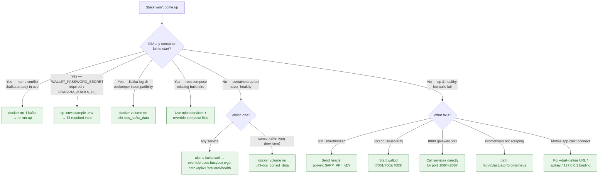

# Troubleshooting

A practical **problem → cause → fix** guide for running the ULHT Digital Credential System.

The stack is **Spring Boot 4.1.0 / Java 25** microservices, **KRaft-mode Kafka** (`confluentinc/cp-kafka:8.3.0`, no ZooKeeper), Consul, Prometheus/Grafana/Loki, and three [Flutter apps](MOBILE_APPS.md). The credential service talks to an external [walt.id](https://walt.id) stack.

See also: [Getting Started](GETTING_STARTED.md) · [Configuration](CONFIGURATION.md) · [Security](SECURITY.md) · [API](API.md) · [Architecture](ARCHITECTURE.md) · [Mobile Apps](MOBILE_APPS.md) · [Project home](index.md)

---

## Primary run command

Use the microservices compose file **plus** the local override — do **not** use the root `docker-compose.yml` (it is stale and references deleted build directories):

```bash
docker compose -f docker-compose.microservices.yml -f docker-compose.override.yml up -d
```

!!! warning "Before your first KRaft start"
    Wipe any old ZooKeeper-mode Kafka volume first (see [Kafka won't start](#kafka-wont-start-after-switching-to-kraft)). The old log format is incompatible with KRaft.

---

## "The stack won't come up" — start here

Follow this decision tree; each leaf links to the detailed fix below.



---

## Startup issues

### Service won't start — "WALLET_PASSWORD_SECRET required" (or `GRAFANA_ADMIN_PASSWORD` / `KAFKA_UI_PASSWORD`)

- **Cause:** a required environment variable is unset. Several vars have **no default** and the service fails fast without them (the credential-service refuses to boot without `WALLET_PASSWORD_SECRET` + `WALLET_PASSWORD_SALT`).
- **Fix:** create your `.env` from the template and fill in the values.

```bash
cp .env.example .env
# then edit .env and set at least:
#   APP_API_KEY, WALLET_PASSWORD_SECRET, WALLET_PASSWORD_SALT,
#   GRAFANA_ADMIN_PASSWORD, KAFKA_UI_PASSWORD, APP_CORS_ALLOWED_ORIGINS
```

### Kafka won't start after switching to KRaft

*(Errors like "log directory … zookeeper" / log-format incompatibility.)*

- **Cause:** an old ZooKeeper-mode data volume is incompatible with KRaft's log format (the stack migrated off ZooKeeper).
- **Fix:** wipe the stale Kafka volume, then bring the stack up again.

```bash
docker volume rm ulht-dcs_kafka_data
# or reset all volumes at once:
docker compose -f docker-compose.microservices.yml -f docker-compose.override.yml down -v
```

### Container name conflict — "/kafka already in use"

- **Cause:** a stale container from a previous run still exists (common after a crashed/aborted `up`).
- **Fix:** remove it and re-run `up`.

```bash
docker rm -f kafka
docker compose -f docker-compose.microservices.yml -f docker-compose.override.yml up -d
```

### Root `docker-compose.yml` errors about missing build dirs

- **Cause:** the root `docker-compose.yml` is **stale** and references directories that no longer exist (e.g. a removed waltid-proxy dir).
- **Fix:** always use `docker-compose.microservices.yml` **together with** `docker-compose.override.yml` (the override is untracked and holds required fixes: busybox healthchecks, host-port remaps, the lusofona API endpoint, 127.0.0.1 bindings). See the [primary run command](#primary-run-command).

---

## Health & discovery issues

### Healthchecks never go healthy

- **Cause:** the `eclipse-temurin` **alpine** base images do **not** ship `curl`, so a `curl`-based healthcheck always fails and the container is stuck "starting/unhealthy".
- **Fix:** already handled — the override uses busybox `wget`. If you edit healthchecks, keep using `wget`. The health path is `/api/v1/actuator/health` for all four services.

```bash
# verify a service is actually serving health (public, no key)
curl http://localhost:8084/api/v1/actuator/health
```

!!! note "kafka-ui / loki healthchecks"
    kafka-ui and loki have their own health semantics — kafka-ui may take longer to report healthy while it connects to the broker, and loki must be reachable before promtail ships logs. Give the broker time to elect a KRaft quorum leader before expecting kafka-ui to be green.

### Consul unhealthy after long downtime

- **Cause:** a stale `consul_data` volume — it goes stale after extended offline periods (observed after >168h offline).
- **Fix:**

```bash
docker volume rm ulht-dcs_consul_data
```

### Prometheus not scraping a service

- **Cause:** Prometheus must scrape the metrics path `/api/v1/actuator/prometheus` (public, no key required). A wrong path yields empty targets.
- **Fix:** verify the target path and reachability.

```bash
curl http://localhost:8084/api/v1/actuator/prometheus
```

---

## API & auth issues

### 401 Unauthorized on API calls

- **Cause:** the request is missing the `apikey` header (or sending the wrong key). Every business endpoint is protected by Spring Security.
- **Fix:** send the API key on **every** call.

```bash
curl -H "apikey: $APP_API_KEY" \
  http://localhost:8084/api/v1/student/status/<credentialId>
```

Only `/api/v1/actuator/health`, `/api/v1/actuator/info`, `/api/v1/actuator/prometheus`, and the Swagger endpoints are public. Everything else requires the key. The dev default is `ulht-dev-local-CHANGE-ME`. The [mobile apps](MOBILE_APPS.md) send this automatically from `--dart-define=API_KEY=…`.

### Kong gateway (8000) returns 503

- **Cause:** the gateway routes are partial / aspirational and not fully wired (and now hardened with key-auth). `student-service` and `lusofona-service` also both serve `/api/v1/student/*`, a collision a single route can't disambiguate.
- **Fix:** call the services **directly by port** (`8084`–`8087`) with the `apikey` header. This is exactly what the [mobile apps](MOBILE_APPS.md) do.

---

## Credential / walt.id issues

### credential-service returns 503 on issue / verify

- **Cause:** the external walt.id backend is not running.
- **Fix:** start the walt.id stack. Expected ports: **wallet 7001**, **issuer 7002**, **verifier 7003**.

### walt.id issuer-api crashes at startup — "notBefore cannot be in the past"

- **Cause:** some issuer-api versions (e.g. 0.15.1, 0.16.2) ship example certificates whose dates are now in the past — a time-bomb.
- **Fix:** use a newer / patched issuer-api image (e.g. `waltid/issuer-api:0.22.0`). Running it under a network alias `issuer-api` lets the rest of the stack keep its config unchanged.

---

## Mobile app issues

### Mobile app can't reach the backend

- **Cause:** wrong `--dart-define` base URL, missing `apikey`, or services bound to `127.0.0.1` and thus unreachable from a device/emulator.
- **Fix:**
  - Pass the correct `*_SVC_URL` values (see [Mobile Apps](MOBILE_APPS.md)).
  - Ensure `API_KEY` is set so the `apikey` header is sent (otherwise every call is `401`).
  - From a physical device or the Android emulator, use the host's reachable address (`10.0.2.2` for the Android emulator, or the host's LAN IP) rather than `localhost`. Ports bound to `127.0.0.1` on the host are **not** reachable from a device — bind to `0.0.0.0` or port-forward.

### Scanned QR is "blocked — not an allowed destination"

- **Cause:** the student-app validates scanned `http(s)` URLs against the `url_guard` allowlist. A host not in the allowlist is refused for safety.
- **Fix:** in dev, the allowlist accepts `localhost`, `127.0.0.1`, `10.0.2.2`, and the `ulusofona.pt` / `university-sis.example.edu` suffixes, plus the `openid4vp` / `openid4vci` / `haip` schemes. For production, add your real gateway/SIS host (https only) to `url_guard.dart`. See [Mobile Apps → Security](MOBILE_APPS.md).

### Docs site build fails

- **Cause:** the CI `setup-python` pip cache expects a requirements file to hash.
- **Fix:** ensure `requirements-docs.txt` exists and is referenced by the pip cache key in the docs workflow.

---

## Useful commands

```bash
# Follow logs for all services
docker compose -f docker-compose.microservices.yml -f docker-compose.override.yml logs -f

# Follow logs for one service
docker compose -f docker-compose.microservices.yml -f docker-compose.override.yml logs -f credential-service

# List running containers (with health status)
docker compose -f docker-compose.microservices.yml -f docker-compose.override.yml ps

# List Kafka topics (KRaft mode)
docker exec kafka kafka-topics --bootstrap-server localhost:9092 --list

# Check a service health endpoint (public, no key needed)
curl http://localhost:8084/api/v1/actuator/health

# Authenticated smoke test (needs the apikey header)
curl -H "apikey: $APP_API_KEY" \
  http://localhost:8086/api/v1/wallet/credentials?userName=<student-username>

# Bring the stack down (add -v to also drop volumes)
docker compose -f docker-compose.microservices.yml -f docker-compose.override.yml down
```
